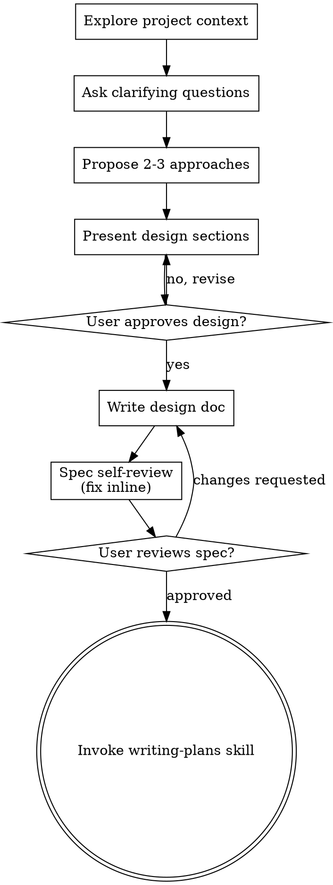

OpenAI Codex v0.143.0
--------
workdir: /home/rob/bpm-pizza-vibecoding-solution
model: gpt-5.4
provider: openai
approval: never
sandbox: read-only
reasoning effort: medium
reasoning summaries: none
session id: 019fbc71-7bb8-7f82-9cc1-4cebe594c151
--------
user
You are an independent reviewer for the repository in the current working directory. Read-only; you never write code. Two roles in one pass:
1. Devil's advocate: attack the implementation — bugs, gaps, missing error cases, spec violations, divergence from the approved plan.
2. Judge: score against the fixed rubric in SPEC.md.

Task: Review the v2 IMPLEMENTATION against SPEC.md (v3, patched, gate-approved) and PLAN.md (v2, approved 23/25, all tickets checked off). The v2 delta on top of the previously approved v1 build: prices/totals in core (core/order.py, core/menu.py, core/tools.py), per-session tenancy via a core session factory + language authority + confirm_and_submit (core/agent.py), web API v2 (channels/web.py: /config /session /chat /confirm /language /health), channels/speech.py, fully rebuilt UI (channels/static/), offline stubs (tests/stubs.py) and the browser E2E suite (tests/test_web_e2e.py), plus extended unit/tool tests.

Facts you cannot observe from the files, all demonstrated live before this review: the offline suite passes — 101 passed, 1 skipped (the opt-in live test), including 11 API-surface tests and 6 Playwright browser E2E tests asserting against the DOM (full order with header/footer contract, pizzeria switch + language, vanished pizzeria, tool error, gateway unreachable, stream without answer); the live acceptance test PASSED against the real API (full conversation at the tool layer, submit, then customer/items/quantities verified via the pizzeria's list + detail endpoints). Your sandbox may lack a writable temp dir for pytest; judge from code plus this evidence if so.

Scope notes: tests/fixtures/*.json are recorded real API responses. venv/, logs/, node-free static assets are as committed. decisions/qa.md records oracle decisions; the five retrofit conditions there are binding and PLAN.md maps them.

Output MUST end with exactly this block (numbers 1-5, 5 best):
SCORES (1-5 each, 5 = best):
completeness: N
correctness: N
error_handling: N
simplicity: N
spec_compliance: N
TOTAL: N/25
VERDICT: APPROVED | CHANGES_REQUIRED
ISSUES: (max 5 bullets, concrete and actionable, empty if approved)

APPROVED requires TOTAL >= 20 and no dimension below 4. Maximum 3 rounds.

codex
Reviewing the repository against `SPEC.md`, `PLAN.md`, and the cited implementation areas. I’ll gather the spec/plan context first, then inspect the v2 delta and tests, and I’ll keep this read-only.
exec
/bin/bash -lc "sed -n '1,220p' /home/rob/.agents/skills/using-superpowers/SKILL.md" in /home/rob/bpm-pizza-vibecoding-solution
 succeeded in 156ms:
---
name: using-superpowers
description: Use when starting any conversation - establishes how to find and use skills, requiring skill invocation before ANY response including clarifying questions
---

<SUBAGENT-STOP>
If you were dispatched as a subagent to execute a specific task, ignore this skill.
</SUBAGENT-STOP>

<EXTREMELY-IMPORTANT>
If you think there is even a 1% chance a skill might apply to what you are doing, you ABSOLUTELY MUST invoke the skill.

IF A SKILL APPLIES TO YOUR TASK, YOU DO NOT HAVE A CHOICE. YOU MUST USE IT.

This is not negotiable. You cannot rationalize your way out of this.
</EXTREMELY-IMPORTANT>

## The Rule

**Invoke relevant or requested skills BEFORE any response or action** — including clarifying questions, exploring the codebase, or checking files. If it turns out wrong for the situation, you don't have to use it.

**Before entering plan mode:** if you haven't already brainstormed, invoke the brainstorming skill first.

Then announce "Using [skill] to [purpose]" and follow the skill exactly. If it has a checklist, create a todo per item.

## Skill Priority

When multiple skills apply, process skills come first — they set the approach, then implementation skills (frontend-design, etc.) carry it out. Brainstorming and systematic-debugging are Superpowers' most common process skills, but the rule holds for any of them.

- "Let's build X" → superpowers:brainstorming first, then implementation skills.
- "Fix this bug" → superpowers:systematic-debugging first, then domain skills.

## Red Flags

These thoughts mean STOP—you're rationalizing:

| Thought | Reality |
|---------|---------|
| "This is just a simple question" | Questions are tasks. Check for skills. |
| "I need more context first" | Skill check comes BEFORE clarifying questions. |
| "Let me explore the codebase first" | Skills tell you HOW to explore. Check first. |
| "I can check git/files quickly" | Files lack conversation context. Check for skills. |
| "Let me gather information first" | Skills tell you HOW to gather information. |
| "This doesn't need a formal skill" | If a skill exists, use it. |
| "I remember this skill" | Skills evolve. Read current version. |
| "This doesn't count as a task" | Action = task. Check for skills. |
| "The skill is overkill" | Simple things become complex. Use it. |
| "I'll just do this one thing first" | Check BEFORE doing anything. |
| "This feels productive" | Undisciplined action wastes time. Skills prevent this. |
| "I know what that means" | Knowing the concept ≠ using the skill. Invoke it. |

## Platform Adaptation

If your harness appears here, read its reference file for special instructions:

- Codex: `references/codex-tools.md`
- Pi: `references/pi-tools.md`
- Antigravity: `references/antigravity-tools.md`

## User Instructions

User instructions (CLAUDE.md, AGENTS.md, GEMINI.md, etc, direct requests) take precedence over skills, which in turn override default behavior. Only skip skill workflows or instructions when your human partner has explicitly told you to.

codex
Using `using-superpowers` to determine the required review workflow before inspecting the code. Next I’m checking the Codex-specific instructions and then the review-relevant skills.
exec
/bin/bash -lc "sed -n '1,240p' /home/rob/.agents/skills/using-superpowers/references/codex-tools.md" in /home/rob/bpm-pizza-vibecoding-solution
exec
/bin/bash -lc "sed -n '1,260p' /home/rob/.agents/skills/requesting-code-review/SKILL.md" in /home/rob/bpm-pizza-vibecoding-solution
exec
/bin/bash -lc "sed -n '1,260p' /home/rob/.agents/skills/brainstorming/SKILL.md" in /home/rob/bpm-pizza-vibecoding-solution
 succeeded in 124ms:
---
name: requesting-code-review
description: Use when completing tasks, implementing major features, or before merging to verify work meets requirements
---

# Requesting Code Review

Dispatch a code reviewer subagent to catch issues before they cascade. The reviewer gets precisely crafted context for evaluation — never your session's history.

**Core principle:** Review early, review often.

## When to Request Review

**Mandatory:**
- After each task in subagent-driven development
- After completing major feature
- Before merge to main

**Optional but valuable:**
- When stuck (fresh perspective)
- Before refactoring (baseline check)
- After fixing complex bug

## How to Request

**1. Get git SHAs:**
```bash
BASE_SHA=$(git rev-parse HEAD~1)  # or origin/main
HEAD_SHA=$(git rev-parse HEAD)
```

**2. Dispatch code reviewer subagent:**

Dispatch a `general-purpose` subagent, filling the template at [code-reviewer.md](code-reviewer.md)

**Placeholders:**
- `{DESCRIPTION}` - Brief summary of what you built
- `{PLAN_OR_REQUIREMENTS}` - What it should do
- `{BASE_SHA}` - Starting commit
- `{HEAD_SHA}` - Ending commit

**3. Act on feedback:**
- Fix Critical issues immediately
- Fix Important issues before proceeding
- Note Minor issues for later
- Push back if reviewer is wrong (with reasoning)

## Example

```
[Just completed Task 2: Add verification function]

You: Let me request code review before proceeding.

BASE_SHA=$(git log --oneline | grep "Task 1" | head -1 | awk '{print $1}')
HEAD_SHA=$(git rev-parse HEAD)

[Dispatch code reviewer subagent]
  DESCRIPTION: Added verifyIndex() and repairIndex() with 4 issue types
  PLAN_OR_REQUIREMENTS: Task 2 from docs/superpowers/plans/deployment-plan.md
  BASE_SHA: a7981ec
  HEAD_SHA: 3df7661

[Subagent returns]:
  Strengths: Clean architecture, real tests
  Issues:
    Important: Missing progress indicators
    Minor: Magic number (100) for reporting interval
  Assessment: Ready to proceed

You: [Fix progress indicators]
[Continue to Task 3]
```

## Common Rationalizations

| Excuse | Reality |
|--------|---------|
| "I'll just review the diff myself instead of dispatching a reviewer" | You're the coordinator — reviewing the diff inline burns the context window you need to keep driving the work. Dispatch a reviewer subagent: the diff and the evaluation live in its context, and only the findings come back to you. |
| "The reviewer needs my whole session history to understand the change" | Hand it precisely crafted context, never your session's history. That keeps the reviewer on the work product, not your thought process. |

## Red Flags

**Never:**
- Skip review because "it's simple"
- Ignore Critical issues
- Proceed with unfixed Important issues
- Argue with valid technical feedback

**If reviewer wrong:**
- Push back with technical reasoning
- Show code/tests that prove it works
- Request clarification

See template at: [code-reviewer.md](code-reviewer.md)

 succeeded in 142ms:
## Subagent dispatch requires multi-agent support

Add to your Codex config (`~/.codex/config.toml`):

```toml
[features]
multi_agent = true
```

This enables `spawn_agent`, `wait_agent`, and `close_agent` for skills like `dispatching-parallel-agents` and `subagent-driven-development`. When using subagent-driven-development, close reviewer subagents when their review returns. Keep each implementer subagent open until its task's review passes — the fix loop resumes the implementer — then close it. If your harness cannot send another message to a spawned agent, dispatch each fix round as a fresh implementer carrying the brief, the report file, and the findings.

## Environment Detection

Skills that create worktrees or finish branches should detect their
environment with read-only git commands before proceeding:

```bash
GIT_DIR=$(cd "$(git rev-parse --git-dir)" 2>/dev/null && pwd -P)
GIT_COMMON=$(cd "$(git rev-parse --git-common-dir)" 2>/dev/null && pwd -P)
BRANCH=$(git branch --show-current)
```

- `GIT_DIR != GIT_COMMON` → already in a linked worktree (skip creation)
- `BRANCH` empty → detached HEAD (cannot branch/push/PR from sandbox)

See `using-git-worktrees` Step 0 and `finishing-a-development-branch`
Step 1 for how each skill uses these signals.

## Codex App Finishing

When the sandbox blocks branch/push operations (detached HEAD in an
externally managed worktree), the agent commits all work and informs
the user to use the App's native controls:

- **"Create branch"** — names the branch, then commit/push/PR via App UI
- **"Hand off to local"** — transfers work to the user's local checkout

The agent can still run tests, stage files, and output suggested branch
names, commit messages, and PR descriptions for the user to copy.

 succeeded in 146ms:
---
name: brainstorming
description: "You MUST use this before any creative work - creating features, building components, adding functionality, or modifying behavior. Explores user intent, requirements and design before implementation."
---

# Brainstorming Ideas Into Designs

Help turn ideas into fully formed designs and specs through natural collaborative dialogue.

Start by understanding the current project context, then ask questions one at a time to refine the idea. Once you understand what you're building, present the design and get user approval.

<HARD-GATE>
Do NOT invoke any implementation skill, write any code, scaffold any project, or take any implementation action until you have presented a design and the user has approved it. This applies to EVERY project regardless of perceived simplicity.
</HARD-GATE>

## Anti-Pattern: "This Is Too Simple To Need A Design"

Every project goes through this process. A todo list, a single-function utility, a config change — all of them. "Simple" projects are where unexamined assumptions cause the most wasted work. The design can be short (a few sentences for truly simple projects), but you MUST present it and get approval.

## Checklist

You MUST create a task for each of these items and complete them in order:

1. **Explore project context** — check files, docs, recent commits
2. **Offer the visual companion just-in-time** — NOT upfront. The first time a question would genuinely be clearer shown than described, offer it then (its own message); on approval its browser tab opens for you. If no visual question ever arises, never offer it. See the Visual Companion section below.
3. **Ask clarifying questions** — one at a time, understand purpose/constraints/success criteria
4. **Propose 2-3 approaches** — with trade-offs and your recommendation
5. **Present design** — in sections scaled to their complexity, get user approval after each section
6. **Write design doc** — save to `docs/superpowers/specs/YYYY-MM-DD-<topic>-design.md` and commit
7. **Spec self-review** — quick inline check for placeholders, contradictions, ambiguity, scope (see below)
8. **User reviews written spec** — ask user to review the spec file before proceeding
9. **Transition to implementation** — invoke writing-plans skill to create implementation plan

## Process Flow



**The terminal state is invoking writing-plans.** Do NOT invoke frontend-design, mcp-builder, or any other implementation skill. The ONLY skill you invoke after brainstorming is writing-plans.

## The Process

**Understanding the idea:**

- Check out the current project state first (files, docs, recent commits)
- Before asking detailed questions, assess scope: if the request describes multiple independent subsystems (e.g., "build a platform with chat, file storage, billing, and analytics"), flag this immediately. Don't spend questions refining details of a project that needs to be decomposed first.
- If the project is too large for a single spec, help the user decompose into sub-projects: what are the independent pieces, how do they relate, what order should they be built? Then brainstorm the first sub-project through the normal design flow. Each sub-project gets its own spec → plan → implementation cycle.
- For appropriately-scoped projects, ask questions one at a time to refine the idea
- Prefer multiple choice questions when possible, but open-ended is fine too
- Only one question per message - if a topic needs more exploration, break it into multiple questions
- Focus on understanding: purpose, constraints, success criteria

**Exploring approaches:**

- Propose 2-3 different approaches with trade-offs
- Present options conversationally with your recommendation and reasoning
- Lead with your recommended option and explain why
- YAGNI ruthlessly - remove unnecessary features from every approach and design

**Presenting the design:**

- Once you believe you understand what you're building, present the design
- Scale each section to its complexity: a few sentences if straightforward, up to 200-300 words if nuanced
- Ask after each section whether it looks right so far
- Cover: architecture, components, data flow, error handling, testing
- Be ready to go back and clarify if something doesn't make sense

**Design for isolation and clarity:**

- Break the system into smaller units that each have one clear purpose, communicate through well-defined interfaces, and can be understood and tested independently
- For each unit, you should be able to answer: what does it do, how do you use it, and what does it depend on?
- Can someone understand what a unit does without reading its internals? Can you change the internals without breaking consumers? If not, the boundaries need work.
- Smaller, well-bounded units are also easier for you to work with - you reason better about code you can hold in context at once, and your edits are more reliable when files are focused. When a file grows large, that's often a signal that it's doing too much.

**Working in existing codebases:**

- Explore the current structure before proposing changes. Follow existing patterns.
- Where existing code has problems that affect the work (e.g., a file that's grown too large, unclear boundaries, tangled responsibilities), include targeted improvements as part of the design - the way a good developer improves code they're working in.
- Don't propose unrelated refactoring. Stay focused on what serves the current goal.

## After the Design

**Documentation:**

- Write the validated design (spec) to `docs/superpowers/specs/YYYY-MM-DD-<topic>-design.md`
  - (User preferences for spec location override this default)
- Use elements-of-style:writing-clearly-and-concisely skill if available
- Commit the design document to git

**Spec Self-Review:**
After writing the spec document, look at it with fresh eyes:

1. **Placeholder scan:** Any "TBD", "TODO", incomplete sections, or vague requirements? Fix them.
2. **Internal consistency:** Do any sections contradict each other? Does the architecture match the feature descriptions?
3. **Scope check:** Is this focused enough for a single implementation plan, or does it need decomposition?
4. **Ambiguity check:** Could any requirement be interpreted two different ways? If so, pick one and make it explicit.

Fix any issues inline. No need to re-review — just fix and move on.

**User Review Gate:**
After the spec review loop passes, ask the user to review the written spec before proceeding:

> "Spec written and committed to `<path>`. Please review it and let me know if you want to make any changes before we start writing out the implementation plan."

Wait for the user's response. If they request changes, make them and re-run the spec review loop. Only proceed once the user approves.

**Implementation:**

- Invoke the writing-plans skill to create a detailed implementation plan
- Do NOT invoke any other skill. writing-plans is the next step.

## Visual Companion

A browser-based companion for showing mockups, diagrams, and visual options during brainstorming. Available as a tool — not a mode. Accepting the companion means it's available for questions that benefit from visual treatment; it does NOT mean every question goes through the browser.

**Offering the companion (just-in-time):** Do NOT offer it upfront. Wait until a question would genuinely be clearer shown than told — a real mockup / layout / diagram question, not merely a UI *topic*. The first time that happens, offer it then, as its own message:
> "This next part might be easier if I show you — I can put together mockups, diagrams, and comparisons in a browser tab as we go. It's still new and can be token-intensive. Want me to? I'll open it for you."

**This offer MUST be its own message.** Only the offer — no clarifying question, summary, or other content. Wait for the user's response. If they accept, start the server with `--open` so their browser opens to the first screen automatically. If they decline, continue text-only and don't offer again unless they raise it.

**Per-question decision:** Even after the user accepts, decide FOR EACH QUESTION whether to use the browser or the terminal. The test: **would the user understand this better by seeing it than reading it?**

- **Use the browser** for content that IS visual — mockups, wireframes, layout comparisons, architecture diagrams, side-by-side visual designs
- **Use the terminal** for content that is text — requirements questions, conceptual choices, tradeoff lists, A/B/C/D text options, scope decisions

A question about a UI topic is not automatically a visual question. "What does personality mean in this context?" is a conceptual question — use the terminal. "Which wizard layout works better?" is a visual question — use the browser.

If they agree to the companion, read the detailed guide before proceeding:
`skills/brainstorming/visual-companion.md`

codex
I’ve confirmed the review-specific workflow and I’m moving into repository inspection. Next I’m reading the governing documents and the implementation/test files that define the claimed v2 delta.
exec
/bin/bash -lc "sed -n '1,260p' decisions/qa.md" in /home/rob/bpm-pizza-vibecoding-solution
exec
/bin/bash -lc "sed -n '1,260p' SPEC.md" in /home/rob/bpm-pizza-vibecoding-solution
exec
/bin/bash -lc "rg --files -g 'SPEC.md' -g 'PLAN.md' -g 'decisions/qa.md' -g 'core/*.py' -g 'channels/*.py' -g 'tests/*.py' -g 'channels/static/**'" in /home/rob/bpm-pizza-vibecoding-solution
exec
/bin/bash -lc "sed -n '1,260p' PLAN.md" in /home/rob/bpm-pizza-vibecoding-solution
 succeeded in 846ms:
# PizzaSim Ordering Agent — Specification

> Hand this to a coding agent as the entire task:
> `FOLLOW INSTRUCTIONS PRECISELY AT "SPEC.MD"`.
> This file is the source of truth for what the product is. Everything else in
> the repo — code, tests, prompts, tickets — derives from it.

---

## Where this format comes from

The **shape** of this document is not ours. It is borrowed from Cedric Mössner —
**The Morpheus** ([youtube.com/@TheMorpheusTutorials](https://www.youtube.com/@TheMorpheusTutorials)),
who writes exactly one `SPEC.md` per project and hands the identical file to
every new model in order to compare them. The prompt he sends alongside it is a
single line — `FOLLOW INSTRUCTIONS PRECISELY AT "SPEC.MD"` — which is why that
line, and not a long prompt, stands at the top of this file.

Sections adopted from his specs: *Soul*, *The One Load-Bearing Idea*, hard
*Scope In / Out*, an explicit autonomy clause, work *in passes* with
verification after each, a file-level *Deliverables* list, *Decisions Locked /
Deferred*, and the one-hour *ticket sizing rules*.

Reference specs:
[morphcook](https://github.com/TheMorpheus407/morphcook) — offline Flutter
recipe app; one spec, seven model implementations.
[hogwarts-blender-benchmark](https://github.com/TheMorpheus407/hogwarts-blender-benchmark)
— fully procedural Blender build; `prompt.txt` plus `SPEC.md`.

The content below is ours. The form is his — with thanks.

---

## What done looks like

There is exactly one success condition, and everything else in this document
exists to serve it:

**A customer talks to the agent, and the resulting order appears in the API
under the pizzeria they chose — with the right customer, the right items, the
right quantities.**

Concretely, and this is the acceptance criterion:

1. `POST /pizzerias/{id}/orders` returned an order id.
2. Reading that pizzeria's orders back shows the order, and it is visible on
   that pizzeria's dashboard.
3. The customer name is the one the customer gave.
4. The items and quantities are the ones that were read back and confirmed —
   not a superset, not a subset, not a near match on the item code.

Nothing else counts as done. A green test suite, a clean architecture, a
pleasant interface: none of it is the product. **The order on the board is the
product.**

**Four failures that look like success**, each a failed run and not a partial
one:

- The order landed under a **different pizzeria** than the one the customer
  chose.
- A retry after a timeout created the order **twice**.
- A misheard or mistyped name created a **new customer** instead of matching
  the intended one.
- The order was submitted **without the customer confirming** the read-back.

Every rule below — the state machine, the revision-bound confirmation, the ban
on blind retries, the name read-back, the tenant in the URL path — exists to
prevent exactly one of those four.

---

## Soul

Ordering food by phone works because the person on the other end keeps the
order in their head, reads it back to you, and only then walks to the kitchen.
Nothing is cooked before you said yes.

Most LLM ordering demos invert this. The model holds the order in its context,
guesses item names that sound close enough, and fires the write call the moment
it feels confident. It works in the demo and fails on the fourth turn, in a
noisy room, when the customer changes their mind.

This agent puts the order back where it belongs: **in the code**. The model
does the one thing it is genuinely good at — turning messy human speech into
intent — and nothing else. It never holds the cart, never invents a menu item,
and never reaches the kitchen without a confirmed read-back.

**Core belief:** a language model is a great waiter and a terrible order pad.

---

## The One Load-Bearing Idea

**The order is a state machine owned by the code. The model only speaks.**

- Exactly one `Order` object per conversation, held by the runtime.
- The model cannot write to it directly. It calls tools that request a
  transition, and every transition is validated before it is applied.
- Every item code is validated against the **live menu**. An unknown code is a
  tool error carrying candidate matches — never a silent guess, never a
  fallback to a hardcoded list.
- `submit_order` is the only network write, legal in exactly one state:
  `CONFIRMED`. The only way into `CONFIRMED` is a read-back the customer
  answered yes to.
- One core serves every channel. A transport carries words in and words out;
  it owns no order logic whatsoever.

This one rule replaces prompt-engineering the model into good behaviour. If the
model misbehaves, the state machine refuses — and the refusal is a tool result
the model must deal with in front of the customer.

---

## Scope

### In

- **Two transports over one core:**
  - `cli` — interactive terminal chat.
  - `web` — FastAPI server on port 8888, browser chat UI, streaming the
    agent's intermediate steps as newline-delimited JSON so tool calls and
    tool results are visible, not just the final answer.
- **Speech on the web transport**, served by a self-hosted CPU-only speech
  container over HTTP. See *Speech*.
- **Several pizzerias.** The customer chooses which one they are ordering
  from, and can change it. `PIZZERIA_ID` is the preselection, not a
  restriction.
- **Languages:** German and English. The agent answers in the language the
  customer used, per turn, without being told to switch.
- **Menu, prices, cart, customer, submit.** The full happy path plus
  correction ("no, make that three"), removal, and abandonment. The customer
  can ask what is on offer and what items cost, and sees what the basket
  comes to before confirming.
- **Deterministic tests** that run with no network and no LLM, plus one live
  acceptance test and a browser end-to-end test.
- **Structured logging** of every turn: user text, model tool calls, tool
  results, state transitions. One line per event, JSON, to a file.

### Out (explicitly)

- Payment and anything financial beyond showing prices the API supplies.
- Delivery routing, or an ETA of our own invention.
- Accounts, auth, sessions surviving a process restart.
- Modifying or cancelling an order after it was submitted.
- Any regex or keyword parser that produces an order without the model.
  See **Anti-patterns**; this is a hard ban, not a style preference.
- Reading the whole menu aloud when the answer will be spoken.
- Persisting customer data anywhere beyond the process and the PizzaSim API.

---

## Environment and configuration

All configuration comes from environment variables. Load `~/.env` if present;
never write to it, never create it, never print a value.

| Variable | Purpose |
|---|---|
| `LITELLM_PIZZA_URL` | OpenAI-compatible gateway base URL (`/chat/completions` appended) |
| `LITELLM_PIZZA_KEY` | Bearer token for the gateway |
| `LITELLM_PIZZA_MODEL_1` | Model the ordering agent calls; required, no default in code |
| `LITELLM_PIZZA_MODEL_2` | Second configured model, where the build uses one |
| `PIZZASIM_URL` | PizzaSim API base URL; dashboard and docs links derive from it |
| `PIZZASIM_API_KEY` | Sent as header `X-API-Key` on protected routes |
| `PIZZERIA_ID` | UUID of the pizzeria preselected on first load |
| `PIZZERIA_LANG` | Initial language, `de` or `en`: the greeting, the CLI, and the web UI before the customer switches |
| `APP_VERSION` | Release version, `x.y.z`, shown in the footer |
| `SPEECH_URL` | Base URL of the self-hosted speech service (optional) |
| `SPEECH_STT_MODEL` | Transcription model id |
| `SPEECH_TTS_MODEL` | Synthesis model id |
| `SPEECH_TTS_VOICE` | Voice id |

Rules:

- **Nothing is hardcoded.** No UUID, no model name, no menu, no base URL, no
  vendor — not even as a fallback "just in case".
- Missing or empty required variable → exit before the first turn with a
  message naming the variable and the file it was expected in. Never start
  half-configured. `SPEECH_*` are the exception: absent means the speech
  features are not rendered, and everything else works.
- Secrets never appear in logs, transcripts, error messages or the web UI.

---

## The PizzaSim API (contract)

Facts below are **verified** — against running code or a live response. A
verified fact never moves back into the open list; the open list only shrinks.

| Call | Auth | Notes |
|---|---|---|
| `GET /menu` | public | returns `pizzas[]` and `pasta[]`, each with `code` |
| `GET /pizzerias` | `X-API-Key` | list of pizzerias with `id`, `name` |
| `GET /pizzerias/{id}/orders` | `X-API-Key` | that pizzeria's orders; used by timeout recovery |
| `POST /pizzerias/{id}/orders` | `X-API-Key` | places the order |
| `GET /location?street=…` | public | street plausibility check (optional tool) |

Order request body:

```json
{
  "customer": { "first_name": "Marco", "street_one": "via di Cantieri" },
  "items": [{ "type": "pizza", "code": "margherita", "qty": 2, "extras": [] }]
}
```

Response carries `order_id`, `status`, `eta_seconds`.

Derived URLs — built from `PIZZASIM_URL`, never hardcoded:

- Dashboard of a pizzeria: `{PIZZASIM_URL}/dashboard/pizzerias/{id}`
  (verified against the dashboard's routing code).
- API documentation: `{PIZZASIM_URL}/swagger.html` — there is **no** `/docs`.

Facts that shape behaviour:

- The tenant is **always** in the URL path, never in a header. The API key is
  a server key, not a pizzeria id.
- Customers are unique per pizzeria **by first name**. An unknown name
  silently creates a new customer — a misheard name creates a ghost. Speech
  input must therefore confirm the name explicitly.
- `street_one` is optional and **not** validated for deliverability. Asking
  for it is a policy of this agent — never claim to have checked an address.
- `POST /orders` is **not** idempotent. A retry after a timeout can double a
  real order. See **Error handling**.

Further verified facts (live responses, 2026-07-31/08-01):

- **Menu item shape:** `{"code", "name", "base": [ingredients], "price"}`.
  `price` is a number in euros — the source for every price answer and the
  basket total; no other financial data exists in the API. `name` is a
  single string (identical in DE and EN; there are no per-language names).
  The menu response also carries a top-level `toppings[]` array.
- **`extras[]` is a controlled vocabulary:** the `toppings[]` from
  `GET /menu`. The server rejects unknown extras with `422`
  (`"items[0].extras contains invalid topping 'unicorn_dust'"`); the tool
  layer validates extras against `toppings[]` exactly like item codes.
- **Error bodies are machine-readable:**
  `{"error": "<code>", "details": ["<human sentence>", ...]}` (e.g.
  `validation_failed` with HTTP 422) — mapped to typed errors; `details`
  may feed targeted questions.
- **Status values observed:** `ordered` → `prepared_planned` → `delivered`
  (with `delivered_at` set on the last). A fresh order starts as `ordered`.
- **`GET /location?street=` returns** `{"street": "<echo>",
  "deliverable": <bool>}`, HTTP 200 — `deliverable: true` even for nonsense
  input, so it is a weak plausibility signal at best: never tell the
  customer an address was verified.
- **The list endpoint carries no items.** The detail endpoint
  `GET /pizzerias/{id}/orders/{order_id}` (auth: `X-API-Key`) returns the
  full order incl. `customer` and `items[]`. Submit-timeout recovery
  shortlists by `first_name` + `created_at` recency on the list, then
  verifies the candidate's items via the detail endpoint before adopting
  it; the live acceptance test asserts items and quantities through the
  same detail endpoint.
- **Item codes are unique per type, not globally** — `tonno` exists as a
  pizza and a pasta. Validation and removal always key on `(type, code)`.

### Open contract questions — shrink-only

Resolve against the live API before the affected component is implemented,

 succeeded in 1026ms:
# PizzaSim Ordering Agent — Implementation Plan v2

> Stage-1 artifact for SPEC.md (v3, patched, gate-approved in Issue #1).
> Retrofit of the approved v1 build per the grill verdict in
> `decisions/qa.md` (RETROFIT, 5 binding conditions). Design only — no code.

**Goal:** Extend the approved v1 agent to SPEC v3: customer-selectable
pizzerias, prices and code-owned totals, the full web-channel contract
(header/footer/basket/confirm control/answer invariant), APP_VERSION,
per-session language, and a mandatory offline browser E2E suite.

**Architecture:** unchanged core idea — the order is a state machine owned
by code, the model only speaks. What moves: everything tenant-, language-
and menu-scoped moves from process-global into a per-session `Session`
owned by core. Channels stay transports; the web UI is rebuilt to the new
contract.

**Tech stack:** Python 3.13, httpx, FastAPI + uvicorn, pytest, Playwright
(browser E2E, already installed), stdlib elsewhere. No new dependencies
beyond Playwright.

## What carries over unchanged from v1 (approved 24/25)

- `core/order.py` Order/Item/Customer + revision + submit bookkeeping
- `core/state.py` transitions, invariants 1–5, demotion, terminality,
  deterministic `remove_item` semantics (now also written into SPEC)
- `core/menu.py` (type, code) validation, candidates, extras vocabulary
- `core/pizzasim.py` typed errors, timeouts, list+detail endpoints,
  submit-timeout recovery (shortlist via list, verify items via detail —
  exactly what the patched SPEC now demands)
- `core/tools.py` schemas/dispatch incl. atomic add, error shape
- `core/agent.py` model loop, retry-once, JSONL logging, stub-model seam
- CLI channel, prompts, 71 deterministic tests, golden transcripts

## The five binding retrofit conditions (decisions/qa.md) → where honored

| Condition | Where in this plan |
|---|---|
| 1. `PIZZERIA_LANG` documented | now in SPEC's env table; config section below |
| 2. Core-owned session factory, immutable tenant | "Session model v2" |
| 3. Confirm path via one core method | "Confirm control" |
| 4. Web = substantial rewrite | "Web channel v2" + tickets 6–7 |
| 5. Totals canonical in core + E2E coverage | "Prices and totals", ticket 1, 9 |

## Configuration

| Module | Vars |
|---|---|
| `core/agent.py` | `LITELLM_PIZZA_URL`, `LITELLM_PIZZA_KEY`, `LITELLM_PIZZA_MODEL_1`, `PIZZERIA_LANG` (required; `LITELLM_PIZZA_MODEL_2` read, unused) |
| `core/pizzasim.py` | `PIZZASIM_URL`, `PIZZASIM_API_KEY`, `PIZZERIA_ID` (required) |
| `channels/web.py` | `APP_VERSION` (required) |
| `channels/speech.py` | `SPEECH_URL`, `SPEECH_STT_MODEL`, `SPEECH_TTS_MODEL`, `SPEECH_TTS_VOICE` (all optional; absence disables speech) |

Loading unchanged: process env, else `~/.env`; missing required var →
exit before the first turn naming variable and file. `APP_VERSION` must
match `x.y.z` (regex on the value is config validation, not order
parsing). Derived URLs, never literal: dashboard
`{PIZZASIM_URL}/dashboard/pizzerias/{id}`, docs
`{PIZZASIM_URL}/swagger.html`.

## Session model v2 (condition 2)

`Session` (core/agent.py): `{id, pizzeria_id, pizzeria_name, client,
menu, lang, order, messages}` — pizzeria fields and client are set at
creation and never mutated (a tenant switch is a NEW session; invariant 6).

Core factory `create_session(config, base, pizzeria_id, lang)`:

1. `base.list_pizzerias()` (tenant-free call) → id must be present, else
   typed `NotFoundError` → channel renders "that pizzeria isn't available
   right now" (session error; process stays up, per the new error row).
2. Build a tenant-bound `PizzaSim` client for `pizzeria_id`.
3. Fetch the fresh, immutable menu snapshot for this session (invariant 5).
4. Render `prompts/system.{lang}.md` with the pizzeria name.

Startup (unchanged semantics, now explicit about roles): validate required
env; `GET /pizzerias` must contain the preselected `PIZZERIA_ID` (else the
process refuses to start — the startup 404 row); fetch `/menu` once as a
health check ("We're not taking orders right now" on failure). The
preselection is only the default for new sessions.

CLI: one session from `PIZZERIA_ID` + `PIZZERIA_LANG`; no switching (per
SPEC's language-authority rule and header-only selector).

## Language authority (condition 1)

`Session.lang` starts from the channel: CLI and web default =
`PIZZERIA_LANG`; the web header switch calls `set_language(session, lang)`
(core), which re-renders `messages[0]` from the prompt file in the new
language — same policy text, history preserved. Apologies and the STT/TTS
language read `session.lang`. Reply language stays per-turn mirroring by
the model (prompt rule) and always wins over the switch, exactly as SPEC
states. UI chrome strings are a small de/en dictionary in `app.js`, keyed
by the session language.

## Prices and totals (condition 5)

- `Menu` keeps `price` per (type, code); `as_tool_result()` returns
  `{code, name, price}` per item plus `toppings[]`.
- `Item` gains `unit_price`, copied at add time from the session menu
  snapshot (prices are stable for the session, like the menu itself).
- `Order.snapshot()` gains per line `unit_price`, `line_total`
  (= qty × unit_price) and top-level `basket_total` — computed in
  `core/order.py` only. Money is rounded to cents with `Decimal`;
  no float accumulation.
- `read_back` carries the snapshot and therefore the canonical total; the
  web basket renders the same numbers. Extras carry no API price → lines
  show base prices; the UI labels extras "not separately priced" — no
  invented figures.
- The model never computes prices: the prompt instructs it to quote
  `price`/`basket_total` from tool results verbatim.

## Tools — v1 contract plus prices

Schemas and parameters unchanged (fixed by SPEC). Result changes only:

- `get_menu` → `{menu: {pizzas: [{code, name, price}], pasta: [...],
  toppings: [...]}, snapshot}`
- `SNAPSHOT` → `{state, revision, items: [{type, code, name, qty, extras,
  unit_price, line_total}], basket_total, customer, read_back_done}`
- everything else exactly as approved in v1 (uniform error shape,
  atomicity, invalid_quantity, deterministic remove).

## Confirm control (condition 3)

- `read_back` results stream to the UI (they already do); the UI renders a
  visually distinct read-back panel with a **Bestellen/Confirm** button
  bound to the streamed `revision`.
- Click → `POST /confirm {session_id, revision}` → **one core method**
  `Agent.confirm_and_submit(session, revision, emit)` with **symmetric
  success/failure semantics** — one path, not two:
  1. `tools.dispatch("confirm_order", {revision})`; on success also
     `tools.dispatch("submit_order", {})` (full v1 semantics incl.
     timeout recovery).
  2. **Every** dispatch performed — successful or failed — is appended to
     `session.messages` as a synthetic assistant `tool_calls` message +
     `tool` result (OpenAI format) and emitted/logged as the usual
     `tool_call`/`tool_result`/`state` events. The model's context and
     the JSONL log are identical in shape to a model-initiated call.
  3. One model call then phrases the outcome to the customer — the order
     id in groups and minutes on success, or the refusal in plain words
     on failure (stale revision → "the order changed, let me read it back
     again"), exactly the SPEC's "the refusal is a tool result the model
     must deal with in front of the customer". It streams like a normal
     turn. The UI additionally refreshes the basket panel from the
     streamed snapshot; nothing is submitted on a failed confirm.
  4. The phrasing call goes through the **same gateway path as every
     turn** — same timeout, same retry-once, same apology emitted as an
     `assistant` event on failure — so `/confirm` satisfies the
     answer-or-rendered-error invariant even when the gateway dies after
     the order was submitted (the order id is already in the snapshot the
     UI received; the apology never claims the order failed). Unit test:
     gateway failure during post-confirm phrasing → dispatches applied,
     apology streamed as `assistant`, state consistent.
- The customer action is a click, not a word; `CONFIRMED` remains
  reachable only via `confirm_order(revision)`; the transport forwards two
  identifiers and owns zero logic.
- CLI keeps the conversational path: customer says yes → model calls
  `confirm_order` + `submit_order` itself. Both paths converge on dispatch.

## Web channel v2 (condition 4 — a rewrite, named as such)

Server (`channels/web.py`):

- `GET /config` → `{version, speech, lang_default, pizzerias:
  [{id, name}] | null, preselected_id, dashboard_base, docs_url}`.
  `pizzerias: null` when `GET /pizzerias` failed at request time — the UI
  then shows "list unavailable" and no selector (no fallback entry).
- `POST /session {pizzeria_id?, lang?}` → creates a Session (defaults:
  preselected id, `PIZZERIA_LANG`), returns `{session_id, pizzeria_id,
  pizzeria_name, lang}`. Invalid/vanished id → 409 with the session-error
  text; the UI then **re-fetches `/config`** (which performs a fresh
  `GET /pizzerias`), re-renders the selector from that live list — or the
  "list unavailable" state if the fetch fails — and shows the notice.
  Covered by a TestClient test (409 + fresh list served) and an E2E
  scenario (stub drops a pizzeria between load and selection).
- `POST /chat {session_id, text|null}` → NDJSON stream (unchanged
  protocol; `text: null` = greeting turn). 404 for unknown session (the
  UI then creates a fresh one). Per-session lock → 409 on overlap.
- `POST /confirm {session_id, revision}` → NDJSON stream (same event
  shapes) via `confirm_and_submit`.
- `POST /language {session_id, lang}` → `{lang}`; core `set_language`.
- `GET /health` → `{api: "ok"|"down", gateway: "ok"|"down"|"unknown"}`.
  Exact semantics: `api` is measured live per `/health` request
  (`GET /pizzerias`, 3s timeout — ok on 2xx, down otherwise). `gateway`
  is a **process-wide** last-known status: `unknown` until the first
  model call anywhere; every gateway call by any session through either
  `/chat` or `/confirm` (both share the single Agent gateway path) sets
  it — `ok` on a successful completion, `down` when a call exhausts its
  retry and aborts the turn; the next success flips it back to `ok`.
  `/health` itself never calls the gateway (no cost, no side effects).
  Polled by the UI every 30s for the footer badges. Tests: TestClient —
  fresh app → `unknown`; scripted turn → `ok`; stub gateway failure →
  `down`; subsequent success → `ok`; `api` flips with the stub PizzaSim
  up/down. E2E asserts the badges render these states.
- Speech proxy endpoints move to `channels/speech.py` (deliverable):
  `SpeechService` class (config, probe, stt(audio, lang), tts(text,
  lang)); web.py keeps only the thin route handlers.

**Speech behaviour (full SPEC coverage, not just the STT hint):**

- STT **and** TTS requests carry `session.lang` as the language; no
  separate speech-language config (SPEC's language-authority rule).
- Synthesis is **off by default**, toggled by the customer, applied only
  to the **final** assistant message of a turn — never to intermediate
  steps (v1 behaviour, kept and E2E-visible: the toggle exists only when
  speech is enabled).
- Spoken-answer policy: `POST /chat` gains optional `spoken: true`, set by
  the UI when the input came from the microphone or the TTS toggle is on.
  Core appends a one-line per-turn note instructing spoken style (≤3 menu
  items + invitation, minutes not seconds, order id in groups) — the
  policy itself lives in the system prompt; the flag only activates it.
  Unit test: flag → note present; no flag → absent.
- Push-to-talk with visible recording state; a failed STT/TTS call shows a
  notice and never touches the order (v1, kept). Manual checklist in
  README as SPEC requires.

UI (`channels/static/` — rebuilt):

- **Header:** pizzeria name (prominent, from the session), selector
  (name + first 8 UUID chars, from `/config.pizzerias`), dashboard link
  (`dashboard_base` + id, `target="_blank"`), language switch DE/EN,
  Start over. Selector change and Start over both: abort any in-flight
  stream (AbortController), clear the chat and basket views, create a NEW
  session (fresh id — invariant 6 by construction), render the greeting
  turn.
- **Footer:** `version`, full selected UUID (selectable text), connection
  badges from `/health`, docs link.
- **Basket panel:** rendered from every `snapshot` in tool results /
  `done` events: lines with qty × name, `line_total`, `basket_total`;
  after `state == "SUBMITTED"`: locked, shows order id + "submitted", no
  control on the page can modify or resubmit (confirm button removed,
  input stays usable for a new conversation via Start over / new session).
- **Read-back panel:** on a `read_back` tool result: visually distinct
  block + confirm button bound to the streamed revision.
- **Answer invariant** ("no message ends unanswered"):
  - send → immediate "agent is working" indicator;
  - tool events render as they stream (collapsible steps, visually
    distinct) — never discarded (anti-pattern 6);
  - `done` without a preceding `assistant` event in the turn → rendered
    notice "the agent did not answer — resend?";
  - fetch error / abort / non-2xx → rendered notice naming which
    (error, timeout, connection lost) + a resend button that re-posts the
    same text;
  - all notices in plain words, in the **customer's language**, defined
    as follows.
- **Notice-language rule (explicit decision):** UI-generated text (chrome,
  notices, resend prompts) follows `session.lang` — the language the
  customer chose via the header switch, or the default before any choice.
  The UI performs **no language detection** (a heuristic would be a
  parser-shaped guess, and model replies already mirror per turn); the
  switch is the customer's declaration of their language toward the UI.
  Tested: switch to EN → subsequent notices render in English (E2E).

## CLI v2

Unchanged flow; read_back output now includes line totals and the basket
total from the snapshot (printing what core computed, no arithmetic).

## Error handling — new rows on top of v1's table

 succeeded in 1196ms:
# Oracle Q&A (Codex, read-only)

## 2026-07-31 — Greeting language source

**Q:** SPEC requires greeting in the pizzeria-country language; the live API
exposes no country field; DE/EN only; nothing hardcoded, config from env.
Which mechanism: (a) optional env `PIZZERIA_LANG` default de, (b) required
env var failing at startup, (c) constant in source, (d) other?

**A (decision):** **(b)** — `PIZZERIA_LANG` (de|en) is a required env var.
A default would smuggle in a hardcoded fallback, conflicting with "nothing
is hardcoded" and the missing-var-fails-startup rule. If missing/empty, exit
before the first turn naming `PIZZERIA_LANG` and where it was expected; no
default applied.

## 2026-08-01 — SPEC v2: Nachbessern oder Neustart?

**Q:** Operator replaced SPEC.md (v2: prices+totals, customer-selectable
multi-pizzeria, APP_VERSION, full "The web channel" contract, mandatory
browser E2E). Retrofit the approved v1 codebase or restart from scratch?

**Process:** Codex audit of the v1 claims (PASS — review trail, artifacts,
test count verified in-repo; reviews/round9-audit-grill.md), then a 6-question
grill of the retrofit position and answers (reviews/round10-grill-verdict.md).

**A (decision): RETROFIT**, under 5 binding conditions:
1. `PIZZERIA_LANG` must be documented in SPEC.md's env table — no hidden
   required var.
2. Core-owned session factory; immutable per-session
   {pizzeria_id, pizzeria_name, client, menu, lang, order, messages};
   no app-wide tenant-bound client/agent.
3. Confirm path exactly: UI control → POST /confirm {session_id, revision}
   → one core method dispatching confirm_order(revision) then submit_order,
   synthetic tool messages appended, stale revisions rejected.
4. Web channel treated as substantial rewrite (done-event, unanswered/
   resend paths, header/footer contract, basket+total, connection states,
   start over, switch-race abandonment via fresh session ids).
5. Prices/totals canonical in core only, copied at add time, unit-tested +
   Playwright E2E incl. tenant switch and the three failure paths.

 succeeded in 1335ms:
core/tools.py
core/order.py
core/agent.py
core/pizzasim.py
core/menu.py
core/__init__.py
core/state.py
tests/test_web_e2e.py
tests/__init__.py
tests/stubs.py
tests/test_tools.py
tests/test_state.py
tests/test_transcripts.py
SPEC.md
PLAN.md
decisions/qa.md
channels/speech.py
channels/static/index.html
channels/static/app.js
channels/__init__.py
channels/web.py
channels/cli.py
channels/static/style.css

codex
I have the spec and most of the plan in hand. I’m pulling the rest of the plan plus the file inventory so I can compare the stated retrofit conditions against the actual implementation and tests.
codex
Plan for the review:
1. Compare `SPEC.md` and `PLAN.md` requirements to the v2 implementation in `core/`, `channels/`, and `channels/static/`.
2. Cross-check whether tests actually cover the retrofit conditions and the binding oracle decisions.
3. Produce findings first, then rubric scores strictly from the fixed approval rule.
exec
/bin/bash -lc "sed -n '1,420p' core/agent.py" in /home/rob/bpm-pizza-vibecoding-solution
exec
/bin/bash -lc "sed -n '1,320p' core/menu.py" in /home/rob/bpm-pizza-vibecoding-solution
exec
/bin/bash -lc "sed -n '1,260p' core/order.py" in /home/rob/bpm-pizza-vibecoding-solution
exec
/bin/bash -lc "sed -n '1,360p' channels/web.py" in /home/rob/bpm-pizza-vibecoding-solution
exec
/bin/bash -lc "sed -n '1,360p' core/tools.py" in /home/rob/bpm-pizza-vibecoding-solution
exec
/bin/bash -lc "sed -n '1,320p' channels/speech.py" in /home/rob/bpm-pizza-vibecoding-solution
 succeeded in 1101ms:
"""Model loop: prompt assembly, chat-completions calls, tool dispatch,
JSONL event logging. The model only speaks; the order lives in core.

v2: everything tenant-, language- and menu-scoped lives in the per-session
Session; the session factory owns tenant validation and construction. The
transport passes identifiers only.
"""
from __future__ import annotations

import json
import time
import uuid
from dataclasses import dataclass, field
from pathlib import Path

import httpx

from . import tools
from .menu import Menu
from .order import Order
from .pizzasim import NotFoundError, PizzaSim, optional_env, require_env

PROMPT_DIR = Path(__file__).resolve().parent.parent / "prompts"
LOG_DIR = Path("logs")
MAX_TOOL_ROUNDS = 8
GATEWAY_TIMEOUT = httpx.Timeout(30.0, connect=10.0)  # per approved plan

APOLOGY = {
    "de": "Entschuldigung, da ist gerade etwas schiefgegangen. "
          "Können Sie das bitte noch einmal sagen?",
    "en": "I'm sorry, something went wrong on my end just now. "
          "Could you say that again, please?",
}

SPOKEN_NOTE = {
    "de": "Diese Antwort wird vorgelesen: höchstens drei Gerichte nennen, "
          "Zeiten in Minuten, Bestellnummern in Gruppen, kurze Sätze.",
    "en": "This reply will be spoken aloud: name at most three dishes, "
          "times in minutes, order ids in groups, short sentences.",
}


class GatewayError(Exception):
    pass


@dataclass
class AgentConfig:
    url: str
    key: str
    model: str
    lang: str  # PIZZERIA_LANG: the initial/default session language

    @classmethod
    def from_env(cls) -> "AgentConfig":
        lang = require_env("PIZZERIA_LANG").lower()
        if lang not in ("de", "en"):
            raise ValueError(
                "PIZZERIA_LANG must be 'de' or 'en', got something else"
            )
        optional_env("LITELLM_PIZZA_MODEL_2")  # read; unused (single-model)
        return cls(
            url=require_env("LITELLM_PIZZA_URL").rstrip("/"),
            key=require_env("LITELLM_PIZZA_KEY"),
            model=require_env("LITELLM_PIZZA_MODEL_1"),
            lang=lang,
        )


def system_prompt(lang: str, pizzeria_name: str) -> str:
    text = (PROMPT_DIR / f"system.{lang}.md").read_text()
    return text.replace("{pizzeria_name}", pizzeria_name)


@dataclass
class Session:
    """One conversation: one Order, one immutable Menu snapshot, one
    tenant-bound client, one language, one history. The tenant fields are
    set at creation and never mutated — switching pizzeria is a new
    Session (SPEC invariant 6)."""
    order: Order
    menu: Menu
    messages: list[dict]
    client: PizzaSim | None = None
    pizzeria_id: str = ""
    pizzeria_name: str = ""
    lang: str = "de"
    id: str = field(default_factory=lambda: uuid.uuid4().hex[:12])


def create_session(config: AgentConfig, base: PizzaSim,
                   pizzeria_id: str | None = None,
                   lang: str | None = None) -> Session:
    """Core-owned session factory. Validates the tenant against the live
    pizzeria list, builds the tenant-bound client, fetches the session's
    immutable menu snapshot, renders the prompt. Raises NotFoundError for
    an unknown/vanished pizzeria (session error — the process stays up)."""
    pizzeria_id = pizzeria_id or base.pizzeria_id
    lang = (lang or config.lang).lower()
    if lang not in ("de", "en"):
        lang = config.lang
    names = {p["id"]: p["name"] for p in base.list_pizzerias()}
    if pizzeria_id not in names:
        raise NotFoundError(
            f"pizzeria {pizzeria_id} not found on the PizzaSim server"
        )
    client = base.for_pizzeria(pizzeria_id)
    menu = Menu(client.get_menu())
    return Session(
        order=Order(),
        menu=menu,
        messages=[{"role": "system",
                   "content": system_prompt(lang, names[pizzeria_id])}],
        client=client,
        pizzeria_id=pizzeria_id,
        pizzeria_name=names[pizzeria_id],
        lang=lang,
    )


def set_language(session: Session, lang: str) -> None:
    """The customer's language declaration (web header switch). Re-renders
    the system prompt in place — same policy text, history preserved."""
    lang = lang.lower()
    if lang not in ("de", "en") or lang == session.lang:
        return
    session.lang = lang
    session.messages[0] = {
        "role": "system",
        "content": system_prompt(lang, session.pizzeria_name),
    }
    log_event(session, {"type": "language", "lang": lang})


def log_event(session: Session, event: dict) -> None:
    """One line per event, JSON, to a file. Never carries config values."""
    LOG_DIR.mkdir(exist_ok=True)
    record = {"ts": round(time.time(), 3), "session": session.id, **event}
    with (LOG_DIR / f"agent-{session.id}.jsonl").open("a") as fh:
        fh.write(json.dumps(record, ensure_ascii=False) + "\n")


class Agent:
    def __init__(self, config: AgentConfig, chat_fn=None, status_cb=None):
        self.config = config
        # chat_fn(messages, tools) -> assistant message dict; injectable so
        # the golden transcripts and E2E stubs run without the gateway.
        self._chat_fn = chat_fn or self._gateway_chat
        # status_cb("ok"|"down"): process-wide gateway health, fed by every
        # call from any session (/chat and /confirm share this path).
        self._status_cb = status_cb or (lambda status: None)

    def _gateway_chat(self, messages: list[dict],
                      tool_schemas: list[dict]) -> dict:
        payload = {
            "model": self.config.model,
            "messages": messages,
            "tools": tool_schemas,
        }
        headers = {"Authorization": f"Bearer {self.config.key}"}
        last_exc: Exception | None = None
        for attempt in range(2):  # one retry on timeout, then abort turn
            try:
                response = httpx.post(
                    f"{self.config.url}/chat/completions",
                    json=payload, headers=headers, timeout=GATEWAY_TIMEOUT,
                )
                response.raise_for_status()
                message = response.json()["choices"][0]["message"]
                self._status_cb("ok")
                return message
            except httpx.TimeoutException as exc:
                last_exc = exc
                continue
            except (httpx.HTTPError, KeyError, ValueError) as exc:
                self._status_cb("down")
                raise GatewayError(f"gateway request failed: "
                                   f"{type(exc).__name__}") from exc
        self._status_cb("down")
        raise GatewayError("gateway timed out twice") from last_exc

    def run_turn(self, session: Session, user_text: str | None,
                 emit=lambda event: None, spoken: bool = False) -> str:
        """One customer turn: returns the assistant's final text. Every
        intermediate step goes to emit() and the JSONL log. user_text None
        is the opening/continuation turn — the agent speaks unprompted."""

        def event(payload: dict) -> None:
            log_event(session, payload)
            emit(payload)

        if user_text is not None:
            session.messages.append({"role": "user", "content": user_text})
            event({"type": "user", "text": user_text})
            if spoken:
                # Activates the spoken-style policy already in the prompt.
                session.messages.append(
                    {"role": "system",
                     "content": SPOKEN_NOTE[session.lang]})

        for _ in range(MAX_TOOL_ROUNDS):
            try:
                message = self._chat_fn(session.messages,
                                        tools.openai_tools())
            except GatewayError as exc:
                event({"type": "error", "error": str(exc)})
                apology = APOLOGY[session.lang]
                session.messages.append({"role": "assistant",
                                         "content": apology})
                event({"type": "assistant", "text": apology})
                return apology

            tool_calls = message.get("tool_calls")
            if not tool_calls:
                text = message.get("content") or ""
                session.messages.append({"role": "assistant",
                                         "content": text})
                event({"type": "assistant", "text": text})
                return text

            session.messages.append({
                "role": "assistant",
                "content": message.get("content"),
                "tool_calls": tool_calls,
            })
            for call in tool_calls:
                name = call["function"]["name"]
                try:
                    args = json.loads(call["function"]["arguments"] or "{}")
                except ValueError:
                    args = {}
                event({"type": "tool_call", "tool": name, "args": args})
                result = tools.dispatch(session.order, session.menu,
                                        session.client, name, args)
                event({"type": "tool_result", "tool": name,
                       "result": result})
                event({"type": "state",
                       "state": session.order.state.value,
                       "revision": session.order.revision})
                session.messages.append({
                    "role": "tool",
                    "tool_call_id": call.get("id", name),
                    "content": json.dumps(result, ensure_ascii=False),
                })

        event({"type": "error", "error": "tool loop guard exceeded"})
        apology = APOLOGY[session.lang]
        session.messages.append({"role": "assistant", "content": apology})
        event({"type": "assistant", "text": apology})
        return apology

    def _synthetic_call(self, session: Session, name: str, args: dict,
                        event) -> dict:
        """One UI-initiated dispatch, recorded exactly like a model call:
        synthetic assistant tool_calls message + tool result + events."""
        call_id = f"ui-{name}-{session.order.revision}"
        event({"type": "tool_call", "tool": name, "args": args})
        session.messages.append({
            "role": "assistant",
            "content": None,
            "tool_calls": [{"id": call_id, "type": "function",
                            "function": {"name": name,
                                         "arguments": json.dumps(args)}}],
        })
        result = tools.dispatch(session.order, session.menu,
                                session.client, name, args)
        event({"type": "tool_result", "tool": name, "result": result})
        event({"type": "state", "state": session.order.state.value,
               "revision": session.order.revision})
        session.messages.append({
            "role": "tool",
            "tool_call_id": call_id,
            "content": json.dumps(result, ensure_ascii=False),
        })
        return result

    def confirm_and_submit(self, session: Session, revision: int,
                           emit=lambda event: None) -> str:
        """The explicit confirm control (SPEC: confirmation is an action
        the customer takes). One core path, symmetric for success and
        failure; CONFIRMED stays reachable only via confirm_order."""

        def event(payload: dict) -> None:
            log_event(session, payload)
            emit(payload)

        result = self._synthetic_call(
            session, "confirm_order", {"revision": revision}, event)
        if "error" not in result:
            self._synthetic_call(session, "submit_order", {}, event)
        # The phrasing call is a normal turn: same gateway path, same
        # retry-once, same apology-as-assistant-event on failure.
        return self.run_turn(session, None, emit)


def startup(config: AgentConfig) -> tuple[PizzaSim, str, Menu]:
    """The one startup sequence: env → preselected-pizzeria check → menu
    health check. Raises before the first turn on any failure. The
    preselection is only the default tenant for new sessions."""
    client = PizzaSim.from_env()
    pizzeria_name = client.pizzeria_name()
    menu = Menu(client.get_menu())
    return client, pizzeria_name, menu

 succeeded in 1127ms:
"""Order data: items, customer, revision, submit bookkeeping. Pure data."""
from __future__ import annotations

from dataclasses import dataclass, field
from decimal import ROUND_HALF_UP, Decimal
from enum import Enum


def _cents(value: Decimal) -> float:
    return float(value.quantize(Decimal("0.01"), rounding=ROUND_HALF_UP))


class State(str, Enum):
    EMPTY = "EMPTY"
    COLLECTING = "COLLECTING"
    READY = "READY"
    CONFIRMED = "CONFIRMED"
    SUBMITTED = "SUBMITTED"


@dataclass
class Item:
    type: str  # "pizza" | "pasta"
    code: str
    name: str
    qty: int
    extras: list[str] = field(default_factory=list)
    # Copied from the session menu snapshot at add time; totals are
    # computed here in core only — the model never does arithmetic.
    unit_price: float = 0.0

    def line_key(self) -> tuple:
        return (self.type, self.code, tuple(sorted(self.extras)))

    def line_total(self) -> float:
        return _cents(Decimal(str(self.unit_price)) * self.qty)


@dataclass
class Customer:
    first_name: str
    street_one: str | None = None

    def as_dict(self) -> dict:
        return {"first_name": self.first_name, "street_one": self.street_one}


@dataclass
class Order:
    items: list[Item] = field(default_factory=list)
    customer: Customer | None = None
    revision: int = 0
    read_back_revision: int | None = None
    state: State = State.EMPTY
    submit_attempted_at: float | None = None
    submit_unknown: bool = False
    result: dict | None = None  # order_id, status, eta_seconds after submit

    def snapshot(self) -> dict:
        """Full current state — every successful tool result embeds this."""
        return {
            "state": self.state.value,
            "revision": self.revision,
            "items": [
                {
                    "type": i.type,
                    "code": i.code,
                    "name": i.name,
                    "qty": i.qty,
                    "extras": list(i.extras),
                    "unit_price": i.unit_price,
                    "line_total": i.line_total(),
                }
                for i in self.items
            ],
            "basket_total": _cents(
                sum((Decimal(str(i.unit_price)) * i.qty
                     for i in self.items), Decimal("0"))
            ),
            "customer": self.customer.as_dict() if self.customer else None,
            "read_back_done": self.read_back_revision == self.revision,
        }

 succeeded in 1232ms:
"""The eight tool schemas the model sees, plus dispatch.

Success results always embed the full state snapshot; failures are
{"error": {"code", "message", "candidates"}} with a speakable message.
"""
from __future__ import annotations

import time

from . import state
from .menu import Menu, MenuError
from .order import Customer, Item, Order
from .pizzasim import (
    ApiTimeout,
    AuthError,
    PizzaSim,
    PizzaSimError,
    ServerError,
    ValidationError,
)

_ITEM_SCHEMA = {
    "type": "object",
    "properties": {
        "type": {"type": "string", "enum": ["pizza", "pasta"]},
        "code": {"type": "string"},
        "qty": {"type": "integer", "minimum": 1},
        "extras": {"type": "array", "items": {"type": "string"}},
    },
    "required": ["type", "code", "qty"],
}

TOOL_SCHEMAS = [
    {"name": "get_menu",
     "description": "The menu: pizzas and pasta with codes and display "
                    "names, and the available extra toppings.",
     "parameters": {"type": "object", "properties": {}}},
    {"name": "add_items",
     "description": "Add items to the basket. Codes must come from "
                    "get_menu. Rejects the whole call if any item or extra "
                    "is unknown.",
     "parameters": {"type": "object",
                    "properties": {"items": {"type": "array",
                                             "items": _ITEM_SCHEMA}},
                    "required": ["items"]}},
    {"name": "remove_item",
     "description": "Remove an item line (or reduce its quantity when qty "
                    "is given).",
     "parameters": {"type": "object",
                    "properties": {
                        "type": {"type": "string",
                                 "enum": ["pizza", "pasta"]},
                        "code": {"type": "string"},
                        "qty": {"type": "integer", "minimum": 1}},
                    "required": ["type", "code"]}},
    {"name": "set_customer",
     "description": "Store the customer's first name and, optionally, "
                    "street.",
     "parameters": {"type": "object",
                    "properties": {
                        "first_name": {"type": "string", "minLength": 1},
                        "street_one": {"type": "string"}},
                    "required": ["first_name"]}},
    {"name": "read_back",
     "description": "The complete order as it stands — read this back to "
                    "the customer before asking for confirmation.",
     "parameters": {"type": "object", "properties": {}}},
    {"name": "confirm_order",
     "description": "Confirm the order after the customer said yes to the "
                    "read-back. revision must be the revision that was "
                    "read back.",
     "parameters": {"type": "object",
                    "properties": {"revision": {"type": "integer"}},
                    "required": ["revision"]}},
    {"name": "submit_order",
     "description": "Send the confirmed order to the kitchen. Only legal "
                    "after confirm_order.",
     "parameters": {"type": "object", "properties": {}}},
    {"name": "check_street",
     "description": "Rough plausibility check of a street name. Not a "
                    "deliverability check — never claim the address was "
                    "verified.",
     "parameters": {"type": "object",
                    "properties": {"street": {"type": "string"}},
                    "required": ["street"]}},
]


def openai_tools() -> list[dict]:
    return [{"type": "function", "function": schema}
            for schema in TOOL_SCHEMAS]


def _error(code: str, message: str, candidates: list | None = None) -> dict:
    return {"error": {"code": code, "message": message,
                      "candidates": candidates or []}}


def _int_qty(value) -> int:
    if isinstance(value, bool) or not isinstance(value, int) or value < 1:
        raise MenuError(
            "invalid_quantity",
            "I need the quantity as a plain number, please.",
            [],
        )
    return value


def dispatch(order: Order, menu: Menu, client: PizzaSim,
             name: str, args: dict) -> dict:
    """Execute one tool call. Never raises — every failure is a tool
    result the model must deal with in front of the customer."""
    try:
        return _dispatch(order, menu, client, name, args)
    except MenuError as exc:
        return _error(exc.code, exc.message, exc.candidates)
    except state.TransitionError as exc:
        return _error(exc.code, exc.message)
    except AuthError:
        return _error("api_unavailable",
                      "I can't reach the kitchen system right now.")
    except ApiTimeout:
        return _error("api_unavailable",
                      "The kitchen system isn't answering right now.")
    except PizzaSimError:
        return _error("api_unavailable",
                      "The kitchen system isn't answering right now.")


def _dispatch(order: Order, menu: Menu, client: PizzaSim,
              name: str, args: dict) -> dict:
    if name == "get_menu":
        return {"menu": menu.as_tool_result(), "snapshot": order.snapshot()}

    if name == "add_items":
        items = []
        for raw in args.get("items", []):
            extras = raw.get("extras") or []
            menu.validate_extras(extras)
            items.append(Item(
                type=raw.get("type", ""),
                code=raw.get("code", ""),
                name=menu.display_name(raw.get("type", ""),
                                       raw.get("code", "")),
                qty=_int_qty(raw.get("qty")),
                extras=extras,
                unit_price=menu.price(raw.get("type", ""),
                                      raw.get("code", "")),
            ))  # any failure above rejects the whole call — atomic
        if not items:
            return _error("invalid_quantity", "What can I get you?")
        state.add_items(order, items)
        return {"snapshot": order.snapshot()}

    if name == "remove_item":
        qty = args.get("qty")
        state.remove_item(order, args.get("type", ""), args.get("code", ""),
                          None if qty is None else _int_qty(qty))
        return {"snapshot": order.snapshot()}

    if name == "set_customer":
        first_name = (args.get("first_name") or "").strip()
        if not first_name:
            return _error("invalid_state", "I still need a name.")
        customer = Customer(first_name, args.get("street_one") or None)
        state.set_customer(order, customer)
        return {"customer": customer.as_dict(),
                "snapshot": order.snapshot()}

    if name == "read_back":
        state.read_back(order)
        return {"snapshot": order.snapshot()}

    if name == "confirm_order":
        revision = args.get("revision")
        if isinstance(revision, bool) or not isinstance(revision, int):
            return _error("stale_revision",
                          "The order changed — let me read it back again.")
        state.confirm(order, revision)
        return {"snapshot": order.snapshot()}

    if name == "submit_order":
        return _submit(order, client)

    if name == "check_street":
        result = client.check_street(args.get("street", ""))
        return {"street": result.get("street", ""),
                "deliverable": bool(result.get("deliverable")),
                "snapshot": order.snapshot()}

    return _error("unknown_tool", "Something went wrong on my side.")


_UNSURE = ("I'm not sure that went through — let me check before I try "
           "again.")


def _same_items(api_items: list[dict], basket) -> bool:
    def norm(entries):
        return sorted(
            (e["type"], e["code"], e["qty"], tuple(sorted(e["extras"])))
            for e in entries
        )
    ours = [{"type": i.type, "code": i.code, "qty": i.qty,
             "extras": list(i.extras)} for i in basket]
    return norm(api_items) == norm(ours)


def _submit(order: Order, client: PizzaSim) -> dict:
    state.begin_submit(order)

    if order.submit_unknown:
        # A previous attempt timed out: verify against the order list
        # before any retry — a blind retry doubles a real order. The list
        # carries no items, so a shortlisted candidate is verified via the
        # detail endpoint before it is adopted.
        try:
            existing = client.list_orders()
        except PizzaSimError:
            return _error("submit_unknown", _UNSURE)
        cutoff = order.submit_attempted_at - 60  # clock-skew allowance
        matches = [
            o for o in existing
            if o.get("first_name") == order.customer.first_name
            and o.get("created_at", 0) >= cutoff
        ]
        if matches:
            found = max(matches, key=lambda o: o.get("created_at", 0))
            try:
                detail = client.get_order(found["id"])
            except PizzaSimError:
                return _error("submit_unknown", _UNSURE)
            if _same_items(detail.get("items", []), order.items):
                eta = max(0, int(found.get("ready_at", 0) - time.time()))
                state.mark_submitted(order, {
                    "order_id": found["id"],
                    "status": found.get("status", "ordered"),
                    "eta_seconds": eta,
                })
                return {**order.result, "snapshot": order.snapshot()}
        # verified absent (or a different order) → exactly one real retry

    customer = order.customer.as_dict()
    if customer.get("street_one") is None:
        customer.pop("street_one")
    items = [{"type": i.type, "code": i.code, "qty": i.qty,
              "extras": list(i.extras)} for i in order.items]
    try:
        result = client.submit_order(customer, items)
    except ValidationError as exc:
        return _error("submit_failed",
                      "The kitchen rejected part of the order: "
                      + "; ".join(exc.details))
    except AuthError:
        return _error("api_unavailable",
                      "I can't reach the kitchen system right now.")
    except (ApiTimeout, ServerError):
        order.submit_unknown = True
        return _error("submit_unknown", _UNSURE)

    state.mark_submitted(order, {
        "order_id": result["order_id"],
        "status": result["status"],
        "eta_seconds": result["eta_seconds"],
    })
    return {**order.result, "snapshot": order.snapshot()}

 succeeded in 1320ms:
"""Immutable menu snapshot: (type, code) validation, extras validation,
candidate suggestions. One snapshot per session (SPEC invariant 5)."""
from __future__ import annotations

import difflib


class MenuError(Exception):
    def __init__(self, code: str, message: str, candidates: list[dict]):
        super().__init__(message)
        self.code = code
        self.message = message
        self.candidates = candidates


class Menu:
    def __init__(self, payload: dict):
        self._by_type: dict[str, dict[str, str]] = {
            "pizza": {p["code"]: p["name"] for p in payload["pizzas"]},
            "pasta": {p["code"]: p["name"] for p in payload["pasta"]},
        }
        self._prices: dict[tuple[str, str], float] = {
            (t, p["code"]): p.get("price", 0.0)
            for t, key in (("pizza", "pizzas"), ("pasta", "pasta"))
            for p in payload[key]
        }
        self.toppings: list[str] = list(payload.get("toppings", []))

    def as_tool_result(self) -> dict:
        return {
            "pizzas": [{"code": c, "name": n,
                        "price": self._prices[("pizza", c)]}
                       for c, n in self._by_type["pizza"].items()],
            "pasta": [{"code": c, "name": n,
                       "price": self._prices[("pasta", c)]}
                      for c, n in self._by_type["pasta"].items()],
            "toppings": self.toppings,
        }

    def price(self, type_: str, code: str) -> float:
        return self._prices[(type_, code)]

    def display_name(self, type_: str, code: str) -> str:
        """Validate (type, code); return display name or raise unknown_item
        with up to three candidates."""
        if type_ not in self._by_type:
            raise MenuError(
                "unknown_item",
                "I only have pizza and pasta on the menu.",
                self.candidates("pizza", code),
            )
        name = self._by_type[type_].get(code)
        if name is None:
            cands = self.candidates(type_, code)
            raise MenuError(
                "unknown_item",
                "I don't have that on the menu."
                + (
                    " Did you mean "
                    + " or ".join(c["name"] for c in cands)
                    + "?"
                    if cands
                    else ""
                ),
                cands,
            )
        return name

    def validate_extras(self, extras: list[str]) -> None:
        for extra in extras:
            if extra not in self.toppings:
                cands = [
                    {"type": "topping", "code": t, "name": t.replace("_", " ")}
                    for t in difflib.get_close_matches(
                        extra.lower(), self.toppings, n=3, cutoff=0.5
                    )
                ]
                raise MenuError(
                    "invalid_extra",
                    "I can't add that topping."
                    + (
                        " Did you mean "
                        + " or ".join(c["name"] for c in cands)
                        + "?"
                        if cands
                        else ""
                    ),
                    cands,
                )

    def candidates(self, type_: str, query: str) -> list[dict]:
        """Up to three close matches, same type first, other type as
        fallback so 'pizza tonno' asked as pasta still helps."""
        out: list[dict] = []
        order = [type_] + [t for t in self._by_type if t != type_]
        for t in order:
            if t not in self._by_type or len(out) >= 3:
                continue
            table = self._by_type[t]
            keys = list(table) + [n.lower() for n in table.values()]
            for match in difflib.get_close_matches(
                query.lower(), keys, n=3, cutoff=0.4
            ):
                code = next(
                    c for c, n in table.items()
                    if c == match or n.lower() == match
                )
                entry = {"type": t, "code": code, "name": table[code]}
                if entry not in out:
                    out.append(entry)
        return out[:3]

 succeeded in 1279ms:
"""Speech service client: self-hosted, OpenAI-compatible, optional.

The browser captures and plays audio; recognition and synthesis happen
here, server-side, against {SPEECH_URL}. The language sent with STT/TTS is
the session language — there is no separate speech-language config.
"""
from __future__ import annotations

import sys

import httpx

from core.pizzasim import optional_env


class SpeechUnavailable(Exception):
    pass


class SpeechService:
    """All-or-nothing: enabled only if SPEECH_URL is set, all models are
    configured, and the service answered the startup probe with 2xx."""

    def __init__(self):
        self.url = (optional_env("SPEECH_URL") or "").rstrip("/")
        self.stt_model = optional_env("SPEECH_STT_MODEL")
        self.tts_model = optional_env("SPEECH_TTS_MODEL")
        self.voice = optional_env("SPEECH_TTS_VOICE")
        self.enabled = False
        if self.url and self.stt_model and self.tts_model and self.voice:
            try:
                httpx.get(f"{self.url}/v1/models",
                          timeout=3.0).raise_for_status()
                self.enabled = True
            except httpx.HTTPError:
                print("speech service not answering — text-only mode",
                      file=sys.stderr)

    def stt(self, audio: bytes, filename: str, content_type: str,
            lang: str) -> str:
        try:
            response = httpx.post(
                f"{self.url}/v1/audio/transcriptions",
                files={"file": (filename, audio, content_type)},
                data={"model": self.stt_model, "language": lang},
                timeout=60.0)
            response.raise_for_status()
        except httpx.HTTPError as exc:
            raise SpeechUnavailable(str(exc)) from exc
        return response.json().get("text", "")

    def tts(self, text: str, lang: str) -> tuple[bytes, str]:
        try:
            response = httpx.post(
                f"{self.url}/v1/audio/speech",
                json={"model": self.tts_model, "voice": self.voice,
                      "input": text, "language": lang},
                timeout=60.0)
            response.raise_for_status()
        except httpx.HTTPError as exc:
            raise SpeechUnavailable(str(exc)) from exc
        return (response.content,
                response.headers.get("content-type", "audio/mpeg"))

 succeeded in 1315ms:
"""FastAPI web channel on port 8888. Same core, zero order logic here —
routes forward identifiers to core and stream its events.

Contract (PLAN v2): /config, /session, /chat, /confirm, /language,
/health, speech proxies, static UI. Turns are serialized per session;
tenants are immutable per session; the pizzeria selector list comes from
the live API and from nowhere else.

Run:  python -m channels.web
"""
from __future__ import annotations

import json
import queue
import re
import sys
import threading

from pathlib import Path

import uvicorn
from fastapi import FastAPI, HTTPException, UploadFile
from fastapi.responses import FileResponse, Response, StreamingResponse
from fastapi.staticfiles import StaticFiles

from channels.speech import SpeechService, SpeechUnavailable
from core.agent import (
    Agent,
    AgentConfig,
    Session,
    create_session,
    set_language,
    startup,
)
from core.pizzasim import (
    ConfigError,
    NotFoundError,
    PizzaSimError,
    require_env,
)

STATIC = Path(__file__).resolve().parent / "static"
app = FastAPI(title="PizzaSim ordering agent")

SESSION_ERROR = {
    "de": "Diese Pizzeria ist gerade nicht verfügbar.",
    "en": "That pizzeria isn't available right now.",
}


@app.on_event("startup")
def boot() -> None:
    try:
        config = AgentConfig.from_env()
        version = require_env("APP_VERSION")
        if not re.fullmatch(r"\d+\.\d+\.\d+", version):
            raise ConfigError("APP_VERSION must look like x.y.z")
        base, _pizzeria_name, _menu = startup(config)
    except (ConfigError, ValueError) as exc:
        print(f"Configuration error: {exc}", file=sys.stderr)
        raise SystemExit(1)
    except PizzaSimError as exc:
        print(f"Startup check against PizzaSim failed: {exc}\n"
              "We're not taking orders right now.", file=sys.stderr)
        raise SystemExit(1)
    app.state.config = config
    app.state.version = version
    app.state.base = base  # tenant-free surface + preselection default
    app.state.gateway_status = "unknown"  # process-wide, set by any call
    app.state.agent = Agent(
        config,
        status_cb=lambda status: setattr(app.state, "gateway_status",
                                         status),
    )
    app.state.sessions: dict[str, Session] = {}
    app.state.locks: dict[str, threading.Lock] = {}
    app.state.speech = SpeechService()


@app.get("/")
def index():
    return FileResponse(STATIC / "index.html")


@app.get("/config")
def ui_config():
    """UI bootstrap. The pizzeria list comes from the live API on every
    call; on failure it is null and the UI must not offer a selector."""
    try:
        pizzerias = [{"id": p["id"], "name": p["name"]}
                     for p in app.state.base.list_pizzerias()]
    except PizzaSimError:
        pizzerias = None
    return {
        "version": app.state.version,
        "speech": app.state.speech.enabled,
        "lang_default": app.state.config.lang,
        "pizzerias": pizzerias,
        "preselected_id": app.state.base.pizzeria_id,
        "dashboard_base": f"{app.state.base.base_url}/dashboard/pizzerias",
        "docs_url": f"{app.state.base.base_url}/swagger.html",
    }


@app.get("/health")
def health():
    """api: measured live per request. gateway: process-wide last-known
    status from real calls; /health itself never calls the gateway."""
    try:
        app.state.base.list_pizzerias()
        api = "ok"
    except PizzaSimError:
        api = "down"
    return {"api": api, "gateway": app.state.gateway_status}


@app.post("/session")
def new_session(body: dict):
    pizzeria_id = body.get("pizzeria_id") or None
    lang = body.get("lang") or None
    try:
        session = create_session(app.state.config, app.state.base,
                                 pizzeria_id, lang)
    except NotFoundError:
        lang = lang if lang in SESSION_ERROR else app.state.config.lang
        raise HTTPException(409, SESSION_ERROR[lang])
    except PizzaSimError:
        raise HTTPException(503, "We're not taking orders right now.")
    app.state.sessions[session.id] = session
    app.state.locks[session.id] = threading.Lock()
    return {"session_id": session.id, "pizzeria_id": session.pizzeria_id,
            "pizzeria_name": session.pizzeria_name, "lang": session.lang}


def _session(session_id: str) -> Session:
    session = app.state.sessions.get(session_id or "")
    if session is None:
        raise HTTPException(404, "unknown session")
    return session


def _stream(session: Session, work) -> StreamingResponse:
    """Serialize turns per session and stream core events as NDJSON."""
    lock = app.state.locks[session.id]
    if not lock.acquire(blocking=False):
        raise HTTPException(409, "a turn is already in progress")

    events: queue.Queue = queue.Queue()

    def run() -> None:
        try:
            work(events.put)
        finally:
            events.put({"type": "done", "state": session.order.snapshot()})
            events.put(None)
            lock.release()

    threading.Thread(target=run, daemon=True).start()

    def ndjson():
        while (event := events.get()) is not None:
            yield json.dumps(event, ensure_ascii=False) + "\n"

    return StreamingResponse(ndjson(), media_type="application/x-ndjson")


@app.post("/chat")
async def chat(body: dict):
    session = _session(str(body.get("session_id") or ""))
    text = body.get("text")  # None → opening turn, the agent greets
    if text is not None and not str(text).strip():
        raise HTTPException(422, "text must not be empty")
    spoken = bool(body.get("spoken"))
    return _stream(
        session,
        lambda emit: app.state.agent.run_turn(session, text, emit,
                                              spoken=spoken),
    )


@app.post("/confirm")
async def confirm(body: dict):
    """The explicit confirm control: the transport forwards two
    identifiers; core owns the rest."""
    session = _session(str(body.get("session_id") or ""))
    revision = body.get("revision")
    if isinstance(revision, bool) or not isinstance(revision, int):
        raise HTTPException(422, "revision must be an integer")
    return _stream(
        session,
        lambda emit: app.state.agent.confirm_and_submit(session, revision,
                                                        emit),
    )


@app.post("/language")
async def language(body: dict):
    session = _session(str(body.get("session_id") or ""))
    lang = str(body.get("lang") or "")
    if lang not in ("de", "en"):
        raise HTTPException(422, "lang must be de or en")
    set_language(session, lang)
    return {"lang": session.lang}


def _speech() -> SpeechService:
    if not app.state.speech.enabled:
        raise HTTPException(404, "speech is not available")
    return app.state.speech


@app.post("/speech/stt")
async def stt(audio: UploadFile, session_id: str = ""):
    speech = _speech()
    session = _session(session_id)
    try:
        text = speech.stt(await audio.read(),
                          audio.filename or "audio.webm",
                          audio.content_type or "audio/webm",
                          session.lang)
    except SpeechUnavailable:
        raise HTTPException(502, "speech service unavailable")
    return {"text": text}


@app.post("/speech/tts")
async def tts(body: dict):
    speech = _speech()
    session = _session(str(body.get("session_id") or ""))
    text = str(body.get("text") or "")
    if not text:
        raise HTTPException(422, "text required")
    try:
        audio, content_type = speech.tts(text, session.lang)
    except SpeechUnavailable:
        raise HTTPException(502, "speech service unavailable")
    return Response(audio, media_type=content_type)


app.mount("/static", StaticFiles(directory=STATIC), name="static")


if __name__ == "__main__":
    uvicorn.run(app, host="127.0.0.1", port=8888)

codex
The core/session path is mostly matching the plan on structure. I’m now checking whether state transitions, startup semantics, the web contract, and the browser-side behavior actually honor the stricter SPEC details or only the happy path.
exec
/bin/bash -lc "sed -n '1,320p' core/state.py" in /home/rob/bpm-pizza-vibecoding-solution
exec
/bin/bash -lc "sed -n '1,360p' channels/static/style.css" in /home/rob/bpm-pizza-vibecoding-solution
exec
/bin/bash -lc "sed -n '1,320p' channels/static/index.html" in /home/rob/bpm-pizza-vibecoding-solution
exec
/bin/bash -lc "sed -n '1,360p' core/pizzasim.py" in /home/rob/bpm-pizza-vibecoding-solution
 succeeded in 164ms:
"""State machine: every Order mutation goes through here.

Illegal transitions raise TransitionError with a typed code and a speakable
message. Messages are written to be said to the customer as-is.
"""
from __future__ import annotations

import time

from .order import Customer, Item, Order, State


class TransitionError(Exception):
    def __init__(self, code: str, message: str):
        super().__init__(message)
        self.code = code
        self.message = message


def _reject_closed(order: Order) -> None:
    if order.state is State.SUBMITTED:
        raise TransitionError(
            "order_closed",
            "That order is already on its way to the kitchen and can't be "
            "changed. I can take a new order if you like.",
        )


def _recompute(order: Order) -> None:
    """Derived-state rule after any legal mutation (demotes CONFIRMED)."""
    order.revision += 1
    # A mutation makes any unverified submit attempt meaningless: the
    # recovery correlation belongs to the basket that was confirmed then,
    # not to whatever the basket becomes now.
    order.submit_unknown = False
    order.submit_attempted_at = None
    if not order.items:
        order.state = State.EMPTY
    elif order.customer is None:
        order.state = State.COLLECTING
    else:
        order.state = State.READY


def add_items(order: Order, items: list[Item]) -> None:
    _reject_closed(order)
    for new in items:
        for line in order.items:
            if line.line_key() == new.line_key():
                line.qty += new.qty
                break
        else:
            order.items.append(new)
    _recompute(order)


def remove_item(order: Order, type_: str, code: str, qty: int | None) -> None:
    """The spec fixes remove_item's parameters to (type, code, qty), so a
    basket holding the same (type, code) with different extras needs
    deterministic semantics: without qty every matching line goes; with qty
    the most recently added matching line is reduced. The full snapshot in
    the result lets the model repair anything else by remove + re-add."""
    _reject_closed(order)
    if not order.items:
        raise TransitionError("empty_basket", "Your basket is already empty.")
    lines = [i for i in order.items if i.type == type_ and i.code == code]
    if not lines:
        raise TransitionError(
            "not_in_basket", "That item isn't in your basket."
        )
    if qty is None:
        for line in lines:
            order.items.remove(line)
    else:
        line = lines[-1]
        if qty >= line.qty:
            order.items.remove(line)
        else:
            line.qty -= qty
    _recompute(order)


def set_customer(order: Order, customer: Customer) -> None:
    _reject_closed(order)
    order.customer = customer
    _recompute(order)


def read_back(order: Order) -> None:
    _reject_closed(order)
    if order.state is State.EMPTY:
        raise TransitionError(
            "empty_basket", "There's nothing in the basket yet."
        )
    if order.state is State.COLLECTING:
        raise TransitionError(
            "invalid_state",
            "I still need a name for the order before I can read it back.",
        )
    order.read_back_revision = order.revision


def confirm(order: Order, revision: int) -> None:
    _reject_closed(order)
    if order.state is not State.READY:
        if order.state is State.CONFIRMED:
            raise TransitionError(
                "invalid_state", "The order is already confirmed."
            )
        raise TransitionError(
            "invalid_state",
            "The order isn't complete yet, so it can't be confirmed.",
        )
    if revision != order.revision:
        raise TransitionError(
            "stale_revision",
            "The order changed since it was last read back — let me read it "
            "back again.",
        )
    if order.read_back_revision != order.revision:
        raise TransitionError(
            "read_back_required",
            "Let me read the order back to you first.",
        )
    order.state = State.CONFIRMED


def begin_submit(order: Order) -> None:
    """Guard + bookkeeping before the submit POST. No state change."""
    if order.state is State.SUBMITTED:
        _reject_closed(order)
    if order.state is not State.CONFIRMED:
        raise TransitionError(
            "invalid_state",
            "The order hasn't been confirmed yet."
            if order.items
            else "What can I get you?",
        )
    if order.submit_attempted_at is None:
        order.submit_attempted_at = time.time()


def mark_submitted(order: Order, result: dict) -> None:
    order.result = result
    order.submit_unknown = False
    order.state = State.SUBMITTED

exec
/bin/bash -lc "sed -n '1,360p' tests/test_web_e2e.py" in /home/rob/bpm-pizza-vibecoding-solution
exec
/bin/bash -lc "sed -n '1,420p' channels/static/app.js" in /home/rob/bpm-pizza-vibecoding-solution
 succeeded in 201ms:
* { box-sizing: border-box; margin: 0; }
body {
  font: 15px/1.5 system-ui, sans-serif;
  max-width: 980px; margin: 0 auto; padding: .8rem 1rem;
  display: flex; flex-direction: column; height: 100vh;
  background: #faf7f2; color: #222;
}
header { display: flex; justify-content: space-between; align-items: center;
  gap: .8rem; flex-wrap: wrap; padding-bottom: .5rem;
  border-bottom: 1px solid #e5ded2; }
h1 { font-size: 1.25rem; }
.controls { display: flex; gap: .5rem; align-items: center; flex-wrap: wrap; }
.controls select, .controls button, #lang-switch button {
  padding: .35rem .6rem; border: 1px solid #ccc; border-radius: 8px;
  background: #fff; font: inherit; cursor: pointer; }
#lang-switch button.active { background: #2f6f4f; color: #fff;
  border-color: #2f6f4f; }
#dashboard-link { font-size: .9rem; }
.muted { color: #777; font-size: .85rem; }

#layout { flex: 1; display: flex; gap: 1rem; min-height: 0; }
main { flex: 1; overflow-y: auto; padding: .6rem 0; }
#basket { width: 250px; background: #fff; border: 1px solid #e5ded2;
  border-radius: 12px; padding: .8rem; align-self: flex-start;
  position: sticky; top: 0; }
#basket h2 { font-size: .95rem; margin-bottom: .5rem; }
#basket ul { list-style: none; }
#basket li { display: flex; justify-content: space-between; gap: .5rem;
  font-size: .9rem; padding: .15rem 0; }
#basket-total { border-top: 1px solid #e5ded2; margin-top: .5rem;
  padding-top: .5rem; font-weight: 600; display: flex;
  justify-content: space-between; }
#submitted-banner { margin-top: .6rem; background: #e8f4ec;
  border: 1px solid #2f6f4f; border-radius: 8px; padding: .5rem;
  font-size: .85rem; }
#basket.locked { opacity: .85; }

.msg { margin: .4rem 0; padding: .6rem .9rem; border-radius: 12px;
  max-width: 85%; white-space: pre-wrap; }
.user { background: #2f6f4f; color: #fff; margin-left: auto; }
.assistant { background: #fff; border: 1px solid #e5ded2; }
.notice { color: #a33; font-size: .88rem; margin: .3rem 0;
  display: flex; gap: .6rem; align-items: center; }
.notice button { padding: .2rem .6rem; border: 1px solid #a33;
  border-radius: 6px; background: #fff; color: #a33; cursor: pointer; }
.working { color: #777; font-size: .85rem; margin: .3rem 0; }
details.steps { font-size: .78rem; color: #666; margin: .2rem 0 .6rem; }
details.steps summary { cursor: pointer; user-select: none; }
details.steps pre { white-space: pre-wrap; word-break: break-all;
  background: #f2ede4; padding: .4rem .6rem; border-radius: 8px;
  margin: .2rem 0; }
.readback { background: #fff8e6; border: 2px solid #d9a521;
  border-radius: 12px; padding: .7rem .9rem; margin: .4rem 0;
  max-width: 85%; }
.readback button { margin-top: .5rem; padding: .5rem 1rem; border: 0;
  border-radius: 10px; background: #2f6f4f; color: #fff; font: inherit;
  cursor: pointer; }
.readback button:disabled { opacity: .5; cursor: default; }

#composer { display: flex; gap: .5rem; padding-top: .6rem;
  align-items: center; }
#text { flex: 1; padding: .55rem .8rem; border: 1px solid #ccc;
  border-radius: 10px; font: inherit; }
#composer button { padding: .55rem 1rem; border: 0; border-radius: 10px;
  background: #2f6f4f; color: #fff; font: inherit; cursor: pointer; }
#composer button:disabled { opacity: .5; cursor: default; }
#mic { background: #eee; color: #222; }
#mic.recording { background: #c0392b; color: #fff;
  animation: pulse 1s infinite; }
@keyframes pulse { 50% { opacity: .6; } }
#tts-wrap { font-size: .8rem; color: #555; }

footer { display: flex; gap: 1rem; align-items: center; flex-wrap: wrap;
  padding-top: .5rem; border-top: 1px solid #e5ded2; font-size: .8rem;
  color: #555; }
#uuid { user-select: all; background: #f2ede4; padding: .1rem .4rem;
  border-radius: 6px; }
.badge { padding: .1rem .5rem; border-radius: 999px; border: 1px solid;
  font-size: .75rem; }
.badge.ok { color: #2f6f4f; border-color: #2f6f4f; background: #e8f4ec; }
.badge.down { color: #a33; border-color: #a33; background: #fbeaea; }
.badge.unknown { color: #777; border-color: #bbb; background: #f2f2f2; }

 succeeded in 335ms:
<!doctype html>
<html lang="de">
<head>
<meta charset="utf-8">
<meta name="viewport" content="width=device-width, initial-scale=1">
<title>Pizza bestellen</title>
<link rel="stylesheet" href="/static/style.css">
</head>
<body>
<header>
  <h1 id="pizzeria-name">…</h1>
  <div class="controls">
    <select id="pizzeria-select" hidden aria-label="Pizzeria"></select>
    <span id="list-unavailable" class="muted" hidden></span>
    <a id="dashboard-link" target="_blank" rel="noopener" hidden>Dashboard</a>
    <span id="lang-switch" role="group" aria-label="Sprache">
      <button type="button" data-lang="de">DE</button><button
        type="button" data-lang="en">EN</button>
    </span>
    <button type="button" id="start-over"></button>
  </div>
</header>

<div id="layout">
  <main id="chat" aria-live="polite"></main>
  <aside id="basket">
    <h2 id="basket-title"></h2>
    <ul id="basket-lines"></ul>
    <div id="basket-extras-note" class="muted" hidden></div>
    <div id="basket-total"></div>
    <div id="submitted-banner" hidden></div>
  </aside>
</div>

<form id="composer">
  <button type="button" id="mic" hidden aria-pressed="false"
          title="Push-to-talk">🎤</button>
  <input id="text" autocomplete="off" autofocus>
  <button type="submit" id="send">Senden</button>
  <label id="tts-wrap" hidden>
    <input type="checkbox" id="tts-toggle"> <span id="tts-label"></span>
  </label>
</form>

<footer>
  <span id="version"></span>
  <code id="uuid" title="Pizzeria UUID"></code>
  <span class="badge" id="health-api">API</span>
  <span class="badge" id="health-gateway">Gateway</span>
  <a id="docs-link" target="_blank" rel="noopener">API Docs</a>
</footer>

<script src="/static/app.js"></script>
</body>
</html>

 succeeded in 407ms:
"""PizzaSim API client: httpx, explicit timeouts, typed errors.

Also owns the env-config loading shared by the whole app: process env wins,
else ~/.env if present (never written, never printed).
"""
from __future__ import annotations

import os
from pathlib import Path

import httpx

ENV_FILE = Path.home() / ".env"
_TIMEOUT = httpx.Timeout(10.0)


class ConfigError(Exception):
    pass


def _env_file_values() -> dict[str, str]:
    values: dict[str, str] = {}
    if ENV_FILE.is_file():
        for line in ENV_FILE.read_text().splitlines():
            line = line.strip()
            if line and not line.startswith("#") and "=" in line:
                key, _, val = line.partition("=")
                values[key.strip()] = val.strip().strip('"').strip("'")
    return values


def require_env(name: str) -> str:
    value = os.environ.get(name) or _env_file_values().get(name)
    if not value:
        raise ConfigError(
            f"{name} is not set (expected in the environment or {ENV_FILE})"
        )
    return value


def optional_env(name: str) -> str | None:
    return os.environ.get(name) or _env_file_values().get(name) or None


class PizzaSimError(Exception):
    """Base for typed API errors."""


class AuthError(PizzaSimError):
    pass


class NotFoundError(PizzaSimError):
    pass


class ValidationError(PizzaSimError):
    def __init__(self, details: list[str]):
        super().__init__("; ".join(details))
        self.details = details


class ServerError(PizzaSimError):
    pass


class ApiTimeout(PizzaSimError):
    pass


def _raise_for(response: httpx.Response) -> None:
    if response.status_code in (401, 403):
        raise AuthError(f"auth rejected ({response.status_code})")
    if response.status_code == 404:
        raise NotFoundError("not found")
    if response.status_code == 422:
        try:
            details = response.json().get("details", [])
        except ValueError:
            details = []
        raise ValidationError(details or ["invalid request"])
    if response.status_code >= 500:
        raise ServerError(f"server error ({response.status_code})")
    response.raise_for_status()


class PizzaSim:
    def __init__(self, base_url: str, api_key: str, pizzeria_id: str,
                 transport: httpx.BaseTransport | None = None):
        self.pizzeria_id = pizzeria_id
        self.base_url = base_url.rstrip("/")
        self._api_key = api_key
        self._transport = transport
        self._client = httpx.Client(
            base_url=self.base_url,
            headers={"X-API-Key": api_key},
            timeout=_TIMEOUT,
            transport=transport,
        )

    def for_pizzeria(self, pizzeria_id: str) -> "PizzaSim":
        """Tenant-bound sibling client — same server, same key. Used by the
        session factory; a session's tenant never changes afterwards."""
        return PizzaSim(self.base_url, self._api_key, pizzeria_id,
                        transport=self._transport)

    @classmethod
    def from_env(cls) -> "PizzaSim":
        return cls(
            require_env("PIZZASIM_URL"),
            require_env("PIZZASIM_API_KEY"),
            require_env("PIZZERIA_ID"),
        )

    def _request(self, method: str, path: str, **kw) -> dict:
        try:
            response = self._client.request(method, path, **kw)
        except httpx.TimeoutException as exc:
            raise ApiTimeout(str(exc)) from exc
        except httpx.HTTPError as exc:
            raise ServerError(str(exc)) from exc
        _raise_for(response)
        return response.json()

    def get_menu(self) -> dict:
        return self._request("GET", "/menu")

    def list_pizzerias(self) -> list[dict]:
        return self._request("GET", "/pizzerias")["pizzerias"]

    def pizzeria_name(self) -> str:
        """Startup step 2: auth + tenant check. Unknown PIZZERIA_ID is the
        404-pizzeria case — the process must refuse to start."""
        for pizzeria in self.list_pizzerias():
            if pizzeria["id"] == self.pizzeria_id:
                return pizzeria["name"]
        raise NotFoundError(
            f"pizzeria {self.pizzeria_id} not found on the PizzaSim server"
        )

    def list_orders(self) -> list[dict]:
        return self._request(
            "GET", f"/pizzerias/{self.pizzeria_id}/orders"
        )["orders"]

    def get_order(self, order_id: str) -> dict:
        """Full order incl. customer and items — the list endpoint carries
        neither."""
        return self._request(
            "GET", f"/pizzerias/{self.pizzeria_id}/orders/{order_id}"
        )

    def submit_order(self, customer: dict, items: list[dict]) -> dict:
        """The only network write. Returns order_id, status, eta_seconds."""
        return self._request(
            "POST",
            f"/pizzerias/{self.pizzeria_id}/orders",
            json={"customer": customer, "items": items},
        )

    def check_street(self, street: str) -> dict:
        return self._request("GET", "/location", params={"street": street})

 succeeded in 348ms:
"""Web channel: API-surface tests plus the mandatory headless-browser
end-to-end tests asserting against the DOM. Fully offline: the app under
test talks to a stub PizzaSim and a stub (scripted) gateway on localhost.
The customer never talks to curl — and neither do these assertions."""
from __future__ import annotations

import json
import os

import httpx
import pytest

from tests.stubs import StubGateway, StubPizzaSim, run_server

PZ1 = "11111111-aaaa-bbbb-cccc-000000000001"
PZ2 = "22222222-aaaa-bbbb-cccc-000000000002"
PZ2_ENTRY = {"id": PZ2, "name": "Stub Pizzeria Due"}


@pytest.fixture(scope="module")
def stack():
    """Stub PizzaSim + stub gateway + the real app, all on localhost."""
    pizzasim = StubPizzaSim()
    gateway = StubGateway()
    ps_server, ps_url = run_server(pizzasim.app)
    gw_server, gw_url = run_server(gateway.app)
    os.environ.update({
        "PIZZASIM_URL": ps_url,
        "PIZZASIM_API_KEY": "stub-key",
        "PIZZERIA_ID": PZ1,
        "PIZZERIA_LANG": "de",
        "LITELLM_PIZZA_URL": gw_url,
        "LITELLM_PIZZA_KEY": "stub-key",
        "LITELLM_PIZZA_MODEL_1": "scripted-stub",
        "APP_VERSION": "2.0.0",
    })
    for var in ("SPEECH_URL", "SPEECH_STT_MODEL", "SPEECH_TTS_MODEL",
                "SPEECH_TTS_VOICE", "LITELLM_PIZZA_MODEL_2"):
        os.environ.pop(var, None)
    from channels import web  # app boots against the stub env
    app_server, app_url = run_server(web.app)
    yield {"pizzasim": pizzasim, "gateway": gateway, "url": app_url,
           "web": web, "ps_url": ps_url}
    for server in (app_server, ps_server, gw_server):
        server.should_exit = True


def stream_lines(client, path, body):
    with client.stream("POST", path, json=body) as response:
        response.raise_for_status()
        return [json.loads(line) for line in response.iter_lines()
                if line.strip()]


@pytest.fixture()
def api(stack):
    with httpx.Client(base_url=stack["url"], timeout=30.0) as client:
        yield client


# --- API surface (ordering matters: health-unknown runs first) ------------

def test_health_gateway_unknown_before_first_turn(api):
    health = api.get("/health").json()
    assert health == {"api": "ok", "gateway": "unknown"}


def test_config_contract(stack, api):
    cfg = api.get("/config").json()
    assert cfg["version"] == "2.0.0"
    assert cfg["speech"] is False
    assert cfg["lang_default"] == "de"
    assert [p["id"] for p in cfg["pizzerias"]] == [PZ1, PZ2]
    assert cfg["preselected_id"] == PZ1
    assert cfg["dashboard_base"] == f"{stack['ps_url']}/dashboard/pizzerias"
    assert cfg["docs_url"] == f"{stack['ps_url']}/swagger.html"


def test_config_list_unavailable_no_fallback(stack, api):
    stack["pizzasim"].fail_pizzerias = True
    try:
        cfg = api.get("/config").json()
        assert cfg["pizzerias"] is None  # never a bundled fallback list
        assert api.get("/health").json()["api"] == "down"
    finally:
        stack["pizzasim"].fail_pizzerias = False


def test_session_and_greeting_then_gateway_ok(api):
    created = api.post("/session", json={}).json()
    assert created["pizzeria_id"] == PZ1
    assert created["pizzeria_name"] == "Stub Pizzeria Uno"
    events = stream_lines(api, "/chat",
                          {"session_id": created["session_id"],
                           "text": None})
    kinds = [e["type"] for e in events]
    assert "assistant" in kinds and kinds[-1] == "done"
    assert api.get("/health").json()["gateway"] == "ok"


def test_session_unknown_pizzeria_409(api):
    response = api.post("/session", json={"pizzeria_id": "no-such-id"})
    assert response.status_code == 409


def test_chat_unknown_session_404(api):
    assert api.post("/chat", json={"session_id": "ghost",
                                   "text": "hi"}).status_code == 404


def test_turn_in_flight_409(stack, api):
    sid = api.post("/session", json={}).json()["session_id"]
    lock = stack["web"].app.state.locks[sid]
    assert lock.acquire(blocking=False)
    try:
        response = api.post("/chat", json={"session_id": sid, "text": "x"})
        assert response.status_code == 409
    finally:
        lock.release()


def test_language_switch(api):
    sid = api.post("/session", json={}).json()["session_id"]
    assert api.post("/language",
                    json={"session_id": sid,
                          "lang": "en"}).json() == {"lang": "en"}
    assert api.post("/language",
                    json={"session_id": sid,
                          "lang": "xx"}).status_code == 422


def test_tool_error_surfaces_as_rendered_answer(api):
    """The 422-shaped tool error reaches the customer as model-phrased
    plain language in the stream, never as a code."""
    sid = api.post("/session", json={}).json()["session_id"]
    stream_lines(api, "/chat", {"session_id": sid, "text": None})
    events = stream_lines(api, "/chat",
                          {"session_id": sid,
                           "text": "Einmal Bolognese bitte"})
    errors = [e for e in events if e["type"] == "tool_result"
              and "error" in e["result"]]
    assert errors and errors[0]["result"]["error"]["code"] == "unknown_item"
    final = [e for e in events if e["type"] == "assistant"][-1]
    assert "nicht im Angebot" in final["text"]
    assert "unknown_item" not in final["text"]


def test_confirm_endpoint_places_order_in_selected_tenant(stack, api):
    created = api.post("/session", json={"pizzeria_id": PZ2}).json()
    sid = created["session_id"]
    stream_lines(api, "/chat", {"session_id": sid, "text": None})
    stream_lines(api, "/chat", {"session_id": sid,
                                "text": "Zwei Margherita bitte"})
    events = stream_lines(api, "/chat", {"session_id": sid,
                                         "text": "Ich heiße Eva"})
    snapshot = [e["result"]["snapshot"] for e in events
                if e["type"] == "tool_result"
                and e.get("tool") == "read_back"][-1]
    events = stream_lines(api, "/confirm",
                          {"session_id": sid,
                           "revision": snapshot["revision"]})
    submitted = [e["result"] for e in events
                 if e["type"] == "tool_result"
                 and e.get("tool") == "submit_order"][-1]
    assert submitted["order_id"]
    # the order landed under the CHOSEN tenant, not the preselected one
    assert stack["pizzasim"].orders.get(PZ2), "order missing in tenant"
    assert not any(o["customer"]["first_name"] == "Eva"
                   for o in stack["pizzasim"].orders.get(PZ1, []))
    stored = stack["pizzasim"].orders[PZ2][-1]
    assert stored["customer"]["first_name"] == "Eva"
    assert stored["items"] == [{"type": "pizza", "code": "margherita",
                                "qty": 2, "extras": []}]


def test_confirm_stale_revision_streams_error(api):
    created = api.post("/session", json={}).json()
    sid = created["session_id"]
    stream_lines(api, "/chat", {"session_id": sid,
                                "text": "Zwei Margherita bitte"})
    events = stream_lines(api, "/confirm",
                          {"session_id": sid, "revision": 99})
    errors = [e["result"]["error"]["code"] for e in events
              if e["type"] == "tool_result" and "error" in e["result"]]
    assert errors  # refused by the state machine, streamed to the UI
    assert events[-1]["state"]["state"] != "SUBMITTED"


# --- browser end-to-end (Playwright, DOM assertions) ----------------------

@pytest.fixture(scope="module")
def page_factory(stack):
    from playwright.sync_api import sync_playwright
    with sync_playwright() as p:
        browser = p.chromium.launch()
        yield lambda: browser.new_page()
        browser.close()


def open_app(page_factory, stack):
    page = page_factory()
    page.goto(stack["url"], timeout=30000)
    page.wait_for_selector(".msg.assistant", timeout=30000)
    return page


def test_e2e_full_order_with_header_footer_contract(page_factory, stack):
    stack["gateway"].mode = "ok"
    page = open_app(page_factory, stack)

    # header contract
    assert page.locator("#pizzeria-name").inner_text() == \
        "Stub Pizzeria Uno"
    first_option = page.locator("#pizzeria-select option").first
    assert "Stub Pizzeria Uno (11111111)" == first_option.inner_text()
    dash = page.locator("#dashboard-link")
    assert dash.get_attribute("href").endswith(
        f"/dashboard/pizzerias/{PZ1}")
    assert dash.get_attribute("target") == "_blank"
    # footer contract
    assert page.locator("#version").inner_text() == "v2.0.0"
    assert page.locator("#uuid").inner_text() == PZ1
    assert page.locator("#docs-link").get_attribute("href").endswith(
        "/swagger.html")
    page.wait_for_selector("#health-api.ok", timeout=15000)
    page.wait_for_selector("#health-gateway.ok", timeout=15000)
    # speech disabled → controls not rendered
    assert page.locator("#mic").is_hidden()
    assert page.locator("#tts-wrap").is_hidden()

    def say(text):
        page.fill("#text", text)
        page.click("#send")

    say("Was kostet eine Margherita?")
    page.wait_for_selector("text=8.5 €", timeout=30000)

    say("Zwei Margherita bitte")
    page.wait_for_selector("#basket-lines li", timeout=30000)
    assert "2× Margherita" in page.locator("#basket-lines").inner_text()
    assert "17,00 €" in page.locator("#basket-total").inner_text()

    say("Ich heiße Eva")
    page.wait_for_selector(".readback button:enabled", timeout=30000)
    readback = page.locator(".readback").last
    assert "17,00 €" in readback.inner_text()

    page.locator(".readback button:enabled").click()
    page.wait_for_selector("#submitted-banner:not([hidden])",
                           timeout=30000)
    banner = page.locator("#submitted-banner").inner_text()
    order_id = banner.split()[-1]
    assert len(order_id) == 36  # a real order id, visible to the customer
    assert page.locator("#basket.locked").count() == 1
    assert page.locator(".readback button").last.is_disabled()
    assert page.locator("details.steps").count() >= 3  # steps rendered
    page.close()


def test_e2e_pizzeria_switch_and_language(page_factory, stack):
    stack["gateway"].mode = "ok"
    page = open_app(page_factory, stack)
    page.fill("#text", "Zwei Margherita bitte")
    page.click("#send")
    page.wait_for_selector("#basket-lines li", timeout=30000)

    page.select_option("#pizzeria-select", PZ2)
    page.wait_for_function(
        "document.getElementById('pizzeria-name').textContent === "
        "'Stub Pizzeria Due'", timeout=30000)
    assert page.locator("#uuid").inner_text() == PZ2
    assert page.locator("#basket-lines li").count() == 0  # basket cleared
    page.wait_for_selector(".msg.assistant", timeout=30000)  # fresh greet

    page.locator("#lang-switch button[data-lang=en]").click()
    page.wait_for_function(
        "document.getElementById('start-over').textContent === "
        "'Start over'", timeout=15000)  # chrome follows the declared lang
    page.close()


def test_e2e_vanished_pizzeria_refreshes_selector(page_factory, stack):
    stack["gateway"].mode = "ok"
    page = open_app(page_factory, stack)
    stack["pizzasim"].pizzerias = [p for p in stack["pizzasim"].pizzerias
                                   if p["id"] != PZ2]
    try:
        page.select_option("#pizzeria-select", PZ2)
        page.wait_for_selector(".notice", timeout=30000)
        page.wait_for_function(
            "document.querySelectorAll('#pizzeria-select option')"
            ".length === 1", timeout=15000)
    finally:
        stack["pizzasim"].pizzerias.append(PZ2_ENTRY)
    page.close()


def test_e2e_tool_error_leaves_visible_message(page_factory, stack):
    stack["gateway"].mode = "ok"
    page = open_app(page_factory, stack)
    page.fill("#text", "Einmal Bolognese bitte")
    page.click("#send")
    page.wait_for_selector("text=nicht im Angebot", timeout=30000)
    page.close()


def test_e2e_gateway_unreachable_leaves_visible_message(page_factory,
                                                        stack):
    stack["gateway"].mode = "ok"
    page = open_app(page_factory, stack)
    stack["gateway"].mode = "http500"
    try:
        page.fill("#text", "Hallo?")
        page.click("#send")
        # the retry-once path ends in a rendered apology — an answer
        page.wait_for_selector("text=schiefgegangen", timeout=30000)
    finally:
        stack["gateway"].mode = "ok"
    page.close()


def test_e2e_stream_without_answer_offers_resend(page_factory, stack):
    stack["gateway"].mode = "ok"
    page = open_app(page_factory, stack)
    stack["gateway"].mode = "empty"
    try:
        page.fill("#text", "Hallo?")
        page.click("#send")
        page.wait_for_selector(".notice button", timeout=30000)
    finally:
        stack["gateway"].mode = "ok"
    page.locator(".notice button").last.click()  # resend, now answered
    page.wait_for_function(
        "document.querySelectorAll('.msg.assistant').length >= 2",
        timeout=30000)
    page.close()

 succeeded in 378ms:
/* Web UI over the NDJSON stream. The invariant this file serves: no sent
   message ends without a rendered assistant reply or a rendered error.
   Speech: browser captures/plays audio only (MediaRecorder + <audio>);
   recognition/synthesis happen server-side. No browser speech APIs. */
"use strict";

const $ = (id) => document.getElementById(id);
const chat = $("chat");

const I18N = {
  de: {
    working: "Der Agent arbeitet …",
    steps: "Zwischenschritte",
    notAnswered: "Der Agent hat nicht geantwortet.",
    errNetwork: "Verbindung fehlgeschlagen.",
    errTimeout: "Zeitüberschreitung.",
    errHttp: "Es gab einen technischen Fehler.",
    busy: "Es läuft gerade eine Antwort — einen Moment.",
    resend: "Erneut senden",
    listUnavailable: "Pizzeria-Liste nicht verfügbar",
    startOver: "Neu beginnen",
    basket: "Warenkorb",
    total: "Summe",
    extrasNote: "Extras sind nicht separat bepreist.",
    submitted: "Bestellung abgeschickt — Nummer:",
    confirm: "Bestellung bestätigen",
    placeholder: "Nachricht schreiben …",
    send: "Senden",
    ttsLabel: "Antworten vorlesen",
    sttFail: "Spracherkennung gerade nicht erreichbar — bitte tippen.",
    sttEmpty: "Ich habe nichts verstanden — bitte noch einmal.",
    ttsFail: "Vorlesen gerade nicht möglich.",
    micDenied: "Kein Mikrofonzugriff.",
    sessionGone: "Diese Pizzeria ist gerade nicht verfügbar.",
  },
  en: {
    working: "The agent is working …",
    steps: "Intermediate steps",
    notAnswered: "The agent did not answer.",
    errNetwork: "Connection failed.",
    errTimeout: "The request timed out.",
    errHttp: "A technical error occurred.",
    busy: "A reply is already in progress — one moment.",
    resend: "Resend",
    listUnavailable: "Pizzeria list unavailable",
    startOver: "Start over",
    basket: "Basket",
    total: "Total",
    extrasNote: "Extras are not separately priced.",
    submitted: "Order submitted — number:",
    confirm: "Confirm order",
    placeholder: "Type a message …",
    send: "Send",
    ttsLabel: "Read replies aloud",
    sttFail: "Speech recognition unavailable — please type.",
    sttEmpty: "I didn't catch that — please try again.",
    ttsFail: "Read-aloud is unavailable right now.",
    micDenied: "No microphone access.",
    sessionGone: "That pizzeria isn't available right now.",
  },
};

let cfg = null;
let session = null;          // {id, pizzeriaId, pizzeriaName}
let lang = "de";
let currentAbort = null;
let lastOrderId = null;
const t = (key) => I18N[lang][key];

/* ---------- chrome ------------------------------------------------------ */

function applyChrome() {
  document.documentElement.lang = lang;
  $("text").placeholder = t("placeholder");
  $("send").textContent = t("send");
  $("start-over").textContent = t("startOver");
  $("basket-title").textContent = t("basket");
  $("tts-label").textContent = t("ttsLabel");
  $("list-unavailable").textContent = t("listUnavailable");
  document.querySelectorAll("#lang-switch button").forEach((b) =>
    b.classList.toggle("active", b.dataset.lang === lang));
}

function addMsg(cls, text) {
  const div = document.createElement("div");
  div.className = "msg " + cls;
  div.textContent = text;
  chat.appendChild(div);
  chat.scrollTop = chat.scrollHeight;
  return div;
}

function notice(text, resendText) {
  const div = document.createElement("div");
  div.className = "notice";
  div.appendChild(document.createTextNode(text));
  if (resendText !== undefined) {
    const btn = document.createElement("button");
    btn.textContent = t("resend");
    btn.onclick = () => { div.remove(); sendTurn(resendText); };
    div.appendChild(btn);
  }
  chat.appendChild(div);
  chat.scrollTop = chat.scrollHeight;
}

/* ---------- basket ------------------------------------------------------ */

function euro(n) {
  return n.toFixed(2).replace(".", lang === "de" ? "," : ".") + " €";
}

function renderBasket(snapshot) {
  const lines = $("basket-lines");
  lines.textContent = "";
  let hasExtras = false;
  for (const item of snapshot.items) {
    const li = document.createElement("li");
    const label = document.createElement("span");
    label.textContent = `${item.qty}× ${item.name}` +
      (item.extras.length ? ` (+${item.extras.join(", ")})` : "");
    if (item.extras.length) hasExtras = true;
    const price = document.createElement("span");
    price.textContent = euro(item.line_total);
    li.append(label, price);
    lines.appendChild(li);
  }
  $("basket-extras-note").hidden = !hasExtras;
  $("basket-extras-note").textContent = t("extrasNote");
  $("basket-total").textContent = "";
  const totalLabel = document.createElement("span");
  totalLabel.textContent = t("total");
  const totalValue = document.createElement("span");
  totalValue.textContent = euro(snapshot.basket_total);
  $("basket-total").append(totalLabel, totalValue);

  const submitted = snapshot.state === "SUBMITTED";
  $("basket").classList.toggle("locked", submitted);
  $("submitted-banner").hidden = !submitted;
  if (submitted) {
    $("submitted-banner").textContent =
      `${t("submitted")} ${lastOrderId || "—"}`;
    disableConfirm();
  }
}

/* ---------- read-back + confirm ---------------------------------------- */

function disableConfirm() {
  document.querySelectorAll(".readback button").forEach((b) => {
    b.disabled = true;
  });
}

function showReadback(snapshot) {
  disableConfirm();
  const panel = document.createElement("div");
  panel.className = "readback";
  const list = snapshot.items
    .map((i) => `${i.qty}× ${i.name} — ${euro(i.line_total)}`)
    .join("\n");
  const who = snapshot.customer
    ? `${snapshot.customer.first_name}` +
      (snapshot.customer.street_one
        ? `, ${snapshot.customer.street_one}` : "")
    : "";
  panel.textContent =
    `${who}\n${list}\n${t("total")}: ${euro(snapshot.basket_total)}`;
  const btn = document.createElement("button");
  btn.textContent = t("confirm");
  btn.onclick = () => { btn.disabled = true; confirmOrder(snapshot.revision); };
  panel.appendChild(btn);
  chat.appendChild(panel);
  chat.scrollTop = chat.scrollHeight;
}

/* ---------- streaming --------------------------------------------------- */

async function readStream(response, resendText) {
  const steps = document.createElement("details");
  steps.className = "steps";
  steps.innerHTML = `<summary>${t("steps")}</summary>`;
  chat.appendChild(steps);

  let assistantAnswered = false;
  let finalText = "";
  const reader = response.body.getReader();
  const decoder = new TextDecoder();
  let buffer = "";
  for (;;) {
    const { done, value } = await reader.read();
    if (done) break;
    buffer += decoder.decode(value, { stream: true });
    let nl;
    while ((nl = buffer.indexOf("\n")) >= 0) {
      const line = buffer.slice(0, nl); buffer = buffer.slice(nl + 1);
      if (!line.trim()) continue;
      const ev = JSON.parse(line);
      if (ev.type === "tool_call" || ev.type === "tool_result") {
        const pre = document.createElement("pre");
        pre.textContent = (ev.type === "tool_call" ? "→ " : "← ")
          + (ev.tool || "") + " " + JSON.stringify(ev.args ?? ev.result);
        steps.appendChild(pre);
        if (ev.type === "tool_result" && !ev.result.error) {
          if (ev.result.order_id) lastOrderId = ev.result.order_id;
          if (ev.result.snapshot) {
            renderBasket(ev.result.snapshot);
            if (ev.tool === "read_back") showReadback(ev.result.snapshot);
          }
        }
      } else if (ev.type === "assistant") {
        if (ev.text && ev.text.trim()) {
          assistantAnswered = true;
          finalText = ev.text;
          addMsg("assistant", ev.text);
        }
      } else if (ev.type === "done") {
        renderBasket(ev.state);
      }
    }
  }
  if (!steps.querySelector("pre")) steps.remove();
  if (!assistantAnswered) notice(t("notAnswered"), resendText);
  return finalText;
}

async function streamPost(path, body, resendText) {
  currentAbort = new AbortController();
  const working = document.createElement("div");
  working.className = "working";
  working.textContent = t("working");
  chat.appendChild(working);
  $("send").disabled = true;
  let finalText = "";
  try {
    const res = await fetch(path, {
      method: "POST",
      headers: { "Content-Type": "application/json" },
      body: JSON.stringify(body),
      signal: currentAbort.signal,
    });
    if (res.status === 404) { await startSession(session.pizzeriaId); return ""; }
    if (res.status === 409) { working.remove(); notice(t("busy")); return ""; }
    if (!res.ok) throw new Error("http");
    working.remove();
    finalText = await readStream(res, resendText);
  } catch (err) {
    working.remove();
    if (err.name === "AbortError") { /* deliberate: switch/start-over */ }
    else if (err.name === "TimeoutError") notice(t("errTimeout"), resendText);
    else if (err.message === "http") notice(t("errHttp"), resendText);
    else notice(t("errNetwork"), resendText);
  }
  $("send").disabled = false;
  $("text").focus();
  return finalText;
}

async function sendTurn(text, spoken = false) {
  if (text !== null) addMsg("user", text);
  const finalText = await streamPost(
    "/chat", { session_id: session.id, text, spoken }, text ?? undefined);
  if (finalText && cfg.speech && $("tts-toggle").checked) speak(finalText);
}

async function confirmOrder(revision) {
  const finalText = await streamPost(
    "/confirm", { session_id: session.id, revision });
  if (finalText && cfg.speech && $("tts-toggle").checked) speak(finalText);
}

/* ---------- sessions / tenancy ----------------------------------------- */

function fillSelector() {
  const select = $("pizzeria-select");
  if (!cfg.pizzerias) {
    select.hidden = true;
    $("list-unavailable").hidden = false;
    return;
  }
  select.hidden = false;
  $("list-unavailable").hidden = true;
  select.textContent = "";
  for (const p of cfg.pizzerias) {
    const opt = document.createElement("option");
    opt.value = p.id;
    opt.textContent = `${p.name} (${p.id.slice(0, 8)})`;
    select.appendChild(opt);
  }
  if (session) select.value = session.pizzeriaId;
}

async function refreshConfig() {
  cfg = await (await fetch("/config")).json();
  $("version").textContent = "v" + cfg.version;
  $("docs-link").href = cfg.docs_url;
  fillSelector();
  const speechUsable = cfg.speech;
  $("tts-wrap").hidden = !speechUsable;
  $("mic").hidden = !(speechUsable && navigator.mediaDevices &&
                      window.MediaRecorder);
}

async function startSession(pizzeriaId) {
  if (currentAbort) currentAbort.abort();
  chat.textContent = "";
  lastOrderId = null;
  renderBasket({ items: [], basket_total: 0, state: "EMPTY",
                 customer: null });
  const res = await fetch("/session", {
    method: "POST",
    headers: { "Content-Type": "application/json" },
    body: JSON.stringify({ pizzeria_id: pizzeriaId, lang }),
  });
  if (!res.ok) {
    notice(t("sessionGone"));
    await refreshConfig();  // fresh selector from the live list
    return;
  }
  const data = await res.json();
  session = { id: data.session_id, pizzeriaId: data.pizzeria_id,
              pizzeriaName: data.pizzeria_name };
  $("pizzeria-name").textContent = data.pizzeria_name;
  document.title = data.pizzeria_name;
  $("dashboard-link").hidden = false;
  $("dashboard-link").href = `${cfg.dashboard_base}/${data.pizzeria_id}`;
  $("uuid").textContent = data.pizzeria_id;
  $("pizzeria-select").value = data.pizzeria_id;
  await sendTurn(null);  // the agent greets first
}

/* ---------- speech (capture/playback only) ------------------------------ */

let recorder = null;

async function startRecording() {
  const stream = await navigator.mediaDevices.getUserMedia({ audio: true });
  recorder = new MediaRecorder(stream);
  const chunks = [];
  recorder.ondataavailable = (e) => chunks.push(e.data);
  recorder.onstop = async () => {
    stream.getTracks().forEach((tr) => tr.stop());
    $("mic").classList.remove("recording");
    $("mic").setAttribute("aria-pressed", "false");
    const blob = new Blob(chunks, { type: recorder.mimeType });
    const body = new FormData();
    body.append("audio", blob, "speech.webm");
    try {
      const res = await fetch(
        `/speech/stt?session_id=${session.id}`, { method: "POST", body });
      if (!res.ok) throw new Error();
      const { text } = await res.json();
      if (text.trim()) sendTurn(text.trim(), true);
      else notice(t("sttEmpty"));
    } catch {
      notice(t("sttFail"));
    }
  };
  recorder.start();
  $("mic").classList.add("recording");
  $("mic").setAttribute("aria-pressed", "true");
}

$("mic").addEventListener("click", () => {
  if (recorder && recorder.state === "recording") recorder.stop();
  else startRecording().catch(() => notice(t("micDenied")));
});

async function speak(text) {
  try {
    const res = await fetch("/speech/tts", {
      method: "POST",
      headers: { "Content-Type": "application/json" },
      body: JSON.stringify({ session_id: session.id, text }),
    });
    if (!res.ok) throw new Error();
    new Audio(URL.createObjectURL(await res.blob())).play();
  } catch {
    notice(t("ttsFail"));
  }
}

/* ---------- health ------------------------------------------------------ */

async function pollHealth() {
  try {
    const h = await (await fetch("/health")).json();
    for (const [id, state] of [["health-api", h.api],
                               ["health-gateway", h.gateway]]) {
      const el = $(id);
      el.classList.remove("ok", "down", "unknown");
      el.classList.add(state);
      el.title = state;
    }
  } catch { /* footer badge keeps its last state */ }
}

/* ---------- wiring ------------------------------------------------------ */

$("composer").addEventListener("submit", (e) => {
  e.preventDefault();
  const text = $("text").value.trim();
  if (!text || !session) return;
  $("text").value = "";
  sendTurn(text);
});

$("pizzeria-select").addEventListener("change", (e) => {
  startSession(e.target.value);
});

$("start-over").addEventListener("click", () => {
  if (session) startSession(session.pizzeriaId);
});

document.querySelectorAll("#lang-switch button").forEach((btn) => {
  btn.addEventListener("click", async () => {
    if (btn.dataset.lang === lang) return;
    lang = btn.dataset.lang;
    applyChrome();

exec
/bin/bash -lc "sed -n '421,520p' channels/static/app.js" in /home/rob/bpm-pizza-vibecoding-solution
 succeeded in 673ms:
    if (session) {
      await fetch("/language", {
        method: "POST",
        headers: { "Content-Type": "application/json" },
        body: JSON.stringify({ session_id: session.id, lang }),
      }).catch(() => {});
    }
  });
});

(async () => {
  try {
    await refreshConfig();
    lang = cfg.lang_default || "de";
    applyChrome();
    await startSession(cfg.preselected_id);
    pollHealth();
    setInterval(pollHealth, 30000);
  } catch {
    notice(I18N[lang].errNetwork);
  }
})();

codex
I’ve got the main implementation and E2E surface. I’m checking the supporting tests around startup, language/session authority, timeout recovery, and speech so I can separate genuinely covered behavior from untested assumptions.
exec
/bin/bash -lc "sed -n '1,360p' tests/test_transcripts.py" in /home/rob/bpm-pizza-vibecoding-solution
exec
/bin/bash -lc "sed -n '1,360p' tests/stubs.py" in /home/rob/bpm-pizza-vibecoding-solution
exec
/bin/bash -lc "sed -n '1,360p' tests/test_tools.py" in /home/rob/bpm-pizza-vibecoding-solution
exec
/bin/bash -lc "rg -n \"startup|confirm_and_submit|spoken|speech|gateway_status|PIZZERIA_LANG|APP_VERSION|submit_unknown|detail endpoint|stale_revision|read_back_required|language\" tests core channels -g '"'!venv/**'"'" in /home/rob/bpm-pizza-vibecoding-solution
 succeeded in 329ms:
"""Tool layer against recorded fixtures. No network, no LLM.

Includes the one opt-in live smoke test (PIZZA_LIVE_TEST=1)."""
import json
import os
import time
from pathlib import Path

import httpx
import pytest

from core import state, tools
from core.menu import Menu, MenuError
from core.order import Customer, Order, State
from core.pizzasim import (
    ApiTimeout,
    AuthError,
    NotFoundError,
    PizzaSim,
    ServerError,
    ValidationError,
)

FIXTURES = Path(__file__).parent / "fixtures"


def fixture(name):
    return json.loads((FIXTURES / name).read_text())


@pytest.fixture
def menu():
    return Menu(fixture("menu.json"))


# --- menu validation ------------------------------------------------------

def test_known_codes(menu):
    assert menu.display_name("pizza", "margherita") == "Margherita"
    assert menu.display_name("pasta", "pesto") == "Pasta Pesto"


def test_tonno_collision_is_per_type(menu):
    """Codes are unique per type, not globally."""
    assert menu.display_name("pizza", "tonno") == "Tonno"
    assert menu.display_name("pasta", "tonno") == "Pasta Tonno"


def test_unknown_code_gives_candidates(menu):
    with pytest.raises(MenuError) as e:
        menu.display_name("pizza", "margarita")  # misspelt
    assert e.value.code == "unknown_item"
    assert 1 <= len(e.value.candidates) <= 3
    assert e.value.candidates[0]["code"] == "margherita"


def test_wrong_type_falls_back_to_other_type(menu):
    with pytest.raises(MenuError) as e:
        menu.display_name("pasta", "hawaii")
    codes = [c["code"] for c in e.value.candidates]
    assert "hawaii" in codes  # found as pizza


def test_extras_controlled_vocabulary(menu):
    menu.validate_extras(["mushrooms", "pineapple"])  # ok
    with pytest.raises(MenuError) as e:
        menu.validate_extras(["unicorn_dust"])
    assert e.value.code == "invalid_extra"


# --- pizzasim client typed errors (httpx MockTransport) -------------------

def client_returning(handler):
    return PizzaSim("http://test", "key", "pz-1",
                    transport=httpx.MockTransport(handler))


def respond(status, body):
    return lambda request: httpx.Response(status, json=body)


def test_auth_error_mapped():
    with pytest.raises(AuthError):
        client_returning(respond(401, {})).get_menu()
    with pytest.raises(AuthError):
        client_returning(respond(403, {})).get_menu()


def test_404_mapped():
    with pytest.raises(NotFoundError):
        client_returning(respond(404, {})).list_orders()


def test_422_mapped_with_details():
    with pytest.raises(ValidationError) as e:
        client_returning(
            respond(422, fixture("error_422.json"))
        ).submit_order({"first_name": "X"}, [])
    assert "valid pizza code" in e.value.details[0]


def test_5xx_mapped():
    with pytest.raises(ServerError):
        client_returning(respond(500, {})).get_menu()


def test_timeout_mapped():
    def handler(request):
        raise httpx.ConnectTimeout("boom")
    with pytest.raises(ApiTimeout):
        client_returning(handler).get_menu()


def test_pizzeria_name_startup_check():
    payload = fixture("pizzerias.json")
    good = PizzaSim("http://test", "key",
                    payload["pizzerias"][0]["id"],
                    transport=httpx.MockTransport(respond(200, payload)))
    assert good.pizzeria_name() == payload["pizzerias"][0]["name"]
    bad = client_returning(respond(200, payload))
    with pytest.raises(NotFoundError):
        bad.pizzeria_name()


def test_submit_parses_order_created():
    client = client_returning(respond(200, fixture("order_created.json")))
    result = client.submit_order({"first_name": "Marco"}, [])
    assert result["order_id"] and result["status"] == "ordered"
    assert isinstance(result["eta_seconds"], int)


# --- prices and totals (canonical in core) --------------------------------

def test_menu_carries_prices(menu):
    result = menu.as_tool_result()
    margherita = next(p for p in result["pizzas"]
                      if p["code"] == "margherita")
    assert margherita["price"] == 8.5
    assert menu.price("pasta", "pesto") == 8.5


def test_unit_price_copied_at_add_time_and_totals_computed(menu):
    fake = FakeClient()
    order = Order()
    tools.dispatch(order, menu, fake, "add_items",
                   {"items": [{"type": "pizza", "code": "margherita",
                               "qty": 3},
                              {"type": "pizza", "code": "funghi",
                               "qty": 1}]})
    snap = order.snapshot()
    line = snap["items"][0]
    assert line["unit_price"] == 8.5
    assert line["line_total"] == 25.5
    assert snap["basket_total"] == 34.5  # 3*8.5 + 9.0


def test_totals_use_cent_rounding_not_float_accumulation():
    from core.order import Item
    order = Order()
    # 0.1 * 3 is the classic float trap: 0.30000000000000004
    order.items.append(Item("pizza", "x", "X", 3, [], unit_price=0.1))
    snap = order.snapshot()
    assert snap["items"][0]["line_total"] == 0.3
    assert snap["basket_total"] == 0.3


# --- dispatch -------------------------------------------------------------

class FakeClient:
    """Scripted stand-in for PizzaSim in dispatch tests."""

    def __init__(self):
        self.submits = 0
        self.list_calls = 0
        self.submit_effect = lambda: fixture("order_created.json")
        self.orders = []
        self.order_details = {}  # id -> detail payload
        self.list_effect = None  # exception to raise, if any

    def submit_order(self, customer, items):
        self.submits += 1
        return self.submit_effect()

    def list_orders(self):
        self.list_calls += 1
        if self.list_effect:
            raise self.list_effect
        return self.orders

    def get_order(self, order_id):
        if order_id not in self.order_details:
            raise NotFoundError("no such order")
        return self.order_details[order_id]

    def check_street(self, street):
        return {"street": street, "deliverable": True}


@pytest.fixture
def fake():
    return FakeClient()


def ready_order(menu, fake):
    order = Order()
    tools.dispatch(order, menu, fake, "add_items",
                   {"items": [{"type": "pizza", "code": "margherita",
                               "qty": 2}]})
    tools.dispatch(order, menu, fake, "set_customer",
                   {"first_name": "Marco", "street_one": "via Roma"})
    return order


def confirmed_order(menu, fake):
    order = ready_order(menu, fake)
    tools.dispatch(order, menu, fake, "read_back", {})
    tools.dispatch(order, menu, fake, "confirm_order",
                   {"revision": order.revision})
    assert order.state is State.CONFIRMED
    return order


def test_every_success_carries_full_snapshot(menu, fake):
    order = Order()
    result = tools.dispatch(order, menu, fake, "get_menu", {})
    assert result["snapshot"]["state"] == "EMPTY"
    assert result["menu"]["toppings"]
    result = tools.dispatch(order, menu, fake, "add_items",
                            {"items": [{"type": "pizza",
                                        "code": "margherita", "qty": 1}]})
    snap = result["snapshot"]
    assert snap["items"][0]["name"] == "Margherita"
    assert snap["state"] == "COLLECTING" and snap["revision"] == 1
    assert snap["customer"] is None and snap["read_back_done"] is False


def test_unknown_item_error_shape(menu, fake):
    result = tools.dispatch(Order(), menu, fake, "add_items",
                            {"items": [{"type": "pizza", "code": "margarita",
                                        "qty": 1}]})
    err = result["error"]
    assert err["code"] == "unknown_item"
    assert err["candidates"][0]["code"] == "margherita"
    assert err["message"]  # speakable


def test_add_is_atomic(menu, fake):
    order = Order()
    result = tools.dispatch(order, menu, fake, "add_items",
                            {"items": [
                                {"type": "pizza", "code": "margherita",
                                 "qty": 1},
                                {"type": "pizza", "code": "nope", "qty": 1},
                            ]})
    assert result["error"]["code"] == "unknown_item"
    assert order.items == [] and order.state is State.EMPTY


def test_invalid_quantity_not_parsed(menu, fake):
    """A tool that receives "zwei" returns invalid_quantity."""
    for bad in ("zwei", 2.5, 0, -1, True, None):
        result = tools.dispatch(Order(), menu, fake, "add_items",
                                {"items": [{"type": "pizza",
                                            "code": "margherita",
                                            "qty": bad}]})
        assert result["error"]["code"] == "invalid_quantity", bad


def test_invalid_extra_via_dispatch(menu, fake):
    result = tools.dispatch(Order(), menu, fake, "add_items",
                            {"items": [{"type": "pizza",
                                        "code": "margherita", "qty": 1,
                                        "extras": ["unicorn_dust"]}]})
    assert result["error"]["code"] == "invalid_extra"


def test_remove_semantics(menu, fake):
    order = ready_order(menu, fake)
    result = tools.dispatch(order, menu, fake, "remove_item",
                            {"type": "pizza", "code": "margherita",
                             "qty": 1})
    assert result["snapshot"]["items"][0]["qty"] == 1
    result = tools.dispatch(order, menu, fake, "remove_item",
                            {"type": "pizza", "code": "margherita"})
    assert result["snapshot"]["items"] == []
    assert result["snapshot"]["state"] == "EMPTY"


def test_submit_success(menu, fake):
    order = confirmed_order(menu, fake)
    result = tools.dispatch(order, menu, fake, "submit_order", {})
    assert result["order_id"] == fixture("order_created.json")["order_id"]
    assert result["status"] == "ordered"
    assert isinstance(result["eta_seconds"], int)
    assert result["snapshot"]["state"] == "SUBMITTED"


def test_submit_outside_confirmed_is_tool_error(menu, fake):
    """Invariant 1: no helpful auto-confirmation."""
    order = ready_order(menu, fake)
    result = tools.dispatch(order, menu, fake, "submit_order", {})
    assert result["error"]["code"] == "invalid_state"
    assert fake.submits == 0


def test_empty_basket_submit(menu, fake):
    result = tools.dispatch(Order(), menu, fake, "submit_order", {})
    assert result["error"]["code"] == "invalid_state"
    assert result["error"]["message"] == "What can I get you?"


def test_submit_timeout_then_recovery_via_list(menu, fake):
    order = confirmed_order(menu, fake)
    fake.submit_effect = lambda: (_ for _ in ()).throw(ApiTimeout("t"))
    result = tools.dispatch(order, menu, fake, "submit_order", {})
    assert result["error"]["code"] == "submit_unknown"
    assert order.state is State.CONFIRMED and order.submit_unknown

    # the order did land — recovery must adopt it, not re-POST
    fake.orders = [{"id": "recovered-1", "first_name": "Marco",
                    "created_at": int(time.time()),
                    "ready_at": int(time.time()) + 300,
                    "status": "ordered"}]
    fake.order_details["recovered-1"] = {
        "id": "recovered-1",
        "customer": {"first_name": "Marco"},
        "items": [{"type": "pizza", "code": "margherita", "qty": 2,
                   "extras": []}],
    }
    result = tools.dispatch(order, menu, fake, "submit_order", {})
    assert result["order_id"] == "recovered-1"
    assert order.state is State.SUBMITTED
    assert fake.submits == 1  # never re-POSTed


def test_recovery_rejects_candidate_with_different_items(menu, fake):
    """A same-name recent order with other items is someone else's order —
    verified via the detail endpoint, then one real retry."""
    order = confirmed_order(menu, fake)
    fake.submit_effect = lambda: (_ for _ in ()).throw(ApiTimeout("t"))
    tools.dispatch(order, menu, fake, "submit_order", {})
    fake.orders = [{"id": "other-1", "first_name": "Marco",
                    "created_at": int(time.time()),
                    "ready_at": int(time.time()) + 300,
                    "status": "ordered"}]
    fake.order_details["other-1"] = {
        "id": "other-1", "customer": {"first_name": "Marco"},
        "items": [{"type": "pasta", "code": "pesto", "qty": 1,
                   "extras": []}],
    }
    fake.submit_effect = lambda: fixture("order_created.json")
    result = tools.dispatch(order, menu, fake, "submit_order", {})
    assert result["order_id"] == fixture("order_created.json")["order_id"]
    assert fake.submits == 2  # retried after verifying the mismatch


def test_mutation_after_submit_timeout_clears_recovery_state(menu, fake):
    """Timeout, then the customer changes the basket and reconfirms: the
    old correlation is void — the new submit must POST fresh, not adopt
    the old attempt's order."""

 succeeded in 411ms:
"""Golden transcripts: five scripted conversations run through the real
agent loop against a stub model that replays fixed tool calls. Asserts the
final state and the calls actually made. No network, no LLM."""
import json
import time
from pathlib import Path

import pytest

from core.agent import Agent, AgentConfig, Session
from core.menu import Menu
from core.order import Order
from core.pizzasim import ApiTimeout

FIXTURES = Path(__file__).parent / "fixtures"
TRANSCRIPTS = sorted((Path(__file__).parent / "transcripts").glob("*.json"))


class StubModel:
    """Replays a transcript's scripted actions, one per chat call."""

    def __init__(self, turns):
        self._queues = [list(turn["script"]) for turn in turns]
        self._current = None

    def next_turn(self):
        self._current = self._queues.pop(0)

    def __call__(self, messages, tool_schemas):
        action = self._current.pop(0)
        if "tool" in action:
            assert any(t["function"]["name"] == action["tool"]
                       for t in tool_schemas), action["tool"]
            return {"tool_calls": [{
                "id": f"call-{action['tool']}",
                "function": {"name": action["tool"],
                             "arguments": json.dumps(action["args"])},
            }]}
        return {"content": action["say"]}


class ScriptedClient:
    """Fake PizzaSim: 'ok' submits succeed; 'timeout_then_recover' times
    out once, then the order shows up in the list."""

    def __init__(self, mode):
        self.mode = mode
        self.submits = 0
        self.created = json.loads((FIXTURES / "order_created.json")
                                  .read_text())

    def submit_order(self, customer, items):
        self.submits += 1
        if self.mode == "timeout_then_recover" and self.submits == 1:
            self._customer = customer
            self._items = items
            raise ApiTimeout("simulated submit timeout")
        return self.created

    def list_orders(self):
        if self.mode == "timeout_then_recover":
            return [{"id": "recovered-1",
                     "first_name": self._customer["first_name"],
                     "created_at": int(time.time()),
                     "ready_at": int(time.time()) + 300,
                     "status": "ordered"}]
        return []

    def get_order(self, order_id):
        return {"id": order_id,
                "customer": self._customer,
                "items": self._items}

    def check_street(self, street):
        return {"street": street, "deliverable": True}


@pytest.mark.parametrize("path", TRANSCRIPTS, ids=lambda p: p.stem)
def test_golden_transcript(path):
    transcript = json.loads(path.read_text())
    stub = StubModel(transcript["turns"])
    client = ScriptedClient(transcript["fake"])
    config = AgentConfig(url="http://unused", key="unused",
                         model="stub", lang="de")
    menu = Menu(json.loads((FIXTURES / "menu.json").read_text()))
    session = Session(order=Order(), menu=menu,
                      messages=[{"role": "system", "content": "stub"}],
                      client=client)
    agent = Agent(config, chat_fn=stub)

    calls, error_codes = [], []

    def emit(event):
        if event["type"] == "tool_call":
            calls.append(event["tool"])
        if event["type"] == "tool_result" and "error" in event["result"]:
            error_codes.append(event["result"]["error"]["code"])

    for turn in transcript["turns"]:
        stub.next_turn()
        final = agent.run_turn(session, turn["user"], emit)
        assert final == turn["script"][-1]["say"]

    expect = transcript["expect"]
    assert session.order.state.value == expect["state"]
    assert calls == expect["calls"]
    assert error_codes == expect["error_codes"]
    actual_items = [{"type": i.type, "code": i.code, "qty": i.qty}
                    for i in session.order.items]
    assert actual_items == expect["items"]
    if "order_id" in expect:
        assert session.order.result["order_id"] == expect["order_id"]
    if expect["state"] == "SUBMITTED":
        assert session.order.result["order_id"]


def test_five_transcripts_exist():
    assert len(TRANSCRIPTS) == 5


def test_gateway_timeout_apology():
    """Gateway timeout: one retry, then abort the turn with an apology."""
    attempts = []

    def flaky(messages, tool_schemas):
        attempts.append(1)
        from core.agent import GatewayError
        raise GatewayError("gateway timed out twice")

    config = AgentConfig(url="http://unused", key="unused",
                         model="stub", lang="en")
    menu = Menu(json.loads((FIXTURES / "menu.json").read_text()))
    session = Session(order=Order(), menu=menu,
                      messages=[{"role": "system", "content": "stub"}],
                      client=ScriptedClient("ok"), lang="en")
    agent = Agent(config, chat_fn=flaky)
    text = agent.run_turn(session, "hello")
    assert "sorry" in text.lower()
    assert session.order.state.value == "EMPTY"  # turn aborted cleanly

 succeeded in 460ms:
"""Offline stand-ins for the two external services: a stub PizzaSim API
and a stub LLM gateway (a scripted model in the golden-transcript spirit).
Both run as real HTTP servers so the app under test is exercised through
its production code paths — no network beyond localhost, no LLM."""
from __future__ import annotations

import json
import threading
import time
import uuid
from pathlib import Path

import uvicorn
from fastapi import FastAPI, Request
from fastapi.responses import JSONResponse

FIXTURES = Path(__file__).parent / "fixtures"
MENU = json.loads((FIXTURES / "menu.json").read_text())


class StubPizzaSim:
    def __init__(self):
        self.pizzerias = [
            {"id": "11111111-aaaa-bbbb-cccc-000000000001",
             "name": "Stub Pizzeria Uno"},
            {"id": "22222222-aaaa-bbbb-cccc-000000000002",
             "name": "Stub Pizzeria Due"},
        ]
        self.orders: dict[str, list[dict]] = {}
        self.fail_pizzerias = False
        self.app = app = FastAPI()

        @app.get("/menu")
        def menu():
            return MENU

        @app.get("/pizzerias")
        def pizzerias():
            if self.fail_pizzerias:
                return JSONResponse({"error": "boom"}, status_code=500)
            return {"pizzerias": self.pizzerias}

        @app.get("/pizzerias/{pid}/orders")
        def list_orders(pid: str):
            listed = [{k: o[k] for k in
                       ("id", "created_at", "ready_at", "status")}
                      | {"first_name": o["customer"]["first_name"],
                         "customer_id": o["customer_id"]}
                      for o in self.orders.get(pid, [])]
            return {"orders": list(reversed(listed))}

        @app.post("/pizzerias/{pid}/orders")
        async def create_order(pid: str, request: Request):
            body = await request.json()
            now = int(time.time())
            order = {
                "id": str(uuid.uuid4()),
                "customer_id": str(uuid.uuid4()),
                "customer": body["customer"],
                "items": body["items"],
                "created_at": now,
                "ready_at": now + 120,
                "status": "ordered",
            }
            self.orders.setdefault(pid, []).append(order)
            return {"order_id": order["id"], "status": "ordered",
                    "eta_seconds": 120}

        @app.get("/pizzerias/{pid}/orders/{oid}")
        def order_detail(pid: str, oid: str):
            for order in self.orders.get(pid, []):
                if order["id"] == oid:
                    return {k: order[k] for k in
                            ("id", "customer", "items", "created_at",
                             "ready_at", "status")}
            return JSONResponse({"error": "not_found"}, status_code=404)

        @app.get("/location")
        def location(street: str = ""):
            return {"street": street, "deliverable": True}


def _tool_call(name: str, args: dict) -> dict:
    return {"tool_calls": [{
        "id": f"stub-{name}-{uuid.uuid4().hex[:6]}",
        "type": "function",
        "function": {"name": name, "arguments": json.dumps(args)},
    }]}


class StubGateway:
    """A scripted, deterministic model. mode: 'ok' plays a fixed order
    script; 'http500' simulates the gateway being unreachable; 'empty'
    returns an empty final message (stream ends without an answer)."""

    def __init__(self):
        self.mode = "ok"
        self.app = app = FastAPI()

        @app.post("/chat/completions")
        async def chat(request: Request):
            if self.mode == "http500":
                return JSONResponse({"error": "boom"}, status_code=500)
            body = await request.json()
            if self.mode == "empty":
                return _reply({"content": ""})
            return _reply(self._script(body["messages"]))


def _reply(message: dict) -> dict:
    return {"choices": [{"message": message}]}


def _last_tool(messages: list[dict]) -> tuple[str, dict] | None:
    last = messages[-1]
    if last.get("role") != "tool":
        return None
    call_id = last.get("tool_call_id")
    for msg in reversed(messages):
        for call in (msg.get("tool_calls") or []):
            if call["id"] == call_id:
                return call["function"]["name"], json.loads(last["content"])
    return None


def _script_impl(messages: list[dict]) -> dict:
    tool = _last_tool(messages)
    if tool:
        name, result = tool
        if "error" in result:
            return {"content": "Das habe ich leider nicht im Angebot — "
                               "vielleicht Pasta Funghi?"}
        if name == "get_menu":
            price = next(p["price"] for p in result["menu"]["pizzas"]
                         if p["code"] == "margherita")
            return {"content": f"Eine Margherita kostet {price} €."}
        if name == "add_items":
            return {"content": "Gern. Wie ist Ihr Vorname?"}
        if name == "set_customer":
            return _tool_call("read_back", {})
        if name == "read_back":
            return {"content": "Ich lese vor — bitte bestätigen Sie die "
                               "Bestellung."}
        if name == "submit_order":
            return {"content": "Bestellt! Ihre Nummer ist "
                               f"{result['order_id']}."}
        if name == "confirm_order":
            return _tool_call("submit_order", {})
        return {"content": "Alles klar."}

    users = [m for m in messages if m.get("role") == "user"]
    if not users:
        return {"content": "Willkommen! Was darf es sein?"}
    text = users[-1]["content"].lower()
    if "kostet" in text or "cost" in text:
        return _tool_call("get_menu", {})
    if "bolognese" in text:
        return _tool_call("add_items", {"items": [
            {"type": "pasta", "code": "bolognese", "qty": 1}]})
    if "margherita" in text:
        return _tool_call("add_items", {"items": [
            {"type": "pizza", "code": "margherita", "qty": 2}]})
    if "heiße" in text or "name is" in text:
        return _tool_call("set_customer", {"first_name": "Eva"})
    return {"content": "Was darf es sein?"}


StubGateway._script = staticmethod(_script_impl)


def run_server(app: FastAPI) -> tuple[uvicorn.Server, str]:
    config = uvicorn.Config(app, host="127.0.0.1", port=0,
                            log_level="warning")
    server = uvicorn.Server(config)
    thread = threading.Thread(target=server.run, daemon=True)
    thread.start()
    for _ in range(200):
        if server.started:
            break
        time.sleep(0.025)
    else:
        raise RuntimeError("stub server did not start")
    port = server.servers[0].sockets[0].getsockname()[1]
    return server, f"http://127.0.0.1:{port}"

 succeeded in 411ms:
channels/speech.py:4:here, server-side, against {SPEECH_URL}. The language sent with STT/TTS is
channels/speech.py:5:the session language — there is no separate speech-language config.
channels/speech.py:22:    configured, and the service answered the startup probe with 2xx."""
channels/speech.py:36:                print("speech service not answering — text-only mode",
channels/speech.py:45:                data={"model": self.stt_model, "language": lang},
channels/speech.py:55:                f"{self.url}/v1/audio/speech",
channels/speech.py:57:                      "input": text, "language": lang},
channels/web.py:4:Contract (PLAN v2): /config, /session, /chat, /confirm, /language,
channels/web.py:5:/health, speech proxies, static UI. Turns are serialized per session;
channels/web.py:26:from channels.speech import SpeechService, SpeechUnavailable
channels/web.py:32:    set_language,
channels/web.py:33:    startup,
channels/web.py:51:@app.on_event("startup")
channels/web.py:55:        version = require_env("APP_VERSION")
channels/web.py:57:            raise ConfigError("APP_VERSION must look like x.y.z")
channels/web.py:58:        base, _pizzeria_name, _menu = startup(config)
channels/web.py:69:    app.state.gateway_status = "unknown"  # process-wide, set by any call
channels/web.py:72:        status_cb=lambda status: setattr(app.state, "gateway_status",
channels/web.py:77:    app.state.speech = SpeechService()
channels/web.py:96:        "speech": app.state.speech.enabled,
channels/web.py:114:    return {"api": api, "gateway": app.state.gateway_status}
channels/web.py:173:    spoken = bool(body.get("spoken"))
channels/web.py:177:                                              spoken=spoken),
channels/web.py:191:        lambda emit: app.state.agent.confirm_and_submit(session, revision,
channels/web.py:196:@app.post("/language")
channels/web.py:197:async def language(body: dict):
channels/web.py:202:    set_language(session, lang)
channels/web.py:206:def _speech() -> SpeechService:
channels/web.py:207:    if not app.state.speech.enabled:
channels/web.py:208:        raise HTTPException(404, "speech is not available")
channels/web.py:209:    return app.state.speech
channels/web.py:212:@app.post("/speech/stt")
channels/web.py:214:    speech = _speech()
channels/web.py:217:        text = speech.stt(await audio.read(),
channels/web.py:222:        raise HTTPException(502, "speech service unavailable")
channels/web.py:226:@app.post("/speech/tts")
channels/web.py:228:    speech = _speech()
channels/web.py:234:        audio, content_type = speech.tts(text, session.lang)
channels/web.py:236:        raise HTTPException(502, "speech service unavailable")
channels/cli.py:11:from core.agent import Agent, AgentConfig, create_session, startup
channels/cli.py:38:        client, pizzeria_name, _menu = startup(config)
channels/cli.py:40:        # PIZZERIA_LANG (no switching in this channel, per SPEC).
channels/static/app.js:4:   recognition/synthesis happen server-side. No browser speech APIs. */
channels/static/app.js:259:async function sendTurn(text, spoken = false) {
channels/static/app.js:262:    "/chat", { session_id: session.id, text, spoken }, text ?? undefined);
channels/static/app.js:263:  if (finalText && cfg.speech && $("tts-toggle").checked) speak(finalText);
channels/static/app.js:269:  if (finalText && cfg.speech && $("tts-toggle").checked) speak(finalText);
channels/static/app.js:298:  const speechUsable = cfg.speech;
channels/static/app.js:299:  $("tts-wrap").hidden = !speechUsable;
channels/static/app.js:300:  $("mic").hidden = !(speechUsable && navigator.mediaDevices &&
channels/static/app.js:332:/* ---------- speech (capture/playback only) ------------------------------ */
channels/static/app.js:347:    body.append("audio", blob, "speech.webm");
channels/static/app.js:350:        `/speech/stt?session_id=${session.id}`, { method: "POST", body });
channels/static/app.js:371:    const res = await fetch("/speech/tts", {
channels/static/app.js:422:      await fetch("/language", {
tests/test_web_e2e.py:31:        "PIZZERIA_LANG": "de",
tests/test_web_e2e.py:35:        "APP_VERSION": "2.0.0",
tests/test_web_e2e.py:71:    assert cfg["speech"] is False
tests/test_web_e2e.py:122:def test_language_switch(api):
tests/test_web_e2e.py:124:    assert api.post("/language",
tests/test_web_e2e.py:127:    assert api.post("/language",
tests/test_web_e2e.py:134:    plain language in the stream, never as a code."""
tests/test_web_e2e.py:176:def test_confirm_stale_revision_streams_error(api):
tests/test_web_e2e.py:227:    # speech disabled → controls not rendered
tests/test_web_e2e.py:260:def test_e2e_pizzeria_switch_and_language(page_factory, stack):
tests/test_tools.py:114:def test_pizzeria_name_startup_check():
tests/test_tools.py:316:    assert result["error"]["code"] == "submit_unknown"
tests/test_tools.py:317:    assert order.state is State.CONFIRMED and order.submit_unknown
tests/test_tools.py:338:    verified via the detail endpoint, then one real retry."""
tests/test_tools.py:364:    assert order.submit_unknown
tests/test_tools.py:369:    assert not order.submit_unknown
tests/test_tools.py:389:    assert result["error"]["code"] == "submit_unknown"
tests/test_tools.py:400:def test_submit_unknown_when_list_unavailable(menu, fake):
tests/test_tools.py:406:    assert result["error"]["code"] == "submit_unknown"
tests/test_tools.py:425:    assert not order.submit_unknown  # not the retry path
tests/test_tools.py:459:# --- session factory, language, confirm path (tickets 2-4) ----------------
tests/test_tools.py:466:    set_language,
tests/test_tools.py:521:def test_set_language_rerenders_system_prompt_in_place():
tests/test_tools.py:525:    set_language(session, "en")
tests/test_tools.py:532:def test_apology_follows_session_language():
tests/test_tools.py:536:    set_language(session, "en")
tests/test_tools.py:541:def test_spoken_flag_appends_style_note():
tests/test_tools.py:546:    agent.run_turn(session, "hallo", spoken=True)
tests/test_tools.py:567:def test_confirm_and_submit_happy_path():
tests/test_tools.py:572:    text = agent.confirm_and_submit(session, session.order.revision,
tests/test_tools.py:584:def test_confirm_with_stale_revision_submits_nothing():
tests/test_tools.py:593:    agent.confirm_and_submit(session, stale, events.append)
tests/test_tools.py:596:    assert errors == ["stale_revision"]
tests/test_tools.py:610:    text = agent.confirm_and_submit(session, session.order.revision,
tests/test_tools.py:617:def test_gateway_status_callback_reports_down():
tests/test_state.py:166:    assert e.value.code == "read_back_required"
tests/test_state.py:169:def test_confirm_with_stale_revision():
tests/test_state.py:176:    assert e.value.code == "stale_revision"
tests/test_state.py:185:    assert e.value.code == "read_back_required"
core/tools.py:177:            return _error("stale_revision",
core/tools.py:212:    if order.submit_unknown:
core/tools.py:216:        # detail endpoint before it is adopted.
core/tools.py:220:            return _error("submit_unknown", _UNSURE)
core/tools.py:232:                return _error("submit_unknown", _UNSURE)
core/tools.py:258:        order.submit_unknown = True
core/tools.py:259:        return _error("submit_unknown", _UNSURE)
core/order.py:56:    submit_unknown: bool = False
core/state.py:35:    order.submit_unknown = False
core/state.py:116:            "stale_revision",
core/state.py:122:            "read_back_required",
core/state.py:145:    order.submit_unknown = False
core/agent.py:4:v2: everything tenant-, language- and menu-scoped lives in the per-session
core/agent.py:38:    "en": "This reply will be spoken aloud: name at most three dishes, "
core/agent.py:52:    lang: str  # PIZZERIA_LANG: the initial/default session language
core/agent.py:56:        lang = require_env("PIZZERIA_LANG").lower()
core/agent.py:59:                "PIZZERIA_LANG must be 'de' or 'en', got something else"
core/agent.py:78:    tenant-bound client, one language, one history. The tenant fields are
core/agent.py:121:def set_language(session: Session, lang: str) -> None:
core/agent.py:122:    """The customer's language declaration (web header switch). Re-renders
core/agent.py:132:    log_event(session, {"type": "language", "lang": lang})
core/agent.py:183:                 emit=lambda event: None, spoken: bool = False) -> str:
core/agent.py:195:            if spoken:
core/agent.py:196:                # Activates the spoken-style policy already in the prompt.
core/agent.py:277:    def confirm_and_submit(self, session: Session, revision: int,
core/agent.py:296:def startup(config: AgentConfig) -> tuple[PizzaSim, str, Menu]:
core/agent.py:297:    """The one startup sequence: env → preselected-pizzeria check → menu
tests/transcripts/submit_timeout.json:27:    "error_codes": ["submit_unknown"],
tests/transcripts/mind_change.json:29:    "error_codes": ["stale_revision"],

exec
/bin/bash -lc "sed -n '360,700p' tests/test_tools.py" in /home/rob/bpm-pizza-vibecoding-solution
 succeeded in 0ms:
    the old attempt's order."""
    order = confirmed_order(menu, fake)
    fake.submit_effect = lambda: (_ for _ in ()).throw(ApiTimeout("t"))
    tools.dispatch(order, menu, fake, "submit_order", {})
    assert order.submit_unknown

    tools.dispatch(order, menu, fake, "add_items",
                   {"items": [{"type": "pasta", "code": "pesto",
                               "qty": 1}]})
    assert not order.submit_unknown
    assert order.submit_attempted_at is None
    tools.dispatch(order, menu, fake, "read_back", {})
    tools.dispatch(order, menu, fake, "confirm_order",
                   {"revision": order.revision})
    fake.orders = [{"id": "stale-1", "first_name": "Marco",
                    "created_at": int(time.time()),
                    "ready_at": int(time.time()) + 300,
                    "status": "ordered"}]
    fake.list_calls = 0
    fake.submit_effect = lambda: fixture("order_created.json")
    result = tools.dispatch(order, menu, fake, "submit_order", {})
    assert result["order_id"] == fixture("order_created.json")["order_id"]
    assert fake.submits == 2 and fake.list_calls == 0


def test_submit_timeout_verified_absent_allows_one_retry(menu, fake):
    order = confirmed_order(menu, fake)
    fake.submit_effect = lambda: (_ for _ in ()).throw(ServerError("500"))
    result = tools.dispatch(order, menu, fake, "submit_order", {})
    assert result["error"]["code"] == "submit_unknown"

    fake.orders = [{"id": "old", "first_name": "Marco",
                    "created_at": int(time.time()) - 7200,
                    "ready_at": 0, "status": "delivered"}]
    fake.submit_effect = lambda: fixture("order_created.json")
    result = tools.dispatch(order, menu, fake, "submit_order", {})
    assert result["snapshot"]["state"] == "SUBMITTED"
    assert fake.submits == 2


def test_submit_unknown_when_list_unavailable(menu, fake):
    order = confirmed_order(menu, fake)
    fake.submit_effect = lambda: (_ for _ in ()).throw(ApiTimeout("t"))
    tools.dispatch(order, menu, fake, "submit_order", {})
    fake.list_effect = ApiTimeout("t")
    result = tools.dispatch(order, menu, fake, "submit_order", {})
    assert result["error"]["code"] == "submit_unknown"
    assert fake.submits == 1  # honest message instead of blind retry


def test_submit_422_keeps_basket(menu, fake):
    order = confirmed_order(menu, fake)
    fake.submit_effect = lambda: (_ for _ in ()).throw(
        ValidationError(["items[0].code must be a valid pizza code"]))
    result = tools.dispatch(order, menu, fake, "submit_order", {})
    assert result["error"]["code"] == "submit_failed"
    assert "valid pizza code" in result["error"]["message"]
    assert order.items  # basket kept


def test_auth_error_no_retry(menu, fake):
    order = confirmed_order(menu, fake)
    fake.submit_effect = lambda: (_ for _ in ()).throw(AuthError("401"))
    result = tools.dispatch(order, menu, fake, "submit_order", {})
    assert result["error"]["code"] == "api_unavailable"
    assert not order.submit_unknown  # not the retry path


def test_street_omitted_from_submit_body(menu, fake):
    order = Order()
    tools.dispatch(order, menu, fake, "add_items",
                   {"items": [{"type": "pizza", "code": "margherita",
                               "qty": 1}]})
    tools.dispatch(order, menu, fake, "set_customer",
                   {"first_name": "Anna"})  # street declined
    tools.dispatch(order, menu, fake, "read_back", {})
    tools.dispatch(order, menu, fake, "confirm_order",
                   {"revision": order.revision})
    captured = {}

    def submit_effect():
        return fixture("order_created.json")
    fake.submit_effect = submit_effect
    real_submit = fake.submit_order

    def spy(customer, items):
        captured.update(customer=customer, items=items)
        return real_submit(customer, items)
    fake.submit_order = spy
    tools.dispatch(order, menu, fake, "submit_order", {})
    assert captured["customer"] == {"first_name": "Anna"}


def test_check_street(menu, fake):
    result = tools.dispatch(Order(), menu, fake, "check_street",
                            {"street": "via Roma"})
    assert result["deliverable"] is True and "snapshot" in result


# --- session factory, language, confirm path (tickets 2-4) ----------------

from core.agent import (  # noqa: E402
    Agent,
    AgentConfig,
    GatewayError,
    create_session,
    set_language,
)


class FakeBase(FakeClient):
    """FakeClient plus the tenant-free surface the session factory uses."""

    def __init__(self, pizzerias=None):
        super().__init__()
        self.pizzeria_id = "pz-default"
        self.pizzerias = pizzerias or [
            {"id": "pz-default", "name": "Pizzeria Default"},
            {"id": "pz-two", "name": "Pizzeria Two"},
        ]

    def list_pizzerias(self):
        return self.pizzerias

    def get_menu(self):
        return fixture("menu.json")

    def for_pizzeria(self, pizzeria_id):
        clone = FakeBase(self.pizzerias)
        clone.pizzeria_id = pizzeria_id
        return clone


def config_stub(lang="de"):
    return AgentConfig(url="http://unused", key="unused",
                       model="stub", lang=lang)


def test_create_session_defaults_to_preselection():
    base = FakeBase()
    session = create_session(config_stub(), base)
    assert session.pizzeria_id == "pz-default"
    assert session.pizzeria_name == "Pizzeria Default"
    assert session.client.pizzeria_id == "pz-default"
    assert session.lang == "de"
    assert session.menu.display_name("pizza", "margherita") == "Margherita"
    assert "Pizzeria Default" in session.messages[0]["content"]


def test_create_session_explicit_tenant_is_immutable_choice():
    session = create_session(config_stub(), FakeBase(), "pz-two", "en")
    assert session.pizzeria_id == "pz-two"
    assert session.client.pizzeria_id == "pz-two"
    assert session.lang == "en"


def test_create_session_unknown_pizzeria_is_session_error():
    with pytest.raises(NotFoundError):
        create_session(config_stub(), FakeBase(), "pz-vanished")


def test_set_language_rerenders_system_prompt_in_place():
    session = create_session(config_stub(), FakeBase())
    history_before = len(session.messages)
    german = session.messages[0]["content"]
    set_language(session, "en")
    assert session.lang == "en"
    assert session.messages[0]["content"] != german
    assert "Pizzeria Default" in session.messages[0]["content"]
    assert len(session.messages) == history_before  # history preserved


def test_apology_follows_session_language():
    def dead(messages, tool_schemas):
        raise GatewayError("gateway timed out twice")
    session = create_session(config_stub(), FakeBase())
    set_language(session, "en")
    text = Agent(config_stub(), chat_fn=dead).run_turn(session, "hi")
    assert "sorry" in text.lower()


def test_spoken_flag_appends_style_note():
    def say(messages, tool_schemas):
        return {"content": "ok"}
    session = create_session(config_stub(), FakeBase())
    agent = Agent(config_stub(), chat_fn=say)
    agent.run_turn(session, "hallo", spoken=True)
    assert any(m["role"] == "system" and "vorgelesen" in m["content"]
               for m in session.messages[1:])
    before = len(session.messages)
    agent.run_turn(session, "hallo")
    assert not any(m["role"] == "system"
                   for m in session.messages[before:])


def confirm_ready_session(chat_fn):
    session = create_session(config_stub(), FakeBase())
    fake = session.client
    tools.dispatch(session.order, session.menu, fake, "add_items",
                   {"items": [{"type": "pizza", "code": "margherita",
                               "qty": 2}]})
    tools.dispatch(session.order, session.menu, fake, "set_customer",
                   {"first_name": "Marco"})
    tools.dispatch(session.order, session.menu, fake, "read_back", {})
    return session, Agent(config_stub(), chat_fn=chat_fn)


def test_confirm_and_submit_happy_path():
    def phrase(messages, tool_schemas):
        return {"content": "Bestellt!"}
    session, agent = confirm_ready_session(phrase)
    events = []
    text = agent.confirm_and_submit(session, session.order.revision,
                                    events.append)
    assert text == "Bestellt!"
    assert session.order.state is State.SUBMITTED
    tool_names = [e["tool"] for e in events if e["type"] == "tool_call"]
    assert tool_names == ["confirm_order", "submit_order"]
    # synthetic history is model-shaped: assistant tool_calls + tool result
    roles = [m["role"] for m in session.messages]
    assert roles.count("tool") == 2
    assert session.messages[-1]["role"] == "assistant"


def test_confirm_with_stale_revision_submits_nothing():
    def phrase(messages, tool_schemas):
        return {"content": "Da hat sich etwas geändert."}
    session, agent = confirm_ready_session(phrase)
    stale = session.order.revision
    tools.dispatch(session.order, session.menu, session.client,
                   "add_items", {"items": [{"type": "pasta",
                                            "code": "pesto", "qty": 1}]})
    events = []
    agent.confirm_and_submit(session, stale, events.append)
    errors = [e["result"]["error"]["code"] for e in events
              if e["type"] == "tool_result" and "error" in e["result"]]
    assert errors == ["stale_revision"]
    assert session.client.submits == 0
    assert session.order.state is not State.SUBMITTED
    # the failed dispatch is in the history exactly like a model call
    assert session.messages[-2]["role"] == "tool"


def test_confirm_gateway_death_still_answers():
    """Answer-or-rendered-error invariant on /confirm: dispatches applied,
    apology streamed as an assistant event."""
    def dead(messages, tool_schemas):
        raise GatewayError("gateway request failed")
    session, agent = confirm_ready_session(dead)
    events = []
    text = agent.confirm_and_submit(session, session.order.revision,
                                    events.append)
    assert session.order.state is State.SUBMITTED  # order went through
    assert any(e["type"] == "assistant" for e in events)
    assert text  # the apology is the rendered answer


def test_gateway_status_callback_reports_down():
    statuses = []
    agent = Agent(AgentConfig(url="http://127.0.0.1:9", key="k",
                              model="stub", lang="de"),
                  status_cb=statuses.append)
    session = create_session(config_stub(), FakeBase())
    text = agent.run_turn(session, "hi")  # closed port → down + apology
    assert statuses and statuses[-1] == "down"
    assert text


# --- the live acceptance test (opt-in) ------------------------------------
# SPEC "What done looks like": full conversation, submit, then read the
# pizzeria's orders back and assert the order is there with the right
# customer, items and quantities — exactly, not a near match.

@pytest.mark.skipif(os.environ.get("PIZZA_LIVE_TEST") != "1",
                    reason="live test only with PIZZA_LIVE_TEST=1")
def test_live_acceptance():
    client = PizzaSim.from_env()
    menu = Menu(client.get_menu())
    order = Order()
    for name, args in [
        ("add_items", {"items": [
            {"type": "pizza", "code": "margherita", "qty": 2},
            {"type": "pasta", "code": "funghi", "qty": 1}]}),
        ("set_customer", {"first_name": "Akzeptanz",
                          "street_one": "via Verdi 7"}),
        ("read_back", {}),
    ]:
        result = tools.dispatch(order, menu, client, name, args)
        assert "error" not in result, result
    result = tools.dispatch(order, menu, client, "confirm_order",
                            {"revision": order.revision})
    assert "error" not in result, result
    result = tools.dispatch(order, menu, client, "submit_order", {})

    # 1. POST returned an order id
    order_id = result.get("order_id")
    assert order_id, result

    # 2. reading the pizzeria's orders back shows the order
    listed = {o["id"] for o in client.list_orders()}
    assert order_id in listed

    # 3. + 4. right customer, exact items and quantities
    detail = client.get_order(order_id)
    assert detail["customer"]["first_name"] == "Akzeptanz"
    assert tools._same_items(detail["items"], order.items)

exec
/bin/bash -lc "rg -n \"answer invariant|speech|APP_VERSION|PIZZERIA_LANG|health|footer|header|Start over|Several pizzerias|Languages|One core serves every channel|nothing is hardcoded|cli|streaming the agent's intermediate steps|deterministic tests|browser end-to-end|per turn|choose which one they are ordering from|can change it|synthesis is off by default|pizzeria-country|session\" SPEC.md PLAN.md decisions/qa.md" in /home/rob/bpm-pizza-vibecoding-solution
exec
/bin/bash -lc "sed -n '260,520p' SPEC.md" in /home/rob/bpm-pizza-vibecoding-solution
exec
/bin/bash -lc "sed -n '260,520p' PLAN.md" in /home/rob/bpm-pizza-vibecoding-solution
 succeeded in 126ms:
Resolve against the live API before the affected component is implemented,
then move the answer up into the facts and delete the question. Never guess.
A verified fact never returns here.

*(empty — all previous questions were resolved against the live API and
moved into the facts above)*

---

## Order state machine

```
EMPTY ──add_items──▶ COLLECTING ──set_customer──▶ READY
  ▲                      │  ▲                       │
  └──remove last item────┘  └───add/remove/edit─────┘
                                                    │ read_back + customer says yes
                                                    ▼
                                               CONFIRMED ──submit_order──▶ SUBMITTED
                                                    │
                                                    └──any change──▶ back to READY
```

Invariants, all enforced in code and all covered by unit tests:

1. `submit_order` outside `CONFIRMED` returns an error. It does not
   "helpfully" confirm on the model's behalf.
2. Any mutation after `CONFIRMED` drops the order back to `READY`. A
   confirmation applies to the basket that was read back, not to a later one.
3. `CONFIRMED` is reachable only via `confirm_order`, which is only legal
   after `read_back` for the current basket revision. The basket carries a
   revision counter; `confirm_order` must name it.
4. `SUBMITTED` is terminal. The conversation may continue; the order may not.
5. An item enters the basket only with a `code` present in the menu snapshot
   fetched this session.
6. A basket never crosses a tenant boundary. Changing pizzeria starts a fresh
   conversation and a fresh order.

---

## Tools

The model sees exactly these. Names, parameters and semantics are fixed.

| Tool | Parameters | Returns |
|---|---|---|
| `get_menu` | — | pizzas and pasta with codes, display names, prices |
| `add_items` | `items[]` of `{type, code, qty, extras[]}` | new basket + revision |
| `remove_item` | `code`, `type`, optional `qty` | new basket + revision |
| `set_customer` | `first_name`, optional `street_one` | customer as stored |
| `read_back` | — | basket, customer, revision, and the code-computed basket total — the text the agent reads out |
| `confirm_order` | `revision` | state `CONFIRMED`, or error if stale |
| `submit_order` | — | `order_id`, `status`, `eta_seconds` |
| `check_street` | `street` | plausibility result (optional) |

Tool result conventions:

- Success: the **full current state**, not a diff. The model never
  reconstructs the basket from history.
- Failure: `{"error": {"code": "...", "message": "...", "candidates": [...]}}`.
  `message` is written so it can be spoken to the customer as-is.
- `add_items` with an unknown code returns `unknown_item` plus up to three
  candidates from the menu. The model asks; it does not pick.
- Quantities are integers. A tool receiving `"zwei"` returns
  `invalid_quantity`; it does not parse German.
- **Totals are computed in code**, from the API prices captured in the
  session's menu snapshot. The model never does arithmetic on prices; the
  web basket shows the same code-owned total that `read_back` carries.
- `remove_item` parameters are fixed, so when several basket lines share
  `(type, code)` with different `extras[]`, the semantics are
  deterministic: without `qty` every matching line is removed; with `qty`
  the most recently added matching line is reduced.

---

## Conversation policy

This is what the system prompt must produce. Write the prompt to achieve it;
do not paste this section into it verbatim.

- Greet first, in the session language, and offer help — one sentence, not a
  menu recital.

**Language authority — one rule.** The session language starts as
`PIZZERIA_LANG` (greeting, CLI, web UI chrome before any switch). The web
header switch changes the session language: UI chrome, the greeting of a
fresh conversation, and the speech hint (STT language, TTS output). For the
agent's replies, per-turn mirroring wins: it answers in the language of the
customer's latest message, even when that differs from the session language.
The CLI has no switch and stays at `PIZZERIA_LANG`.
- **One question per turn.** Never stack "name, street and what would you
  like?"
- Never state a menu item or a price that did not come from `get_menu` in this
  session. Price questions are normal questions, and so is "what does my
  basket come to?"
- Collect first name and street. If the customer declines the street, accept
  it — it is optional in the API.
- Before submitting: call `read_back`, present it, and wait for an explicit
  yes. "Mhm" and silence are not a yes; ask once more, then offer to start
  over.
- Never announce that an order was placed before `submit_order` returned an
  `order_id`.
- On success, state the order id in a form a human can repeat back, and the
  wait time in **minutes**, converted from `eta_seconds`.
- On error, explain in plain language what happened and what the options are.
  Never show a status code, stack trace or JSON.
- Never claim to have checked an address for deliverability.

---

## The web channel

The web UI is where a stranger decides whether this thing works. Everything
below is required, and each line is written so it can be checked by looking at
the page.

### The conversation

Type or paste a message, get an answer. The exchange a first-time customer
should be able to have, end to end, without help:

> *What have you got?* → *What does a Margherita cost?* → *I'll take two of
> those and a pasta* → *I'm a new customer, my name is …* → read-back →
> confirm → order id and wait time.

After a completed order, a new conversation can start immediately from the
same page.

### Header

- **The pizzeria being ordered from, by name**, prominent and always visible.
- **A selector to change pizzeria, filled from the API and from nowhere
  else.** The list comes from `GET /pizzerias` at load time. No hardcoded
  names, no bundled list, no fallback entry when the call fails — if it
  fails, the page says the list is unavailable instead of offering a choice
  it cannot honour. Each entry shows the name plus a short form of its UUID
  so similar names can be told apart. Changing the selection starts a fresh
  conversation for that pizzeria.
- **A link to that pizzeria's dashboard**
  (`{PIZZASIM_URL}/dashboard/pizzerias/{id}`), opening in a new tab. Without
  it nobody can check whether the order arrived — and checking that is the
  entire point of the product.
- **Language: German or English**, switchable, applied to the agent's replies
  and to speech in both directions.
- **Start over**, clearing the session and the basket.

### Footer

- **The running version**, `x.y.z`, from `APP_VERSION`, raised on every
  release: patch for fixes, minor for new behaviour, major for a break.
  Without it nobody can tell which build is answering.
- **The full pizzeria UUID**, selectable, for pasting into API calls.
- **Connection state** for the ordering API and the model gateway.
- **A link to the API documentation** (`{PIZZASIM_URL}/swagger.html`).

### Every message gets an answer

The invariant this channel stands on: **no sent message may end without either
a rendered assistant reply or a rendered error.** Never a silent failure,
never an indicator that stops with nothing after it.

- The moment a message is sent, the UI shows the agent is working.
- Intermediate steps render as they stream — which tool was called and what it
  returned — visually distinct from the assistant's words. A stream whose tool
  events the page discards is a defect: the customer sees a frozen screen
  while the agent works normally.
- If the stream ends without a final assistant message, the UI says so.
- If the request errors, times out, or the connection drops, the UI says which
  happened and offers to resend.
- Errors in the customer's language, in plain words. No status codes, no
  tracebacks, no raw JSON.

### The order on screen

- The current basket is visible, with quantities and what it comes to. The
  code owns the order; the customer must see what the code holds.
- The read-back is visually distinct and carries an explicit confirm control.
  Confirmation is an action the customer takes, not a word the agent claims to
  have heard.
- On success: the order id, readable, and the wait in minutes.
- After submission the basket is locked and shown as submitted. Nothing on the
  page can modify or resubmit it.

---

## Speech

Speech is an input and an output method on the web channel, served by a
**self-hosted speech service**: CPU-only, in its own container, reached over
plain HTTP with an OpenAI-compatible surface.

| Direction | Endpoint | Payload |
|---|---|---|
| STT | `POST {SPEECH_URL}/v1/audio/transcriptions` | multipart audio + model + language |
| TTS | `POST {SPEECH_URL}/v1/audio/speech` | JSON: model, voice, input text → audio |

- **The speech service is the only speech path.** No external speech
  provider, no hosted realtime framework, no audio through the LLM gateway —
  that gateway carries chat completions only.
- **The browser captures and plays audio; it does not recognise or synthesise
  it.** Capture via `getUserMedia` and `MediaRecorder`, playback via a plain
  audio element — cross-browser and cross-platform: Firefox, Safari, Chrome,
  on Linux, macOS and Windows alike.
- **The browser speech APIs are forbidden.** `SpeechRecognition` and
  `speechSynthesis` tied the previous implementation to a single browser
  vendor and sent customer audio to a third party. The self-hosted service
  exists to replace them.
- **Nothing about the speech stack is written into source.** Base URL, models
  and voice come from the environment, exactly like the chat model; the
  language sent with STT/TTS requests is the session language (see
  *Language authority* under Conversation policy), not a separate config.
- **Request/response, not streaming.** Record, upload, transcript back.
  Latency is visible and acceptable; do not build partial results, barge-in
  or turn detection on top — this transport cannot do them, and pretending
  otherwise produces a broken feel.
- **Push-to-talk.** The microphone starts and stops on the customer's action,
  never listens continuously. Recording state is visible at all times.
- **Synthesis is optional and off by default**, toggled by the customer,
  applied only to the final assistant message.
- **Speech is never required.** With `SPEECH_URL` unset or the service down,
  microphone and speaker toggle are not rendered and the text UI is fully
  usable. A speech failure is never an order failure.
- **Speech shortens answers, it does not change them.** Same core, same
  tools, same state machine. When a reply will be spoken: at most three menu
  items plus an invitation, times in minutes, order id read in groups.
- **Confirm the name.** Transcription errors on names are the expensive
  failure: a misheard name silently creates a customer nobody will find
  again. Read the name back before submitting.

---

## Error handling

Every case below needs a test and a phrasing.

| Situation | Code does | Customer sees/hears |
|---|---|---|
| Gateway timeout | one retry, then abort turn | plain apology, offer to resend |
| `401`/`403` from PizzaSim | abort, log, do not retry | "I can't reach the kitchen system right now" |
| `404` on the preselected `PIZZERIA_ID` | fail at startup, not mid-call | — (process refuses to start) |
| Runtime pizzeria selection invalid/gone | session error, refresh the selector; process stays up | "that pizzeria isn't available right now" |
| `422` validation | surface field, keep basket | targeted question about the offending item |
| `5xx` on submit | **no blind retry** | "I'm not sure that went through — let me check" |
| Timeout on submit | mark `UNKNOWN`; shortlist via `GET /pizzerias/{id}/orders`, verify items via `GET /pizzerias/{id}/orders/{order_id}` before any retry | as above |
| Unknown item code | `unknown_item` + candidates | "I have Margherita or Marinara — which one?" |
| Empty basket at submit | reject transition | "What can I get you?" |
| Menu fetch fails at start | fail fast | "We're not taking orders right now" |
| Pizzeria list fetch fails | no selector, say so | list unavailable — no fallback entry |
| Speech service down | hide speech controls | text UI unaffected |

The submit-timeout case is the one that matters: a blind retry doubles a real
order. Recovery: shortlist candidates on the pizzeria's order list, then
verify the candidate's items via `GET /pizzerias/{id}/orders/{order_id}` —
only a verified match is adopted, anything else allows exactly one retry. If
list or detail lookup fails, tell the customer honestly.

---

## Anti-patterns — explicitly forbidden

Each of these was present in a previous implementation. None is a matter of
taste.

 succeeded in 136ms:
PLAN.md:9:(header/footer/basket/confirm control/answer invariant), APP_VERSION,
PLAN.md:10:per-session language, and a mandatory offline browser E2E suite.
PLAN.md:14:and menu-scoped moves from process-global into a per-session `Session`
PLAN.md:33:- CLI channel, prompts, 71 deterministic tests, golden transcripts
PLAN.md:39:| 1. `PIZZERIA_LANG` documented | now in SPEC's env table; config section below |
PLAN.md:40:| 2. Core-owned session factory, immutable tenant | "Session model v2" |
PLAN.md:49:| `core/agent.py` | `LITELLM_PIZZA_URL`, `LITELLM_PIZZA_KEY`, `LITELLM_PIZZA_MODEL_1`, `PIZZERIA_LANG` (required; `LITELLM_PIZZA_MODEL_2` read, unused) |
PLAN.md:51:| `channels/web.py` | `APP_VERSION` (required) |
PLAN.md:52:| `channels/speech.py` | `SPEECH_URL`, `SPEECH_STT_MODEL`, `SPEECH_TTS_MODEL`, `SPEECH_TTS_VOICE` (all optional; absence disables speech) |
PLAN.md:55:exit before the first turn naming variable and file. `APP_VERSION` must
PLAN.md:63:`Session` (core/agent.py): `{id, pizzeria_id, pizzeria_name, client,
PLAN.md:64:menu, lang, order, messages}` — pizzeria fields and client are set at
PLAN.md:65:creation and never mutated (a tenant switch is a NEW session; invariant 6).
PLAN.md:67:Core factory `create_session(config, base, pizzeria_id, lang)`:
PLAN.md:71:   right now" (session error; process stays up, per the new error row).
PLAN.md:72:2. Build a tenant-bound `PizzaSim` client for `pizzeria_id`.
PLAN.md:73:3. Fetch the fresh, immutable menu snapshot for this session (invariant 5).
PLAN.md:79:health check ("We're not taking orders right now" on failure). The
PLAN.md:80:preselection is only the default for new sessions.
PLAN.md:82:CLI: one session from `PIZZERIA_ID` + `PIZZERIA_LANG`; no switching (per
PLAN.md:83:SPEC's language-authority rule and header-only selector).
PLAN.md:88:`PIZZERIA_LANG`; the web header switch calls `set_language(session, lang)`
PLAN.md:91:language read `session.lang`. Reply language stays per-turn mirroring by
PLAN.md:94:by the session language.
PLAN.md:100:- `Item` gains `unit_price`, copied at add time from the session menu
PLAN.md:101:  snapshot (prices are stable for the session, like the menu itself).
PLAN.md:129:- Click → `POST /confirm {session_id, revision}` → **one core method**
PLAN.md:130:  `Agent.confirm_and_submit(session, revision, emit)` with **symmetric
PLAN.md:136:     `session.messages` as a synthetic assistant `tool_calls` message +
PLAN.md:155:- The customer action is a click, not a word; `CONFIRMED` remains
PLAN.md:165:- `GET /config` → `{version, speech, lang_default, pizzerias:
PLAN.md:169:- `POST /session {pizzeria_id?, lang?}` → creates a Session (defaults:
PLAN.md:170:  preselected id, `PIZZERIA_LANG`), returns `{session_id, pizzeria_id,
PLAN.md:171:  pizzeria_name, lang}`. Invalid/vanished id → 409 with the session-error
PLAN.md:177:- `POST /chat {session_id, text|null}` → NDJSON stream (unchanged
PLAN.md:178:  protocol; `text: null` = greeting turn). 404 for unknown session (the
PLAN.md:179:  UI then creates a fresh one). Per-session lock → 409 on overlap.
PLAN.md:180:- `POST /confirm {session_id, revision}` → NDJSON stream (same event
PLAN.md:182:- `POST /language {session_id, lang}` → `{lang}`; core `set_language`.
PLAN.md:183:- `GET /health` → `{api: "ok"|"down", gateway: "ok"|"down"|"unknown"}`.
PLAN.md:184:  Exact semantics: `api` is measured live per `/health` request
PLAN.md:187:  model call anywhere; every gateway call by any session through either
PLAN.md:191:  `/health` itself never calls the gateway (no cost, no side effects).
PLAN.md:192:  Polled by the UI every 30s for the footer badges. Tests: TestClient —
PLAN.md:196:- Speech proxy endpoints move to `channels/speech.py` (deliverable):
PLAN.md:202:- STT **and** TTS requests carry `session.lang` as the language; no
PLAN.md:203:  separate speech-language config (SPEC's language-authority rule).
PLAN.md:207:  speech is enabled).
PLAN.md:220:- **Header:** pizzeria name (prominent, from the session), selector
PLAN.md:223:  Start over. Selector change and Start over both: abort any in-flight
PLAN.md:225:  session (fresh id — invariant 6 by construction), render the greeting
PLAN.md:228:  badges from `/health`, docs link.
PLAN.md:233:  input stays usable for a new conversation via Start over / new session).
PLAN.md:248:  notices, resend prompts) follows `session.lang` — the language the
PLAN.md:249:  customer chose via the header switch, or the default before any choice.
PLAN.md:251:  parser-shaped guess, and model replies already mirror per turn); the
PLAN.md:264:| Runtime pizzeria selection invalid | `create_session` NotFoundError → 409 → UI notice; process stays up |
PLAN.md:287:  / `basket_total` incl. Decimal rounding; snapshot shape; session factory
PLAN.md:290:  `APP_VERSION` validation.
PLAN.md:299:     add items → name → read-back panel → **confirm click** → submitted
PLAN.md:301:     same scenario asserts the full header/footer contract in the DOM:
PLAN.md:302:     pizzeria name in the header; selector entries "name + short UUID";
PLAN.md:305:     footer showing `APP_VERSION` verbatim, the full selected UUID as
PLAN.md:308:  2. pizzeria switch: selector → fresh conversation, header + footer UUID
PLAN.md:323:  the session language.
PLAN.md:327:New: `channels/speech.py`, `tests/test_web_e2e.py`. Rebuilt:
PLAN.md:330:verbatim-price rule), `README.md`, `.env.example` (+`APP_VERSION`),
PLAN.md:343:2. **Session factory & tenancy.** Session v2 fields, `create_session`,
PLAN.md:344:   client per session, agent uses `session.client`, startup preselection
PLAN.md:347:   apologies/STT via session.lang. ☑ switch test ☑ no process-global lang.
PLAN.md:351:5. **Web API surface.** /config, /session, /confirm, /language, /health,
PLAN.md:352:   session 404/409 semantics, speech extraction to `channels/speech.py`.
PLAN.md:355:   start over), footer (version, UUID, health badges, docs), i18n chrome.
PLAN.md:356:   ☑ switch/start-over create fresh session + abort in-flight stream.
PLAN.md:360:   ☑ every notice in session language ☑ no discarded stream events.
PLAN.md:364:   channels + E2E + speech checklist), `.env.example`, `APP_VERSION`
SPEC.md:84:does the one thing it is genuinely good at — turning messy human speech into
SPEC.md:105:- One core serves every channel. A transport carries words in and words out;
SPEC.md:119:  - `cli` — interactive terminal chat.
SPEC.md:123:- **Speech on the web transport**, served by a self-hosted CPU-only speech
SPEC.md:125:- **Several pizzerias.** The customer chooses which one they are ordering
SPEC.md:126:  from, and can change it. `PIZZERIA_ID` is the preselection, not a
SPEC.md:128:- **Languages:** German and English. The agent answers in the language the
SPEC.md:129:  customer used, per turn, without being told to switch.
SPEC.md:135:  acceptance test and a browser end-to-end test.
SPEC.md:143:- Accounts, auth, sessions surviving a process restart.
SPEC.md:164:| `PIZZASIM_API_KEY` | Sent as header `X-API-Key` on protected routes |
SPEC.md:166:| `PIZZERIA_LANG` | Initial language, `de` or `en`: the greeting, the CLI, and the web UI before the customer switches |
SPEC.md:167:| `APP_VERSION` | Release version, `x.y.z`, shown in the footer |
SPEC.md:168:| `SPEECH_URL` | Base URL of the self-hosted speech service (optional) |
SPEC.md:179:  half-configured. `SPEECH_*` are the exception: absent means the speech
SPEC.md:217:- The tenant is **always** in the URL path, never in a header. The API key is
SPEC.md:293:   fetched this session.
SPEC.md:325:  session's menu snapshot. The model never does arithmetic on prices; the
SPEC.md:339:- Greet first, in the session language, and offer help — one sentence, not a
SPEC.md:342:**Language authority — one rule.** The session language starts as
SPEC.md:343:`PIZZERIA_LANG` (greeting, CLI, web UI chrome before any switch). The web
SPEC.md:344:header switch changes the session language: UI chrome, the greeting of a
SPEC.md:345:fresh conversation, and the speech hint (STT language, TTS output). For the
SPEC.md:347:customer's latest message, even when that differs from the session language.
SPEC.md:348:The CLI has no switch and stays at `PIZZERIA_LANG`.
SPEC.md:349:- **One question per turn.** Never stack "name, street and what would you
SPEC.md:352:  session. Price questions are normal questions, and so is "what does my
SPEC.md:354:- Collect first name and street. If the customer declines the street, accept
SPEC.md:402:  and to speech in both directions.
SPEC.md:403:- **Start over**, clearing the session and the basket.
SPEC.md:407:- **The running version**, `x.y.z`, from `APP_VERSION`, raised on every
SPEC.md:447:**self-hosted speech service**: CPU-only, in its own container, reached over
SPEC.md:453:| TTS | `POST {SPEECH_URL}/v1/audio/speech` | JSON: model, voice, input text → audio |
SPEC.md:455:- **The speech service is the only speech path.** No external speech
SPEC.md:462:- **The browser speech APIs are forbidden.** `SpeechRecognition` and
SPEC.md:463:  `speechSynthesis` tied the previous implementation to a single browser
SPEC.md:466:- **Nothing about the speech stack is written into source.** Base URL, models
SPEC.md:468:  language sent with STT/TTS requests is the session language (see
SPEC.md:480:  usable. A speech failure is never an order failure.
SPEC.md:499:| Runtime pizzeria selection invalid/gone | session error, refresh the selector; process stays up | "that pizzeria isn't available right now" |
SPEC.md:507:| Speech service down | hide speech controls | text UI unaffected |
SPEC.md:525:2. **Shelling out to `curl` via `subprocess`.** Use an HTTP client: no shell
SPEC.md:677:5. **Speech.** Wire the speech service into the web UI, spoken-answer policy,
SPEC.md:678:   and the degraded no-speech path.
SPEC.md:698:│   ├── pizzasim.py          ← API client, typed errors, timeouts
SPEC.md:702:│   ├── cli.py
SPEC.md:704:│   ├── speech.py            ← speech service client
SPEC.md:705:│   └── static/              ← web UI incl. speech input/output
SPEC.md:727:| Menu | Fetched live per session, no fallback list |
SPEC.md:732:| Language | Session language from `PIZZERIA_LANG`, switchable in the web header; per-turn mirroring wins for replies |
SPEC.md:734:| Speech | Self-hosted container, OpenAI-compatible HTTP; no vendor, no browser speech API |
SPEC.md:736:| Version | `x.y.z` in the footer, raised every release |
SPEC.md:738:| Languages | DE + EN, mirrored per turn |
SPEC.md:741:| HTTP | A real client with timeouts. No `subprocess curl`. |
SPEC.md:756:- Multi-turn memory across sessions ("the usual").
decisions/qa.md:5:**Q:** SPEC requires greeting in the pizzeria-country language; the live API
decisions/qa.md:7:Which mechanism: (a) optional env `PIZZERIA_LANG` default de, (b) required
decisions/qa.md:10:**A (decision):** **(b)** — `PIZZERIA_LANG` (de|en) is a required env var.
decisions/qa.md:13:before the first turn naming `PIZZERIA_LANG` and where it was expected; no
decisions/qa.md:19:multi-pizzeria, APP_VERSION, full "The web channel" contract, mandatory
decisions/qa.md:27:1. `PIZZERIA_LANG` must be documented in SPEC.md's env table — no hidden
decisions/qa.md:29:2. Core-owned session factory; immutable per-session
decisions/qa.md:30:   {pizzeria_id, pizzeria_name, client, menu, lang, order, messages};
decisions/qa.md:31:   no app-wide tenant-bound client/agent.
decisions/qa.md:32:3. Confirm path exactly: UI control → POST /confirm {session_id, revision}
decisions/qa.md:36:   resend paths, header/footer contract, basket+total, connection states,
decisions/qa.md:37:   start over, switch-race abandonment via fresh session ids).

 succeeded in 185ms:
## Error handling — new rows on top of v1's table

| Situation | Mechanism |
|---|---|
| Runtime pizzeria selection invalid | `create_session` NotFoundError → 409 → UI notice; process stays up |
| Pizzeria list fetch fails | `/config.pizzerias = null` → "list unavailable", no selector, no fallback entry |
| Stream ends without final message | UI-side detection via `done`-without-`assistant` → notice + resend |
| Gateway unreachable | existing retry-once → apology (now also an `assistant` event, v1 fix) + UI resend offer |
| Speech service down | probe fails → controls not rendered; per-call failure → notice, order untouched |

All other rows keep v1 mechanics — but v3 makes their **rendered outcome**
part of the web contract, so each customer-visible row gets web-surface
coverage, not only tool-level tests:

- `401/403` ("can't reach the kitchen system"), `422` submit_failed with
  the offending field, submit `5xx`/timeout (`submit_unknown` honest
  message), empty-basket submit ("What can I get you?"): each is asserted
  as a **rendered assistant message in the DOM or NDJSON stream** —
  tool-level errors reach the customer as model-phrased plain language
  (the model receives the speakable `message`), transport-level failures
  as UI notices. Coverage: golden transcripts (submit timeout), TestClient
  stream assertions (401/422/empty basket via stub PizzaSim), E2E
  (tool error + gateway down + cut stream).

## Testing

- **Unit/tool (extend v1's 71):** prices copied at add time; `line_total`
  / `basket_total` incl. Decimal rounding; snapshot shape; session factory
  (valid id, unknown id, list failure); `set_language` re-render;
  `confirm_and_submit` (happy, stale revision, submit timeout path);
  `APP_VERSION` validation.
- **Golden transcripts:** unchanged five; runner asserts extended snapshot
  keys where relevant.
- **Browser E2E (`tests/test_web_e2e.py`, offline, not optional):**
  in-process **stub PizzaSim** (fixtures: two pizzerias, menu with prices)
  and **stub gateway** (scripted tool-calling model) served locally;
  the app under test started on an ephemeral port with env pointing at the
  stubs; Playwright (chromium, headless) asserts against the DOM:
  1. full order: greeting → price question (price from menu rendered) →
     add items → name → read-back panel → **confirm click** → submitted
     lock + order id visible; basket totals correct at each step. The
     same scenario asserts the full header/footer contract in the DOM:
     pizzeria name in the header; selector entries "name + short UUID";
     dashboard link `href` ending `/dashboard/pizzerias/{selected id}`
     with `target="_blank"`; docs link `href` ending `/swagger.html`;
     footer showing `APP_VERSION` verbatim, the full selected UUID as
     selectable text, and the connection badges (gateway `unknown`
     before the first turn, `ok` after it; api `ok`);
  2. pizzeria switch: selector → fresh conversation, header + footer UUID
     change, basket cleared; language switch to EN → subsequent UI
     notices render in English;
  2b. vanished pizzeria: stub drops a pizzeria between page load and
     selection → 409 → notice + selector re-rendered from the fresh list;
  3. failure — tool error: unknown item → candidates visible in steps,
     answer rendered;
  4. failure — gateway unreachable: stub gateway refuses → apology text
     rendered + resend control;
  5. failure — stream ends without final message: stub cuts the stream →
     UI notice + resend control.
- **Live acceptance test:** as in v1, updated to SPEC wording (presence
  via list, customer/items/qty via detail endpoint). Opt-in
  `PIZZA_LIVE_TEST=1`.
- **Speech:** manual checklist (README) unchanged + STT language follows
  the session language.

## Deliverables delta vs repo

New: `channels/speech.py`, `tests/test_web_e2e.py`. Rebuilt:
`channels/web.py`, `channels/static/*`. Extended: `core/menu.py`,
`core/order.py`, `core/tools.py`, `core/agent.py`, prompts (prices,
verbatim-price rule), `README.md`, `.env.example` (+`APP_VERSION`),
`requirements.txt` (+playwright). Everything else stands as approved.

## Tickets (each ≤ 1h, tests in the ticket that introduces the behaviour)

> Status 2026-08-01: tickets 1-9 all
> implemented; every acceptance box below is verified by the committed
> test suite (101 passed offline incl. 6 browser E2E, live acceptance
> passed).

1. **Prices & totals in core.** Menu price, `Item.unit_price`,
   snapshot totals (Decimal), get_menu result, prompt rule.
   ☑ totals only in core ☑ rounding tested ☑ v1 suite still green.
2. **Session factory & tenancy.** Session v2 fields, `create_session`,
   client per session, agent uses `session.client`, startup preselection
   check kept. ☑ unknown id → typed error ☑ tenant immutable ☑ tests.
3. **Language authority.** `Session.lang`, `set_language` re-render,
   apologies/STT via session.lang. ☑ switch test ☑ no process-global lang.
4. **Confirm path.** `Agent.confirm_and_submit` + synthetic messages.
   ☑ stale revision streams error, nothing submitted ☑ happy path test
   ☑ timeout-recovery reachable from this path.
5. **Web API surface.** /config, /session, /confirm, /language, /health,
   session 404/409 semantics, speech extraction to `channels/speech.py`.
   ☑ httpx TestClient tests with stub PizzaSim ☑ no order logic in routes.
6. **Web UI: frame.** Header (name, selector, dashboard link, language,
   start over), footer (version, UUID, health badges, docs), i18n chrome.
   ☑ switch/start-over create fresh session + abort in-flight stream.
7. **Web UI: conversation contract.** Basket panel, read-back panel +
   confirm button, working indicator, done-without-assistant notice,
   error/resend paths, submitted lock.
   ☑ every notice in session language ☑ no discarded stream events.
8. **Browser E2E suite.** Stub PizzaSim + stub gateway + Playwright;
   scenarios 1–5 above. ☑ fully offline ☑ DOM assertions only.
9. **Harden + docs.** Error-table walk incl. new rows, README (all
   channels + E2E + speech checklist), `.env.example`, `APP_VERSION`
   start at `2.0.0`. ☑ full suite green ☑ live acceptance re-run.

Review protocol: this plan goes to the reviewer (Issue gate) before any
code; implementation follows only after APPROVED under the SPEC rubric.

codex
I’ve identified a couple of likely contract breaks in the browser/client flow and one in the spoken-turn core path. I’m pulling exact line references now so the findings are concrete and tied back to the SPEC/PLAN requirements.
exec
/bin/bash -lc "nl -ba channels/static/app.js | sed -n '330,460p'" in /home/rob/bpm-pizza-vibecoding-solution
exec
/bin/bash -lc "nl -ba channels/static/app.js | sed -n '210,330p'" in /home/rob/bpm-pizza-vibecoding-solution
exec
/bin/bash -lc "nl -ba channels/web.py | sed -n '90,120p'" in /home/rob/bpm-pizza-vibecoding-solution
exec
/bin/bash -lc "nl -ba core/agent.py | sed -n '180,220p'" in /home/rob/bpm-pizza-vibecoding-solution
 succeeded in 421ms:
   330	}
   331	
   332	/* ---------- speech (capture/playback only) ------------------------------ */
   333	
   334	let recorder = null;
   335	
   336	async function startRecording() {
   337	  const stream = await navigator.mediaDevices.getUserMedia({ audio: true });
   338	  recorder = new MediaRecorder(stream);
   339	  const chunks = [];
   340	  recorder.ondataavailable = (e) => chunks.push(e.data);
   341	  recorder.onstop = async () => {
   342	    stream.getTracks().forEach((tr) => tr.stop());
   343	    $("mic").classList.remove("recording");
   344	    $("mic").setAttribute("aria-pressed", "false");
   345	    const blob = new Blob(chunks, { type: recorder.mimeType });
   346	    const body = new FormData();
   347	    body.append("audio", blob, "speech.webm");
   348	    try {
   349	      const res = await fetch(
   350	        `/speech/stt?session_id=${session.id}`, { method: "POST", body });
   351	      if (!res.ok) throw new Error();
   352	      const { text } = await res.json();
   353	      if (text.trim()) sendTurn(text.trim(), true);
   354	      else notice(t("sttEmpty"));
   355	    } catch {
   356	      notice(t("sttFail"));
   357	    }
   358	  };
   359	  recorder.start();
   360	  $("mic").classList.add("recording");
   361	  $("mic").setAttribute("aria-pressed", "true");
   362	}
   363	
   364	$("mic").addEventListener("click", () => {
   365	  if (recorder && recorder.state === "recording") recorder.stop();
   366	  else startRecording().catch(() => notice(t("micDenied")));
   367	});
   368	
   369	async function speak(text) {
   370	  try {
   371	    const res = await fetch("/speech/tts", {
   372	      method: "POST",
   373	      headers: { "Content-Type": "application/json" },
   374	      body: JSON.stringify({ session_id: session.id, text }),
   375	    });
   376	    if (!res.ok) throw new Error();
   377	    new Audio(URL.createObjectURL(await res.blob())).play();
   378	  } catch {
   379	    notice(t("ttsFail"));
   380	  }
   381	}
   382	
   383	/* ---------- health ------------------------------------------------------ */
   384	
   385	async function pollHealth() {
   386	  try {
   387	    const h = await (await fetch("/health")).json();
   388	    for (const [id, state] of [["health-api", h.api],
   389	                               ["health-gateway", h.gateway]]) {
   390	      const el = $(id);
   391	      el.classList.remove("ok", "down", "unknown");
   392	      el.classList.add(state);
   393	      el.title = state;
   394	    }
   395	  } catch { /* footer badge keeps its last state */ }
   396	}
   397	
   398	/* ---------- wiring ------------------------------------------------------ */
   399	
   400	$("composer").addEventListener("submit", (e) => {
   401	  e.preventDefault();
   402	  const text = $("text").value.trim();
   403	  if (!text || !session) return;
   404	  $("text").value = "";
   405	  sendTurn(text);
   406	});
   407	
   408	$("pizzeria-select").addEventListener("change", (e) => {
   409	  startSession(e.target.value);
   410	});
   411	
   412	$("start-over").addEventListener("click", () => {
   413	  if (session) startSession(session.pizzeriaId);
   414	});
   415	
   416	document.querySelectorAll("#lang-switch button").forEach((btn) => {
   417	  btn.addEventListener("click", async () => {
   418	    if (btn.dataset.lang === lang) return;
   419	    lang = btn.dataset.lang;
   420	    applyChrome();
   421	    if (session) {
   422	      await fetch("/language", {
   423	        method: "POST",
   424	        headers: { "Content-Type": "application/json" },
   425	        body: JSON.stringify({ session_id: session.id, lang }),
   426	      }).catch(() => {});
   427	    }
   428	  });
   429	});
   430	
   431	(async () => {
   432	  try {
   433	    await refreshConfig();
   434	    lang = cfg.lang_default || "de";
   435	    applyChrome();
   436	    await startSession(cfg.preselected_id);
   437	    pollHealth();
   438	    setInterval(pollHealth, 30000);
   439	  } catch {
   440	    notice(I18N[lang].errNetwork);
   441	  }
   442	})();

 succeeded in 449ms:
   210	        }
   211	      } else if (ev.type === "assistant") {
   212	        if (ev.text && ev.text.trim()) {
   213	          assistantAnswered = true;
   214	          finalText = ev.text;
   215	          addMsg("assistant", ev.text);
   216	        }
   217	      } else if (ev.type === "done") {
   218	        renderBasket(ev.state);
   219	      }
   220	    }
   221	  }
   222	  if (!steps.querySelector("pre")) steps.remove();
   223	  if (!assistantAnswered) notice(t("notAnswered"), resendText);
   224	  return finalText;
   225	}
   226	
   227	async function streamPost(path, body, resendText) {
   228	  currentAbort = new AbortController();
   229	  const working = document.createElement("div");
   230	  working.className = "working";
   231	  working.textContent = t("working");
   232	  chat.appendChild(working);
   233	  $("send").disabled = true;
   234	  let finalText = "";
   235	  try {
   236	    const res = await fetch(path, {
   237	      method: "POST",
   238	      headers: { "Content-Type": "application/json" },
   239	      body: JSON.stringify(body),
   240	      signal: currentAbort.signal,
   241	    });
   242	    if (res.status === 404) { await startSession(session.pizzeriaId); return ""; }
   243	    if (res.status === 409) { working.remove(); notice(t("busy")); return ""; }
   244	    if (!res.ok) throw new Error("http");
   245	    working.remove();
   246	    finalText = await readStream(res, resendText);
   247	  } catch (err) {
   248	    working.remove();
   249	    if (err.name === "AbortError") { /* deliberate: switch/start-over */ }
   250	    else if (err.name === "TimeoutError") notice(t("errTimeout"), resendText);
   251	    else if (err.message === "http") notice(t("errHttp"), resendText);
   252	    else notice(t("errNetwork"), resendText);
   253	  }
   254	  $("send").disabled = false;
   255	  $("text").focus();
   256	  return finalText;
   257	}
   258	
   259	async function sendTurn(text, spoken = false) {
   260	  if (text !== null) addMsg("user", text);
   261	  const finalText = await streamPost(
   262	    "/chat", { session_id: session.id, text, spoken }, text ?? undefined);
   263	  if (finalText && cfg.speech && $("tts-toggle").checked) speak(finalText);
   264	}
   265	
   266	async function confirmOrder(revision) {
   267	  const finalText = await streamPost(
   268	    "/confirm", { session_id: session.id, revision });
   269	  if (finalText && cfg.speech && $("tts-toggle").checked) speak(finalText);
   270	}
   271	
   272	/* ---------- sessions / tenancy ----------------------------------------- */
   273	
   274	function fillSelector() {
   275	  const select = $("pizzeria-select");
   276	  if (!cfg.pizzerias) {
   277	    select.hidden = true;
   278	    $("list-unavailable").hidden = false;
   279	    return;
   280	  }
   281	  select.hidden = false;
   282	  $("list-unavailable").hidden = true;
   283	  select.textContent = "";
   284	  for (const p of cfg.pizzerias) {
   285	    const opt = document.createElement("option");
   286	    opt.value = p.id;
   287	    opt.textContent = `${p.name} (${p.id.slice(0, 8)})`;
   288	    select.appendChild(opt);
   289	  }
   290	  if (session) select.value = session.pizzeriaId;
   291	}
   292	
   293	async function refreshConfig() {
   294	  cfg = await (await fetch("/config")).json();
   295	  $("version").textContent = "v" + cfg.version;
   296	  $("docs-link").href = cfg.docs_url;
   297	  fillSelector();
   298	  const speechUsable = cfg.speech;
   299	  $("tts-wrap").hidden = !speechUsable;
   300	  $("mic").hidden = !(speechUsable && navigator.mediaDevices &&
   301	                      window.MediaRecorder);
   302	}
   303	
   304	async function startSession(pizzeriaId) {
   305	  if (currentAbort) currentAbort.abort();
   306	  chat.textContent = "";
   307	  lastOrderId = null;
   308	  renderBasket({ items: [], basket_total: 0, state: "EMPTY",
   309	                 customer: null });
   310	  const res = await fetch("/session", {
   311	    method: "POST",
   312	    headers: { "Content-Type": "application/json" },
   313	    body: JSON.stringify({ pizzeria_id: pizzeriaId, lang }),
   314	  });
   315	  if (!res.ok) {
   316	    notice(t("sessionGone"));
   317	    await refreshConfig();  // fresh selector from the live list
   318	    return;
   319	  }
   320	  const data = await res.json();
   321	  session = { id: data.session_id, pizzeriaId: data.pizzeria_id,
   322	              pizzeriaName: data.pizzeria_name };
   323	  $("pizzeria-name").textContent = data.pizzeria_name;
   324	  document.title = data.pizzeria_name;
   325	  $("dashboard-link").hidden = false;
   326	  $("dashboard-link").href = `${cfg.dashboard_base}/${data.pizzeria_id}`;
   327	  $("uuid").textContent = data.pizzeria_id;
   328	  $("pizzeria-select").value = data.pizzeria_id;
   329	  await sendTurn(null);  // the agent greets first
   330	}

 succeeded in 717ms:
    90	        pizzerias = [{"id": p["id"], "name": p["name"]}
    91	                     for p in app.state.base.list_pizzerias()]
    92	    except PizzaSimError:
    93	        pizzerias = None
    94	    return {
    95	        "version": app.state.version,
    96	        "speech": app.state.speech.enabled,
    97	        "lang_default": app.state.config.lang,
    98	        "pizzerias": pizzerias,
    99	        "preselected_id": app.state.base.pizzeria_id,
   100	        "dashboard_base": f"{app.state.base.base_url}/dashboard/pizzerias",
   101	        "docs_url": f"{app.state.base.base_url}/swagger.html",
   102	    }
   103	
   104	
   105	@app.get("/health")
   106	def health():
   107	    """api: measured live per request. gateway: process-wide last-known
   108	    status from real calls; /health itself never calls the gateway."""
   109	    try:
   110	        app.state.base.list_pizzerias()
   111	        api = "ok"
   112	    except PizzaSimError:
   113	        api = "down"
   114	    return {"api": api, "gateway": app.state.gateway_status}
   115	
   116	
   117	@app.post("/session")
   118	def new_session(body: dict):
   119	    pizzeria_id = body.get("pizzeria_id") or None
   120	    lang = body.get("lang") or None

 succeeded in 776ms:
   180	        raise GatewayError("gateway timed out twice") from last_exc
   181	
   182	    def run_turn(self, session: Session, user_text: str | None,
   183	                 emit=lambda event: None, spoken: bool = False) -> str:
   184	        """One customer turn: returns the assistant's final text. Every
   185	        intermediate step goes to emit() and the JSONL log. user_text None
   186	        is the opening/continuation turn — the agent speaks unprompted."""
   187	
   188	        def event(payload: dict) -> None:
   189	            log_event(session, payload)
   190	            emit(payload)
   191	
   192	        if user_text is not None:
   193	            session.messages.append({"role": "user", "content": user_text})
   194	            event({"type": "user", "text": user_text})
   195	            if spoken:
   196	                # Activates the spoken-style policy already in the prompt.
   197	                session.messages.append(
   198	                    {"role": "system",
   199	                     "content": SPOKEN_NOTE[session.lang]})
   200	
   201	        for _ in range(MAX_TOOL_ROUNDS):
   202	            try:
   203	                message = self._chat_fn(session.messages,
   204	                                        tools.openai_tools())
   205	            except GatewayError as exc:
   206	                event({"type": "error", "error": str(exc)})
   207	                apology = APOLOGY[session.lang]
   208	                session.messages.append({"role": "assistant",
   209	                                         "content": apology})
   210	                event({"type": "assistant", "text": apology})
   211	                return apology
   212	
   213	            tool_calls = message.get("tool_calls")
   214	            if not tool_calls:
   215	                text = message.get("content") or ""
   216	                session.messages.append({"role": "assistant",
   217	                                         "content": text})
   218	                event({"type": "assistant", "text": text})
   219	                return text
   220	

codex
**Findings**

- Important: [channels/static/app.js](/home/rob/bpm-pizza-vibecoding-solution/channels/static/app.js:242) breaks the web-channel answer invariant on expired/unknown sessions. A `404` from `/chat` or `/confirm` triggers `startSession(session.pizzeriaId)` and returns immediately, so the user’s sent message is neither answered nor rendered as an error/resend path. SPEC requires every sent message to end in a visible assistant reply or visible error.

- Important: [channels/static/app.js](/home/rob/bpm-pizza-vibecoding-solution/channels/static/app.js:236) does not implement request timeouts even though the UI claims to distinguish them. There is no timer-based abort around `fetch`; the `TimeoutError` branch at [app.js:250](/home/rob/bpm-pizza-vibecoding-solution/channels/static/app.js:250) is effectively dead. If `/chat` or `/confirm` hangs, the page can sit on “agent is working” indefinitely instead of showing the required timeout notice plus resend affordance.

- Important: [core/agent.py](/home/rob/bpm-pizza-vibecoding-solution/core/agent.py:195) persists the spoken-style system note in `session.messages` after a microphone turn. That makes the spoken-answer constraint sticky across later non-spoken turns, diverging from both SPEC and PLAN, which require spoken shortening only when a reply “will be spoken” / as a per-turn note. The current test only checks that a second note is not appended, not that the first one stops affecting later turns.

- Medium: [channels/static/app.js](/home/rob/bpm-pizza-vibecoding-solution/channels/static/app.js:304) clears chat and basket before a new session is successfully created. If `/session` then returns `409` for a vanished pizzeria, the old `session` object remains live, but the UI has already discarded the visible conversation and basket. That leaves the screen out of sync with the still-existing core order, which conflicts with the “customer must see what the code holds” requirement.

Open questions / assumptions: I treated the provided test evidence as true and did not rerun `pytest` because the sandbox is read-only and may not provide a writable temp area. The issues above come from direct code/spec comparison, not from contradicting the reported passing suite.

SCORES (1-5 each, 5 = best):
completeness: 4
correctness: 4
error_handling: 3
simplicity: 4
spec_compliance: 3
TOTAL: 18/25
VERDICT: CHANGES_REQUIRED
ISSUES: (max 5 bullets, concrete and actionable, empty if approved)
- Handle `/chat`/`/confirm` `404` by rendering a visible error/resend path for the user’s original message, or by transparently recreating the session and replaying the same request.
- Add a real client-side timeout/abort for streamed requests so the timeout notice and resend control can actually occur.
- Make the spoken-style note ephemeral to the current turn instead of persisting in `session.messages`, and add a regression test for spoken turn followed by text-only turn.
- Delay clearing chat/basket until `/session` succeeds, or restore the old visible state on `409`, so a failed pizzeria switch does not hide the still-live order.
tokens used
75,511
**Findings**

- Important: [channels/static/app.js](/home/rob/bpm-pizza-vibecoding-solution/channels/static/app.js:242) breaks the web-channel answer invariant on expired/unknown sessions. A `404` from `/chat` or `/confirm` triggers `startSession(session.pizzeriaId)` and returns immediately, so the user’s sent message is neither answered nor rendered as an error/resend path. SPEC requires every sent message to end in a visible assistant reply or visible error.

- Important: [channels/static/app.js](/home/rob/bpm-pizza-vibecoding-solution/channels/static/app.js:236) does not implement request timeouts even though the UI claims to distinguish them. There is no timer-based abort around `fetch`; the `TimeoutError` branch at [app.js:250](/home/rob/bpm-pizza-vibecoding-solution/channels/static/app.js:250) is effectively dead. If `/chat` or `/confirm` hangs, the page can sit on “agent is working” indefinitely instead of showing the required timeout notice plus resend affordance.

- Important: [core/agent.py](/home/rob/bpm-pizza-vibecoding-solution/core/agent.py:195) persists the spoken-style system note in `session.messages` after a microphone turn. That makes the spoken-answer constraint sticky across later non-spoken turns, diverging from both SPEC and PLAN, which require spoken shortening only when a reply “will be spoken” / as a per-turn note. The current test only checks that a second note is not appended, not that the first one stops affecting later turns.

- Medium: [channels/static/app.js](/home/rob/bpm-pizza-vibecoding-solution/channels/static/app.js:304) clears chat and basket before a new session is successfully created. If `/session` then returns `409` for a vanished pizzeria, the old `session` object remains live, but the UI has already discarded the visible conversation and basket. That leaves the screen out of sync with the still-existing core order, which conflicts with the “customer must see what the code holds” requirement.

Open questions / assumptions: I treated the provided test evidence as true and did not rerun `pytest` because the sandbox is read-only and may not provide a writable temp area. The issues above come from direct code/spec comparison, not from contradicting the reported passing suite.

SCORES (1-5 each, 5 = best):
completeness: 4
correctness: 4
error_handling: 3
simplicity: 4
spec_compliance: 3
TOTAL: 18/25
VERDICT: CHANGES_REQUIRED
ISSUES: (max 5 bullets, concrete and actionable, empty if approved)
- Handle `/chat`/`/confirm` `404` by rendering a visible error/resend path for the user’s original message, or by transparently recreating the session and replaying the same request.
- Add a real client-side timeout/abort for streamed requests so the timeout notice and resend control can actually occur.
- Make the spoken-style note ephemeral to the current turn instead of persisting in `session.messages`, and add a regression test for spoken turn followed by text-only turn.
- Delay clearing chat/basket until `/session` succeeds, or restore the old visible state on `409`, so a failed pizzeria switch does not hide the still-live order.
