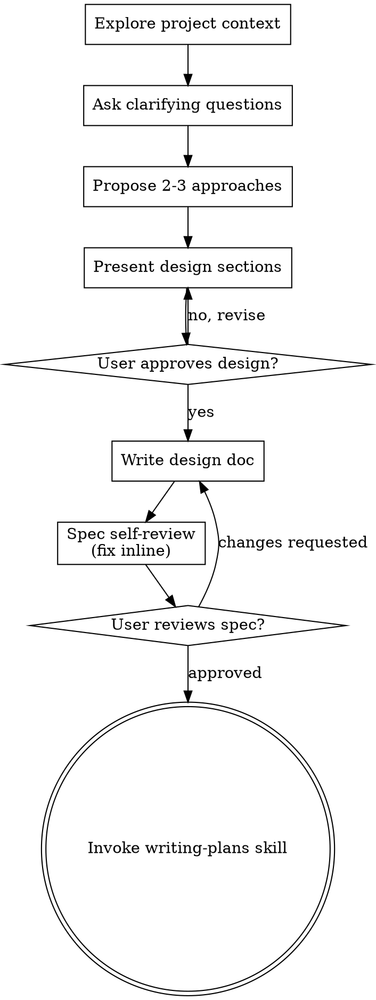

OpenAI Codex v0.143.0
--------
workdir: /home/rob/bpm-pizza-vibecoding-solution
model: gpt-5.4
provider: openai
approval: never
sandbox: read-only
reasoning effort: medium
reasoning summaries: none
session id: 019fbcfc-51b5-71d1-90b2-22be46ead598
--------
user
You are the oracle and devil's advocate for the project specified in SPEC.md (current working directory; read it). The operator wants ONE new capability specified: a returning customer's street can be looked up, so the agent does not ask for the address again. Task: discuss and harden the implementer's proposed SPEC changes BEFORE they are written. Spec text only — no plan, no code will follow yet. The spec must stay self-contained (readable by a fresh developer in an empty repo).

Verified live API fact: GET /pizzerias/{id}/customers (auth X-API-Key) returns customers[] with {id, first_name, street_one, street_two, created_at, deleted_at}; customers are unique per pizzeria by first name.

PROPOSED SPEC CHANGES (attack, improve, or replace):
1. API contract facts: add the customers endpoint fact above.
2. Tools table: add a ninth tool `lookup_customer` — parameters {first_name}; returns {known: bool, street_on_file: bool} plus the usual full-state snapshot. Deliberately does NOT return the street text to the model.
3. Behaviour: when the customer gives a first name, the agent calls lookup_customer; if a street is on file it asks "Soll ich wieder an Ihre gespeicherte Adresse liefern?" WITHOUT reciting the address; on yes, set_customer gains an optional {use_saved_street: true} mode where the CODE copies street_one/street_two from the customer record into the order — the address text never passes through the model or the transcript.
   Rationale (privacy): first names are the only key; anyone claiming "Ich heiße Marko" would otherwise get Marko's address read aloud in an open web chat. Confirm-without-disclosure keeps the convenience without turning the agent into an address oracle.
4. Conversation policy: known name + saved street -> one confirmation question; declined or unknown -> ask for the street as today. Lookup failure (API error) is non-fatal: fall back to asking.
5. Scope In gains "returning customers: saved street reusable after confirmation"; Decisions deferred keeps "the usual" (order memory) deferred — this change covers the address only.
6. Testing: tool-level tests for lookup (known/unknown/api-error) and for use_saved_street copying in code; one golden transcript variant.

Questions for you:
a) Is confirm-without-disclosure the right call, or is it overengineered for a demo (the operator's own tests typed the address openly)? Note the operator's instruction is simply "the street must be look-up-able" — decide the privacy stance and be decisive.
b) Is piggybacking on set_customer (use_saved_street flag) better or worse than lookup_customer returning the street text to the model? Consider "the model never holds data it does not need" vs. tool-contract simplicity.
c) Any contradictions with existing spec sections (fixed tool table wording, "Persisting customer data" Out-item, ghost-customer warnings, read-back contract — should the read-back show the street when it was code-copied)?
d) What exact wording/rows would you add or change — keep it minimal, list per section.

Answer decisively in <=40 lines; end with DECISION: a numbered list of the exact spec edits to make.

codex
I’m reading the project spec and the required skill instructions first, then I’ll pressure-test the proposed change against the existing contract and answer with exact spec wording changes only.
exec
/bin/bash -lc "sed -n '1,220p' /home/rob/.agents/skills/using-superpowers/SKILL.md" in /home/rob/bpm-pizza-vibecoding-solution
exec
/bin/bash -lc "sed -n '1,260p' /home/rob/.agents/skills/brainstorming/SKILL.md" in /home/rob/bpm-pizza-vibecoding-solution
exec
/bin/bash -lc "sed -n '1,260p' SPEC.md" in /home/rob/bpm-pizza-vibecoding-solution
 succeeded in 119ms:
---
name: using-superpowers
description: Use when starting any conversation - establishes how to find and use skills, requiring skill invocation before ANY response including clarifying questions
---

<SUBAGENT-STOP>
If you were dispatched as a subagent to execute a specific task, ignore this skill.
</SUBAGENT-STOP>

<EXTREMELY-IMPORTANT>
If you think there is even a 1% chance a skill might apply to what you are doing, you ABSOLUTELY MUST invoke the skill.

IF A SKILL APPLIES TO YOUR TASK, YOU DO NOT HAVE A CHOICE. YOU MUST USE IT.

This is not negotiable. You cannot rationalize your way out of this.
</EXTREMELY-IMPORTANT>

## The Rule

**Invoke relevant or requested skills BEFORE any response or action** — including clarifying questions, exploring the codebase, or checking files. If it turns out wrong for the situation, you don't have to use it.

**Before entering plan mode:** if you haven't already brainstormed, invoke the brainstorming skill first.

Then announce "Using [skill] to [purpose]" and follow the skill exactly. If it has a checklist, create a todo per item.

## Skill Priority

When multiple skills apply, process skills come first — they set the approach, then implementation skills (frontend-design, etc.) carry it out. Brainstorming and systematic-debugging are Superpowers' most common process skills, but the rule holds for any of them.

- "Let's build X" → superpowers:brainstorming first, then implementation skills.
- "Fix this bug" → superpowers:systematic-debugging first, then domain skills.

## Red Flags

These thoughts mean STOP—you're rationalizing:

| Thought | Reality |
|---------|---------|
| "This is just a simple question" | Questions are tasks. Check for skills. |
| "I need more context first" | Skill check comes BEFORE clarifying questions. |
| "Let me explore the codebase first" | Skills tell you HOW to explore. Check first. |
| "I can check git/files quickly" | Files lack conversation context. Check for skills. |
| "Let me gather information first" | Skills tell you HOW to gather information. |
| "This doesn't need a formal skill" | If a skill exists, use it. |
| "I remember this skill" | Skills evolve. Read current version. |
| "This doesn't count as a task" | Action = task. Check for skills. |
| "The skill is overkill" | Simple things become complex. Use it. |
| "I'll just do this one thing first" | Check BEFORE doing anything. |
| "This feels productive" | Undisciplined action wastes time. Skills prevent this. |
| "I know what that means" | Knowing the concept ≠ using the skill. Invoke it. |

## Platform Adaptation

If your harness appears here, read its reference file for special instructions:

- Codex: `references/codex-tools.md`
- Pi: `references/pi-tools.md`
- Antigravity: `references/antigravity-tools.md`

## User Instructions

User instructions (CLAUDE.md, AGENTS.md, GEMINI.md, etc, direct requests) take precedence over skills, which in turn override default behavior. Only skip skill workflows or instructions when your human partner has explicitly told you to.

 succeeded in 150ms:
---
name: brainstorming
description: "You MUST use this before any creative work - creating features, building components, adding functionality, or modifying behavior. Explores user intent, requirements and design before implementation."
---

# Brainstorming Ideas Into Designs

Help turn ideas into fully formed designs and specs through natural collaborative dialogue.

Start by understanding the current project context, then ask questions one at a time to refine the idea. Once you understand what you're building, present the design and get user approval.

<HARD-GATE>
Do NOT invoke any implementation skill, write any code, scaffold any project, or take any implementation action until you have presented a design and the user has approved it. This applies to EVERY project regardless of perceived simplicity.
</HARD-GATE>

## Anti-Pattern: "This Is Too Simple To Need A Design"

Every project goes through this process. A todo list, a single-function utility, a config change — all of them. "Simple" projects are where unexamined assumptions cause the most wasted work. The design can be short (a few sentences for truly simple projects), but you MUST present it and get approval.

## Checklist

You MUST create a task for each of these items and complete them in order:

1. **Explore project context** — check files, docs, recent commits
2. **Offer the visual companion just-in-time** — NOT upfront. The first time a question would genuinely be clearer shown than described, offer it then (its own message); on approval its browser tab opens for you. If no visual question ever arises, never offer it. See the Visual Companion section below.
3. **Ask clarifying questions** — one at a time, understand purpose/constraints/success criteria
4. **Propose 2-3 approaches** — with trade-offs and your recommendation
5. **Present design** — in sections scaled to their complexity, get user approval after each section
6. **Write design doc** — save to `docs/superpowers/specs/YYYY-MM-DD-<topic>-design.md` and commit
7. **Spec self-review** — quick inline check for placeholders, contradictions, ambiguity, scope (see below)
8. **User reviews written spec** — ask user to review the spec file before proceeding
9. **Transition to implementation** — invoke writing-plans skill to create implementation plan

## Process Flow



**The terminal state is invoking writing-plans.** Do NOT invoke frontend-design, mcp-builder, or any other implementation skill. The ONLY skill you invoke after brainstorming is writing-plans.

## The Process

**Understanding the idea:**

- Check out the current project state first (files, docs, recent commits)
- Before asking detailed questions, assess scope: if the request describes multiple independent subsystems (e.g., "build a platform with chat, file storage, billing, and analytics"), flag this immediately. Don't spend questions refining details of a project that needs to be decomposed first.
- If the project is too large for a single spec, help the user decompose into sub-projects: what are the independent pieces, how do they relate, what order should they be built? Then brainstorm the first sub-project through the normal design flow. Each sub-project gets its own spec → plan → implementation cycle.
- For appropriately-scoped projects, ask questions one at a time to refine the idea
- Prefer multiple choice questions when possible, but open-ended is fine too
- Only one question per message - if a topic needs more exploration, break it into multiple questions
- Focus on understanding: purpose, constraints, success criteria

**Exploring approaches:**

- Propose 2-3 different approaches with trade-offs
- Present options conversationally with your recommendation and reasoning
- Lead with your recommended option and explain why
- YAGNI ruthlessly - remove unnecessary features from every approach and design

**Presenting the design:**

- Once you believe you understand what you're building, present the design
- Scale each section to its complexity: a few sentences if straightforward, up to 200-300 words if nuanced
- Ask after each section whether it looks right so far
- Cover: architecture, components, data flow, error handling, testing
- Be ready to go back and clarify if something doesn't make sense

**Design for isolation and clarity:**

- Break the system into smaller units that each have one clear purpose, communicate through well-defined interfaces, and can be understood and tested independently
- For each unit, you should be able to answer: what does it do, how do you use it, and what does it depend on?
- Can someone understand what a unit does without reading its internals? Can you change the internals without breaking consumers? If not, the boundaries need work.
- Smaller, well-bounded units are also easier for you to work with - you reason better about code you can hold in context at once, and your edits are more reliable when files are focused. When a file grows large, that's often a signal that it's doing too much.

**Working in existing codebases:**

- Explore the current structure before proposing changes. Follow existing patterns.
- Where existing code has problems that affect the work (e.g., a file that's grown too large, unclear boundaries, tangled responsibilities), include targeted improvements as part of the design - the way a good developer improves code they're working in.
- Don't propose unrelated refactoring. Stay focused on what serves the current goal.

## After the Design

**Documentation:**

- Write the validated design (spec) to `docs/superpowers/specs/YYYY-MM-DD-<topic>-design.md`
  - (User preferences for spec location override this default)
- Use elements-of-style:writing-clearly-and-concisely skill if available
- Commit the design document to git

**Spec Self-Review:**
After writing the spec document, look at it with fresh eyes:

1. **Placeholder scan:** Any "TBD", "TODO", incomplete sections, or vague requirements? Fix them.
2. **Internal consistency:** Do any sections contradict each other? Does the architecture match the feature descriptions?
3. **Scope check:** Is this focused enough for a single implementation plan, or does it need decomposition?
4. **Ambiguity check:** Could any requirement be interpreted two different ways? If so, pick one and make it explicit.

Fix any issues inline. No need to re-review — just fix and move on.

**User Review Gate:**
After the spec review loop passes, ask the user to review the written spec before proceeding:

> "Spec written and committed to `<path>`. Please review it and let me know if you want to make any changes before we start writing out the implementation plan."

Wait for the user's response. If they request changes, make them and re-run the spec review loop. Only proceed once the user approves.

**Implementation:**

- Invoke the writing-plans skill to create a detailed implementation plan
- Do NOT invoke any other skill. writing-plans is the next step.

## Visual Companion

A browser-based companion for showing mockups, diagrams, and visual options during brainstorming. Available as a tool — not a mode. Accepting the companion means it's available for questions that benefit from visual treatment; it does NOT mean every question goes through the browser.

**Offering the companion (just-in-time):** Do NOT offer it upfront. Wait until a question would genuinely be clearer shown than told — a real mockup / layout / diagram question, not merely a UI *topic*. The first time that happens, offer it then, as its own message:
> "This next part might be easier if I show you — I can put together mockups, diagrams, and comparisons in a browser tab as we go. It's still new and can be token-intensive. Want me to? I'll open it for you."

**This offer MUST be its own message.** Only the offer — no clarifying question, summary, or other content. Wait for the user's response. If they accept, start the server with `--open` so their browser opens to the first screen automatically. If they decline, continue text-only and don't offer again unless they raise it.

**Per-question decision:** Even after the user accepts, decide FOR EACH QUESTION whether to use the browser or the terminal. The test: **would the user understand this better by seeing it than reading it?**

- **Use the browser** for content that IS visual — mockups, wireframes, layout comparisons, architecture diagrams, side-by-side visual designs
- **Use the terminal** for content that is text — requirements questions, conceptual choices, tradeoff lists, A/B/C/D text options, scope decisions

A question about a UI topic is not automatically a visual question. "What does personality mean in this context?" is a conceptual question — use the terminal. "Which wizard layout works better?" is a visual question — use the browser.

If they agree to the companion, read the detailed guide before proceeding:
`skills/brainstorming/visual-companion.md`

 succeeded in 155ms:
# PizzaSim Ordering Agent — Specification

> Hand this to a coding agent as the entire task:
> `FOLLOW INSTRUCTIONS PRECISELY AT "SPEC.MD"`.
> This file is the source of truth for what the product is. Everything else in
> the repo — code, tests, prompts, tickets — derives from it.

---

## Where this format comes from

The **shape** of this document is not ours. It is borrowed from Cedric Mössner —
**The Morpheus** ([youtube.com/@TheMorpheusTutorials](https://www.youtube.com/@TheMorpheusTutorials)),
who writes exactly one `SPEC.md` per project and hands the identical file to
every new model in order to compare them. The prompt he sends alongside it is a
single line — `FOLLOW INSTRUCTIONS PRECISELY AT "SPEC.MD"` — which is why that
line, and not a long prompt, stands at the top of this file.

Sections adopted from his specs: *Soul*, *The One Load-Bearing Idea*, hard
*Scope In / Out*, an explicit autonomy clause, work *in passes* with
verification after each, a file-level *Deliverables* list, *Decisions Locked /
Deferred*, and the one-hour *ticket sizing rules*.

Reference specs:
[morphcook](https://github.com/TheMorpheus407/morphcook) — offline Flutter
recipe app; one spec, seven model implementations.
[hogwarts-blender-benchmark](https://github.com/TheMorpheus407/hogwarts-blender-benchmark)
— fully procedural Blender build; `prompt.txt` plus `SPEC.md`.

The content below is ours. The form is his — with thanks.

---

## What done looks like

There is exactly one success condition, and everything else in this document
exists to serve it:

**A customer talks to the agent, and the resulting order appears in the API
under the pizzeria they chose — with the right customer, the right items, the
right quantities.**

Concretely, and this is the acceptance criterion:

1. `POST /pizzerias/{id}/orders` returned an order id.
2. Reading that pizzeria's orders back shows the order, and it is visible on
   that pizzeria's dashboard.
3. The customer name is the one the customer gave.
4. The items and quantities are the ones that were read back and confirmed —
   not a superset, not a subset, not a near match on the item code.

Nothing else counts as done. A green test suite, a clean architecture, a
pleasant interface: none of it is the product. **The order on the board is the
product.**

**Four failures that look like success**, each a failed run and not a partial
one:

- The order landed under a **different pizzeria** than the one the customer
  chose.
- A retry after a timeout created the order **twice**.
- A misheard or mistyped name created a **new customer** instead of matching
  the intended one.
- The order was submitted **without the customer confirming** the read-back.

Every rule below — the state machine, the revision-bound confirmation, the ban
on blind retries, the name read-back, the tenant in the URL path — exists to
prevent exactly one of those four.

---

## Soul

Ordering food by phone works because the person on the other end keeps the
order in their head, reads it back to you, and only then walks to the kitchen.
Nothing is cooked before you said yes.

Most LLM ordering demos invert this. The model holds the order in its context,
guesses item names that sound close enough, and fires the write call the moment
it feels confident. It works in the demo and fails on the fourth turn, in a
noisy room, when the customer changes their mind.

This agent puts the order back where it belongs: **in the code**. The model
does the one thing it is genuinely good at — turning messy human speech into
intent — and nothing else. It never holds the cart, never invents a menu item,
and never reaches the kitchen without a confirmed read-back.

**Core belief:** a language model is a great waiter and a terrible order pad.

---

## The One Load-Bearing Idea

**The order is a state machine owned by the code. The model only speaks.**

- Exactly one `Order` object per conversation, held by the runtime.
- The model cannot write to it directly. It calls tools that request a
  transition, and every transition is validated before it is applied.
- Every item code is validated against the **live menu**. An unknown code is a
  tool error carrying candidate matches — never a silent guess, never a
  fallback to a hardcoded list.
- `submit_order` is the only network write, legal in exactly one state:
  `CONFIRMED`. The only way into `CONFIRMED` is a read-back the customer
  answered yes to.
- One core serves every channel. A transport carries words in and words out;
  it owns no order logic whatsoever.

This one rule replaces prompt-engineering the model into good behaviour. If the
model misbehaves, the state machine refuses — and the refusal is a tool result
the model must deal with in front of the customer.

---

## Scope

### In

- **Two transports over one core:**
  - `cli` — interactive terminal chat.
  - `web` — FastAPI server on port 8888, browser chat UI, streaming the
    agent's intermediate steps as newline-delimited JSON so tool calls and
    tool results are visible, not just the final answer.
- **Speech on the web transport**, served by a self-hosted CPU-only speech
  container over HTTP. See *Speech*.
- **Several pizzerias.** The customer chooses which one they are ordering
  from, and can change it. `PIZZERIA_ID` is the preselection, not a
  restriction.
- **Languages:** German and English. The agent answers in the language the
  customer used, per turn, without being told to switch.
- **Menu, prices, cart, customer, submit.** The full happy path plus
  correction ("no, make that three"), removal, and abandonment. The customer
  can ask what is on offer and what items cost, and sees what the basket
  comes to before confirming.
- **Deterministic tests** that run with no network and no LLM, plus one live
  acceptance test and a browser end-to-end test.
- **Structured logging** of every turn: user text, model tool calls, tool
  results, state transitions. One line per event, JSON, to a file.

### Out (explicitly)

- Payment and anything financial beyond showing prices the API supplies.
- Delivery routing, or an ETA of our own invention.
- Accounts, auth, sessions surviving a process restart.
- Modifying or cancelling an order after it was submitted.
- Any regex or keyword parser that produces an order without the model.
  See **Anti-patterns**; this is a hard ban, not a style preference.
- Reading the whole menu aloud when the answer will be spoken.
- Persisting customer data anywhere beyond the process and the PizzaSim API.

---

## Environment and configuration

All configuration comes from environment variables. Load `~/.env` if present;
never write to it, never create it, never print a value.

| Variable | Purpose |
|---|---|
| `LITELLM_PIZZA_URL` | OpenAI-compatible gateway base URL (`/chat/completions` appended) |
| `LITELLM_PIZZA_KEY` | Bearer token for the gateway |
| `LITELLM_PIZZA_MODEL_1` | Model the ordering agent calls; required, no default in code |
| `LITELLM_PIZZA_MODEL_2` | Second configured model, where the build uses one |
| `PIZZASIM_URL` | PizzaSim API base URL; dashboard and docs links derive from it |
| `PIZZASIM_API_KEY` | Sent as header `X-API-Key` on protected routes |
| `PIZZERIA_ID` | UUID of the pizzeria preselected on first load |
| `PIZZERIA_LANG` | Initial language, `de` or `en`: the greeting, the CLI, and the web UI before the customer switches |
| `APP_VERSION` | Release version, `x.y.z`, shown in the footer |
| `SPEECH_URL` | Base URL of the self-hosted speech service (optional) |
| `SPEECH_STT_MODEL` | Transcription model id |
| `SPEECH_TTS_MODEL` | Synthesis model id |
| `SPEECH_TTS_VOICE` | Voice id |

Rules:

- **Nothing is hardcoded.** No UUID, no model name, no menu, no base URL, no
  vendor — not even as a fallback "just in case".
- Missing or empty required variable → exit before the first turn with a
  message naming the variable and the file it was expected in. Never start
  half-configured. `SPEECH_*` are the exception: absent means the speech
  features are not rendered, and everything else works.
- Secrets never appear in logs, transcripts, error messages or the web UI.

---

## The PizzaSim API (contract)

Facts below are **verified** — against running code or a live response. A
verified fact never moves back into the open list; the open list only shrinks.

| Call | Auth | Notes |
|---|---|---|
| `GET /menu` | public | returns `pizzas[]` and `pasta[]`, each with `code` |
| `GET /pizzerias` | `X-API-Key` | list of pizzerias with `id`, `name` |
| `GET /pizzerias/{id}/orders` | `X-API-Key` | that pizzeria's orders; used by timeout recovery |
| `POST /pizzerias/{id}/orders` | `X-API-Key` | places the order |
| `GET /location?street=…` | public | street plausibility check (optional tool) |

Order request body:

```json
{
  "customer": { "first_name": "Marco", "street_one": "via di Cantieri" },
  "items": [{ "type": "pizza", "code": "margherita", "qty": 2, "extras": [] }]
}
```

Response carries `order_id`, `status`, `eta_seconds`.

Derived URLs — built from `PIZZASIM_URL`, never hardcoded:

- Dashboard of a pizzeria: `{PIZZASIM_URL}/dashboard/pizzerias/{id}`
  (verified against the dashboard's routing code).
- API documentation: `{PIZZASIM_URL}/swagger.html` — there is **no** `/docs`.

Facts that shape behaviour:

- The tenant is **always** in the URL path, never in a header. The API key is
  a server key, not a pizzeria id.
- Customers are unique per pizzeria **by first name**. An unknown name
  silently creates a new customer — a misheard name creates a ghost. Speech
  input must therefore confirm the name explicitly.
- `street_one` is optional and **not** validated for deliverability. Asking
  for it is a policy of this agent — never claim to have checked an address.
- `POST /orders` is **not** idempotent. A retry after a timeout can double a
  real order. See **Error handling**.

Further verified facts (live responses, 2026-07-31/08-01):

- **Menu item shape:** `{"code", "name", "base": [ingredients], "price"}`.
  `price` is a number in euros — the source for every price answer and the
  basket total; no other financial data exists in the API. `name` is a
  single string (identical in DE and EN; there are no per-language names).
  The menu response also carries a top-level `toppings[]` array.
- **`extras[]` is a controlled vocabulary:** the `toppings[]` from
  `GET /menu`. The server rejects unknown extras with `422`
  (`"items[0].extras contains invalid topping 'unicorn_dust'"`); the tool
  layer validates extras against `toppings[]` exactly like item codes.
- **Error bodies are machine-readable:**
  `{"error": "<code>", "details": ["<human sentence>", ...]}` (e.g.
  `validation_failed` with HTTP 422) — mapped to typed errors; `details`
  may feed targeted questions.
- **Status values observed:** `ordered` → `prepared_planned` → `delivered`
  (with `delivered_at` set on the last). A fresh order starts as `ordered`.
- **`GET /location?street=` returns** `{"street": "<echo>",
  "deliverable": <bool>}`, HTTP 200 — `deliverable: true` even for nonsense
  input, so it is a weak plausibility signal at best: never tell the
  customer an address was verified.
- **The list endpoint carries no items.** The detail endpoint
  `GET /pizzerias/{id}/orders/{order_id}` (auth: `X-API-Key`) returns the
  full order incl. `customer` and `items[]`. Submit-timeout recovery
  shortlists by `first_name` + `created_at` recency on the list, then
  verifies the candidate's items via the detail endpoint before adopting
  it; the live acceptance test asserts items and quantities through the
  same detail endpoint.
- **Item codes are unique per type, not globally** — `tonno` exists as a
  pizza and a pasta. Validation and removal always key on `(type, code)`.

### Open contract questions — shrink-only

Resolve against the live API before the affected component is implemented,

codex
I have the top half of `SPEC.md`; I’m pulling the tool contract and behavior sections now so I can check for contradictions instead of answering from assumptions.
exec
/bin/bash -lc "sed -n '261,520p' SPEC.md" in /home/rob/bpm-pizza-vibecoding-solution
 succeeded in 0ms:
then move the answer up into the facts and delete the question. Never guess.
A verified fact never returns here.

*(empty — all previous questions were resolved against the live API and
moved into the facts above)*

---

## Order state machine

```
EMPTY ──add_items──▶ COLLECTING ──set_customer──▶ READY
  ▲                      │  ▲                       │
  └──remove last item────┘  └───add/remove/edit─────┘
                                                    │ read_back + customer says yes
                                                    ▼
                                               CONFIRMED ──submit_order──▶ SUBMITTED
                                                    │
                                                    └──any change──▶ back to READY
```

Invariants, all enforced in code and all covered by unit tests:

1. `submit_order` outside `CONFIRMED` returns an error. It does not
   "helpfully" confirm on the model's behalf.
2. Any mutation after `CONFIRMED` drops the order back to `READY`. A
   confirmation applies to the basket that was read back, not to a later one.
3. `CONFIRMED` is reachable only via `confirm_order`, which is only legal
   after `read_back` for the current basket revision. The basket carries a
   revision counter; `confirm_order` must name it.
4. `SUBMITTED` is terminal. The conversation may continue; the order may not.
5. An item enters the basket only with a `code` present in the menu snapshot
   fetched this session.
6. A basket never crosses a tenant boundary. Changing pizzeria starts a fresh
   conversation and a fresh order.

---

## Tools

The model sees exactly these. Names, parameters and semantics are fixed.

| Tool | Parameters | Returns |
|---|---|---|
| `get_menu` | — | pizzas and pasta with codes, display names, prices |
| `add_items` | `items[]` of `{type, code, qty, extras[]}` | new basket + revision |
| `remove_item` | `code`, `type`, optional `qty` | new basket + revision |
| `set_customer` | `first_name`, optional `street_one` | customer as stored |
| `read_back` | — | basket, customer, revision, and the code-computed basket total — the text the agent reads out |
| `confirm_order` | `revision` | state `CONFIRMED`, or error if stale |
| `submit_order` | — | `order_id`, `status`, `eta_seconds` |
| `check_street` | `street` | plausibility result (optional) |

Tool result conventions:

- Success: the **full current state**, not a diff. The model never
  reconstructs the basket from history.
- Failure: `{"error": {"code": "...", "message": "...", "candidates": [...]}}`.
  `message` is written so it can be spoken to the customer as-is.
- `add_items` with an unknown code returns `unknown_item` plus up to three
  candidates from the menu. The model asks; it does not pick.
- Quantities are integers. A tool receiving `"zwei"` returns
  `invalid_quantity`; it does not parse German.
- **Totals are computed in code**, from the API prices captured in the
  session's menu snapshot. The model never does arithmetic on prices; the
  web basket shows the same code-owned total that `read_back` carries.
- `remove_item` parameters are fixed, so when several basket lines share
  `(type, code)` with different `extras[]`, the semantics are
  deterministic: without `qty` every matching line is removed; with `qty`
  the most recently added matching line is reduced.

---

## Conversation policy

This is what the system prompt must produce. Write the prompt to achieve it;
do not paste this section into it verbatim.

- Greet first, in the session language, and offer help — one sentence, not a
  menu recital.

**Language authority — one rule.** The session language starts as
`PIZZERIA_LANG` (greeting, CLI, web UI chrome before any switch). The web
header switch changes the session language: UI chrome, the greeting of a
fresh conversation, and the speech hint (STT language, TTS output). For the
agent's replies, per-turn mirroring wins: it answers in the language of the
customer's latest message, even when that differs from the session language.
The CLI has no switch and stays at `PIZZERIA_LANG`.
- **One question per turn.** Never stack "name, street and what would you
  like?"
- Never state a menu item or a price that did not come from `get_menu` in this
  session. Price questions are normal questions, and so is "what does my
  basket come to?"
- Collect first name and street. If the customer declines the street, accept
  it — it is optional in the API.
- Before submitting: call `read_back`, present it, and wait for an explicit
  yes. "Mhm" and silence are not a yes; ask once more, then offer to start
  over.
- Never announce that an order was placed before `submit_order` returned an
  `order_id`.
- On success, state the order id in a form a human can repeat back, and the
  wait time in **minutes**, converted from `eta_seconds`.
- On error, explain in plain language what happened and what the options are.
  Never show a status code, stack trace or JSON.
- Never claim to have checked an address for deliverability.

---

## The web channel

The web UI is where a stranger decides whether this thing works. Everything
below is required, and each line is written so it can be checked by looking at
the page.

### The conversation

Type or paste a message, get an answer. The exchange a first-time customer
should be able to have, end to end, without help:

> *What have you got?* → *What does a Margherita cost?* → *I'll take two of
> those and a pasta* → *I'm a new customer, my name is …* → read-back →
> confirm → order id and wait time.

After a completed order, a new conversation can start immediately from the
same page.

### Header

- **The pizzeria being ordered from, by name**, prominent and always visible.
- **A selector to change pizzeria, filled from the API and from nowhere
  else.** The list comes from `GET /pizzerias` at load time. No hardcoded
  names, no bundled list, no fallback entry when the call fails — if it
  fails, the page says the list is unavailable instead of offering a choice
  it cannot honour. Each entry shows the name plus a short form of its UUID
  so similar names can be told apart. Changing the selection starts a fresh
  conversation for that pizzeria.
- **A link to that pizzeria's dashboard**
  (`{PIZZASIM_URL}/dashboard/pizzerias/{id}`), opening in a new tab. Without
  it nobody can check whether the order arrived — and checking that is the
  entire point of the product.
- **Language: German or English**, switchable, applied to the agent's replies
  and to speech in both directions.
- **Start over**, clearing the session and the basket.

### Footer

- **The running version**, `x.y.z`, from `APP_VERSION`, raised on every
  release: patch for fixes, minor for new behaviour, major for a break.
  Without it nobody can tell which build is answering.
- **The full pizzeria UUID**, selectable, for pasting into API calls.
- **Connection state** for the ordering API and the model gateway.
- **A link to the API documentation** (`{PIZZASIM_URL}/swagger.html`).

### Every message gets an answer

The invariant this channel stands on: **no sent message may end without either
a rendered assistant reply or a rendered error.** Never a silent failure,
never an indicator that stops with nothing after it.

- The moment a message is sent, the UI shows the agent is working.
- Intermediate steps render as they stream — which tool was called and what it
  returned — visually distinct from the assistant's words. A stream whose tool
  events the page discards is a defect: the customer sees a frozen screen
  while the agent works normally.
- If the stream ends without a final assistant message, the UI says so.
- If the request errors, times out, or the connection drops, the UI says which
  happened and offers to resend.
- Errors in the customer's language, in plain words. No status codes, no
  tracebacks, no raw JSON.

### The order on screen

- The current basket is visible, with quantities and what it comes to. The
  code owns the order; the customer must see what the code holds.
- The read-back is visually distinct and carries an explicit confirm control.
  Confirmation is an action the customer takes, not a word the agent claims to
  have heard.
- On success: the order id, readable, and the wait in minutes.
- After submission the basket is locked and shown as submitted. Nothing on the
  page can modify or resubmit it.

---

## Speech

Speech is an input and an output method on the web channel, served by a
**self-hosted speech service**: CPU-only, in its own container, reached over
plain HTTP with an OpenAI-compatible surface.

| Direction | Endpoint | Payload |
|---|---|---|
| STT | `POST {SPEECH_URL}/v1/audio/transcriptions` | multipart audio + model + language |
| TTS | `POST {SPEECH_URL}/v1/audio/speech` | JSON: model, voice, input text → audio |

- **The speech service is the only speech path.** No external speech
  provider, no hosted realtime framework, no audio through the LLM gateway —
  that gateway carries chat completions only.
- **The browser captures and plays audio; it does not recognise or synthesise
  it.** Capture via `getUserMedia` and `MediaRecorder`, playback via a plain
  audio element — cross-browser and cross-platform: Firefox, Safari, Chrome,
  on Linux, macOS and Windows alike.
- **The browser speech APIs are forbidden.** `SpeechRecognition` and
  `speechSynthesis` tied the previous implementation to a single browser
  vendor and sent customer audio to a third party. The self-hosted service
  exists to replace them.
- **Nothing about the speech stack is written into source.** Base URL, models
  and voice come from the environment, exactly like the chat model; the
  language sent with STT/TTS requests is the session language (see
  *Language authority* under Conversation policy), not a separate config.
- **Request/response, not streaming.** Record, upload, transcript back.
  Latency is visible and acceptable; do not build partial results, barge-in
  or turn detection on top — this transport cannot do them, and pretending
  otherwise produces a broken feel.
- **Push-to-talk.** The microphone starts and stops on the customer's action,
  never listens continuously. Recording state is visible at all times.
- **Synthesis is optional and off by default**, toggled by the customer,
  applied only to the final assistant message.
- **Speech is never required.** With `SPEECH_URL` unset or the service down,
  microphone and speaker toggle are not rendered and the text UI is fully
  usable. A speech failure is never an order failure.
- **Speech shortens answers, it does not change them.** Same core, same
  tools, same state machine. When a reply will be spoken: at most three menu
  items plus an invitation, times in minutes, order id read in groups.
- **Confirm the name.** Transcription errors on names are the expensive
  failure: a misheard name silently creates a customer nobody will find
  again. Read the name back before submitting.

---

## Error handling

Every case below needs a test and a phrasing.

| Situation | Code does | Customer sees/hears |
|---|---|---|
| Gateway timeout | one retry, then abort turn | plain apology, offer to resend |
| `401`/`403` from PizzaSim | abort, log, do not retry | "I can't reach the kitchen system right now" |
| `404` on the preselected `PIZZERIA_ID` | fail at startup, not mid-call | — (process refuses to start) |
| Runtime pizzeria selection invalid/gone | session error, refresh the selector; process stays up | "that pizzeria isn't available right now" |
| `422` validation | surface field, keep basket | targeted question about the offending item |
| `5xx` on submit | **no blind retry** | "I'm not sure that went through — let me check" |
| Timeout on submit | mark `UNKNOWN`; shortlist via `GET /pizzerias/{id}/orders`, verify items via `GET /pizzerias/{id}/orders/{order_id}` before any retry | as above |
| Unknown item code | `unknown_item` + candidates | "I have Margherita or Marinara — which one?" |
| Empty basket at submit | reject transition | "What can I get you?" |
| Menu fetch fails at start | fail fast | "We're not taking orders right now" |
| Pizzeria list fetch fails | no selector, say so | list unavailable — no fallback entry |
| Speech service down | hide speech controls | text UI unaffected |

The submit-timeout case is the one that matters: a blind retry doubles a real
order. Recovery: shortlist candidates on the pizzeria's order list, then
verify the candidate's items via `GET /pizzerias/{id}/orders/{order_id}` —
only a verified match is adopted, anything else allows exactly one retry. If
list or detail lookup fails, tell the customer honestly.

---

## Anti-patterns — explicitly forbidden

Each of these was present in a previous implementation. None is a matter of
taste.

exec
/bin/bash -lc "sed -n '1,220p' /home/rob/.agents/skills/using-superpowers/references/codex-tools.md" in /home/rob/bpm-pizza-vibecoding-solution
 succeeded in 0ms:
## Subagent dispatch requires multi-agent support

Add to your Codex config (`~/.codex/config.toml`):

```toml
[features]
multi_agent = true
```

This enables `spawn_agent`, `wait_agent`, and `close_agent` for skills like `dispatching-parallel-agents` and `subagent-driven-development`. When using subagent-driven-development, close reviewer subagents when their review returns. Keep each implementer subagent open until its task's review passes — the fix loop resumes the implementer — then close it. If your harness cannot send another message to a spawned agent, dispatch each fix round as a fresh implementer carrying the brief, the report file, and the findings.

## Environment Detection

Skills that create worktrees or finish branches should detect their
environment with read-only git commands before proceeding:

```bash
GIT_DIR=$(cd "$(git rev-parse --git-dir)" 2>/dev/null && pwd -P)
GIT_COMMON=$(cd "$(git rev-parse --git-common-dir)" 2>/dev/null && pwd -P)
BRANCH=$(git branch --show-current)
```

- `GIT_DIR != GIT_COMMON` → already in a linked worktree (skip creation)
- `BRANCH` empty → detached HEAD (cannot branch/push/PR from sandbox)

See `using-git-worktrees` Step 0 and `finishing-a-development-branch`
Step 1 for how each skill uses these signals.

## Codex App Finishing

When the sandbox blocks branch/push operations (detached HEAD in an
externally managed worktree), the agent commits all work and informs
the user to use the App's native controls:

- **"Create branch"** — names the branch, then commit/push/PR via App UI
- **"Hand off to local"** — transfers work to the user's local checkout

The agent can still run tests, stage files, and output suggested branch
names, commit messages, and PR descriptions for the user to copy.

codex
I’ve got the relevant contract and policy sections. I’m checking the rest for references to customer persistence, read-back wording, and any tool-table language that would make the proposal internally inconsistent.
exec
/bin/bash -lc 'rg -n "Persisting customer data|ghost|read-back|read_back|set_customer|tool|customer data|street_one|street_two|customer" SPEC.md' in /home/rob/bpm-pizza-vibecoding-solution
 succeeded in 0ms:
39:**A customer talks to the agent, and the resulting order appears in the API
40:under the pizzeria they chose — with the right customer, the right items, the
48:3. The customer name is the one the customer gave.
59:- The order landed under a **different pizzeria** than the one the customer
62:- A misheard or mistyped name created a **new customer** instead of matching
64:- The order was submitted **without the customer confirming** the read-back.
67:on blind retries, the name read-back, the tenant in the URL path — exists to
81:noisy room, when the customer changes their mind.
86:and never reaches the kitchen without a confirmed read-back.
97:- The model cannot write to it directly. It calls tools that request a
100:  tool error carrying candidate matches — never a silent guess, never a
103:  `CONFIRMED`. The only way into `CONFIRMED` is a read-back the customer
109:model misbehaves, the state machine refuses — and the refusal is a tool result
110:the model must deal with in front of the customer.
121:    agent's intermediate steps as newline-delimited JSON so tool calls and
122:    tool results are visible, not just the final answer.
125:- **Several pizzerias.** The customer chooses which one they are ordering
129:  customer used, per turn, without being told to switch.
130:- **Menu, prices, cart, customer, submit.** The full happy path plus
131:  correction ("no, make that three"), removal, and abandonment. The customer
136:- **Structured logging** of every turn: user text, model tool calls, tool
148:- Persisting customer data anywhere beyond the process and the PizzaSim API.
166:| `PIZZERIA_LANG` | Initial language, `de` or `en`: the greeting, the CLI, and the web UI before the customer switches |
196:| `GET /location?street=…` | public | street plausibility check (optional tool) |
202:  "customer": { "first_name": "Marco", "street_one": "via di Cantieri" },
220:  silently creates a new customer — a misheard name creates a ghost. Speech
222:- `street_one` is optional and **not** validated for deliverability. Asking
236:  (`"items[0].extras contains invalid topping 'unicorn_dust'"`); the tool
247:  customer an address was verified.
250:  full order incl. `customer` and `items[]`. Submit-timeout recovery
272:EMPTY ──add_items──▶ COLLECTING ──set_customer──▶ READY
275:                                                    │ read_back + customer says yes
289:   after `read_back` for the current basket revision. The basket carries a
308:| `set_customer` | `first_name`, optional `street_one` | customer as stored |
309:| `read_back` | — | basket, customer, revision, and the code-computed basket total — the text the agent reads out |
319:  `message` is written so it can be spoken to the customer as-is.
322:- Quantities are integers. A tool receiving `"zwei"` returns
326:  web basket shows the same code-owned total that `read_back` carries.
347:customer's latest message, even when that differs from the session language.
354:- Collect first name and street. If the customer declines the street, accept
356:- Before submitting: call `read_back`, present it, and wait for an explicit
377:Type or paste a message, get an answer. The exchange a first-time customer
381:> those and a pasta* → *I'm a new customer, my name is …* → read-back →
421:- Intermediate steps render as they stream — which tool was called and what it
422:  returned — visually distinct from the assistant's words. A stream whose tool
423:  events the page discards is a defect: the customer sees a frozen screen
428:- Errors in the customer's language, in plain words. No status codes, no
434:  code owns the order; the customer must see what the code holds.
435:- The read-back is visually distinct and carries an explicit confirm control.
436:  Confirmation is an action the customer takes, not a word the agent claims to
464:  vendor and sent customer audio to a third party. The self-hosted service
474:- **Push-to-talk.** The microphone starts and stops on the customer's action,
476:- **Synthesis is optional and off by default**, toggled by the customer,
482:  tools, same state machine. When a reply will be spoken: at most three menu
485:  failure: a misheard name silently creates a customer nobody will find
513:list or detail lookup fails, tell the customer honestly.
524:   matches, and makes the tool-calling architecture decorative.
537:   the final message and threw tool events away — the customer watched a
549:  replaying fixed tool calls — happy path, correction, unknown item, customer
550:  changes mind after read-back, submit timeout. Assert final state and the
556:  customer never talks to `curl`. Include three failure paths: a tool error, a
561:  orders back — presence via `GET /pizzerias/{id}/orders`, customer, items
584:deliberately left out of this spec: tools are replaced long before the product
585:is. The roles and the protocol are binding; the tooling is not.
603:  customer: `LITELLM_PIZZA_MODEL_1` and `_2` from the environment.
648:1. **PLAN.** Write `PLAN.md`: file layout, tool schemas, state machine, agent
669:1. **Core.** Order model, state machine, tool layer, tests. No LLM, no
671:2. **Agent loop.** Model, tools, system prompt, one turn end to end.
699:│   ├── tools.py             ← tool schemas + dispatch
712:│   ├── test_tools.py
739:| Confirmation | Mandatory read-back tied to a basket revision |
743:| Errors | Typed in code, plain language to the customer |
748:| Build tooling | Not specified here; the operator picks it |

exec
/bin/bash -lc "sed -n '521,820p' SPEC.md" in /home/rob/bpm-pizza-vibecoding-solution
 succeeded in 0ms:

1. **A regex "fast path" that places an order without the model.** It bypasses
   confirmation, mis-parses quantities, duplicates items on overlapping
   matches, and makes the tool-calling architecture decorative.
2. **Shelling out to `curl` via `subprocess`.** Use an HTTP client: no shell
   quoting bugs, no injection surface, real timeouts, testable.
3. **Hardcoded pizzeria UUID or hardcoded menu fallback.** Both send orders to
   the wrong place while looking like they work. The same ban covers a
   fallback entry in the pizzeria selector.
4. **A system prompt that forbids confirmation** ("never ask if they're sure,
   always place the order immediately"). That is the bug, written down as a
   rule.
5. **Prompt shouting.** ALL-CAPS threats are what people write instead of
   enforcing the rule in code. The state machine enforces it; the prompt stays
   calm and short.
6. **A frontend that discards stream events.** The previous UI rendered only
   the final message and threw tool events away — the customer watched a
   frozen screen while the agent worked. Rendering the intermediate steps is
   part of the product, not a debug view.

---

## Testing

- **Unit:** the state machine, exhaustively. Every illegal transition has a
  test asserting it is refused.
- **Tool level:** against recorded API fixtures. No network, no LLM, fast.
- **Golden transcripts:** five scripted conversations against a stub model
  replaying fixed tool calls — happy path, correction, unknown item, customer
  changes mind after read-back, submit timeout. Assert final state and the
  calls actually made.
- **Browser end-to-end, not optional.** At least one test drives the real
  page in a headless browser — types a message, waits for a rendered reply,
  walks a full order to submission — asserting against the DOM, not the API.
  `curl` proves the server works and proves nothing about the product; the
  customer never talks to `curl`. Include three failure paths: a tool error, a
  stream ending without a final message, the gateway unreachable — each must
  leave a visible message on the page.
- **The acceptance test is live**, opt-in via env flag, the only test that
  touches the real API. Full conversation, submit, then read the pizzeria's
  orders back — presence via `GET /pizzerias/{id}/orders`, customer, items
  and quantities via `GET /pizzerias/{id}/orders/{order_id}` (the list
  endpoint carries no items and cannot verify them) — and assert the four
  points under *What done looks like*. If this fails, the product does not
  work, whatever else is green.
- **Speech**, manual: dictate an order, a name that needs correcting, a menu
  question — plus one run with `SPEECH_URL` unset, which must render a usable
  text-only UI and place an order normally.

---

## Who builds this — and who judges it

The build runs locally, on the operator's own subscriptions, with the most
capable models available. Two roles take part and they are **not**
interchangeable.

| Role | Permission |
|---|---|
| Implementer — one coding agent | writes every file |
| Reviewer / judge — a second, independent agent | read-only, never writes |

Which products and models fill these roles is the operator's decision and is
deliberately left out of this spec: tools are replaced long before the product
is. The roles and the protocol are binding; the tooling is not.

- **One implementer, and nothing else develops.** Every artefact in
  *Deliverables* comes from it. No second implementer, no hand-patched fixes
  between rounds.
- **The reviewer never writes the code it judges.** Read-only, two roles in
  one call: *devil's advocate* — attack the work, find gaps, wrong
  assumptions, missing error cases — and *judge*, scoring against the fixed
  rubric so quality is measurable across rounds instead of a vibe.
- **The reviewer is a different agent from the implementer.** Independence is
  the point; a model reviewing its own output is not a review.

### Two model domains, never mixed

- **Build-time models** power the harnesses. Configured outside this
  repository, none of this spec's business. Nothing in the deliverables
  reads, references, or depends on them.
- **Runtime models** are what the ordering agent calls while serving a
  customer: `LITELLM_PIZZA_MODEL_1` and `_2` from the environment.

Binding consequences:

- The implementer never wires the agent to whatever model the implementer
  itself runs on, and never copies a build-time model name into source,
  config, prompts, tests or docs.
- No model name of any kind is hardcoded. A missing runtime value is a
  startup failure, not a default.
- **Harness is not model.** Never ask an agent which model it is — a
  self-report is not evidence; the configuration is binding.
- Whatever the build runs on, it does not lower the bar. Do not simplify the
  design, skip a test, or accept a weaker answer on the assumption that the
  model behind you is limited.

### Review protocol

Reviewer calls are **stateless** — a fresh reviewer sees nothing of the
previous round, so every request carries its own context. Commit before each
review so the reviewer always sees a committed tree.

```
SCORES (1-5 each, 5 = best):
completeness: N
correctness: N
error_handling: N
simplicity: N
spec_compliance: N
TOTAL: N/25
VERDICT: APPROVED | CHANGES_REQUIRED
ISSUES: (max 5 bullets, concrete and actionable, empty if approved)
```

- `APPROVED` requires `TOTAL >= 20` **and** no dimension below 4. If the
  verdict line says approved but the scores miss that bar, **the numbers
  win**.
- Maximum 3 rounds per stage. Still not approved after round 3 → stop, show
  the scores and the open issues. A valid outcome, not a failure.
- Disagreeing is allowed — one-line rebuttal in the next request. Never
  ignore a finding silently.
- Every reviewer stdout goes into `reviews/`, every round's scores into
  `reviews/scores.md`, and `reviews/` is committed.

### Two stages, in this order

1. **PLAN.** Write `PLAN.md`: file layout, tool schemas, state machine, agent
   loop, error handling, conversation state. **No code.** Iterate with the
   reviewer until `APPROVED`. Implement nothing before that.
2. **IMPLEMENT.** Only after the plan is approved. Build exactly the approved
   plan, then iterate the diff with the reviewer until approved.

"Done" means the judge approved — not that the code runs. Working code that
fails the rubric is not done.

---

## How to work

This is an autonomous build. No clarifying questions will be answered and no
feedback arrives until you are done — every decision inside these constraints
is yours. Work in passes and verify after each; do not write the whole thing
and then run it once.

0. **Contracts.** Resolve the open contract questions against the live API,
   move the answers into the facts, commit. The open list only shrinks — a
   verified fact never becomes a question again.
1. **Core.** Order model, state machine, tool layer, tests. No LLM, no
   network. Pass when the unit tests are green.
2. **Agent loop.** Model, tools, system prompt, one turn end to end.
3. **CLI.** Full conversation, real API, an order visible on the dashboard.
4. **Web.** FastAPI on 8888, same core. Pass only when you have opened the
   page in a browser, switched pizzeria, asked a price question, placed an
   order through the page, and seen it on that pizzeria's dashboard — not
   when the endpoint answers `curl`.
5. **Speech.** Wire the speech service into the web UI, spoken-answer policy,
   and the degraded no-speech path.
6. **Harden.** Walk the error table, force each case, fix what breaks.

After each pass, review your own work as the reviewer who has to reject it:
what would a hostile reader find first? Fix that, then move on. Stop only when
a full pass over the spec finds nothing left that you know how to improve.

---

## Deliverables

```
.
├── SPEC.md                  ← this file
├── README.md                ← how to run each channel
├── PLAN.md                  ← written before any code, updated as you go
├── core/
│   ├── order.py             ← Order, basket, revision
│   ├── state.py             ← state machine, transitions, invariants
│   ├── menu.py              ← menu fetch, code validation, candidates
│   ├── pizzasim.py          ← API client, typed errors, timeouts
│   ├── tools.py             ← tool schemas + dispatch
│   └── agent.py             ← model loop, prompt assembly
├── channels/
│   ├── cli.py
│   ├── web.py               ← FastAPI, port 8888
│   ├── speech.py            ← speech service client
│   └── static/              ← web UI incl. speech input/output
├── prompts/
│   ├── system.de.md
│   └── system.en.md
├── tests/
│   ├── fixtures/            ← recorded API responses
│   ├── test_state.py
│   ├── test_tools.py
│   ├── test_web_e2e.py      ← headless browser, DOM assertions
│   └── transcripts/         ← the five golden conversations
├── reviews/                 ← one file per review round, plus scores.md
└── .env.example             ← names only, never values
```

---

## Decisions locked

| Area | Decision |
|---|---|
| Order ownership | Code. The model never holds the cart. |
| Submit | Single call, only from `CONFIRMED`, never auto-retried |
| Menu | Fetched live per session, no fallback list |
| Tenancy | Customer-selectable; `PIZZERIA_ID` preselects, never restricts; tenant in the URL path |
| Pizzeria selector | Filled from the API only; no fallback entry |
| Prices | Shown from the API; no payment, no invented figures |
| Totals | Computed in code from API prices; the model never does arithmetic |
| Language | Session language from `PIZZERIA_LANG`, switchable in the web header; per-turn mirroring wins for replies |
| Transports | One core, two channels (CLI, web), no logic in the channels |
| Speech | Self-hosted container, OpenAI-compatible HTTP; no vendor, no browser speech API |
| Web UI | Pizzeria name, basket and connection state always visible; no message ends unanswered |
| Version | `x.y.z` in the footer, raised every release |
| Derived URLs | Dashboard and docs built from `PIZZASIM_URL`, never literal |
| Languages | DE + EN, mirrored per turn |
| Confirmation | Mandatory read-back tied to a basket revision |
| Parsing | The model parses. No regex order parser, ever. |
| HTTP | A real client with timeouts. No `subprocess curl`. |
| Persistence | None beyond the process and the PizzaSim API |
| Errors | Typed in code, plain language to the customer |
| Contract facts | Verified facts never return to the open list; the list only shrinks |
| Implementer | One agent only — nothing else writes code |
| Reviewer | A second, independent agent, read-only, judge and devil's advocate |
| Models | Never named, never hardcoded — environment configuration |
| Build tooling | Not specified here; the operator picks it |
| Proof | Verified through the browser and the live API, never only through `curl` |
| Definition of done | The judge approved, not "it runs" |

## Decisions deferred

- Extras and modifiers beyond a passthrough `extras[]`.
- Post-submit modification or cancellation.
- Multi-turn memory across sessions ("the usual").
- Additional languages beyond DE + EN.
- Telephony as a third channel.

---

## Ticket sizing rules

- Each ticket is **one hour or less** of implementation.
- Prefer three narrow tickets over one broad one. Split by file, by component,
  or by "schema / implementation / tests".
- Every ticket carries acceptance criteria as a checklist.
- Tests belong to the ticket that introduces the behaviour, never to a
  follow-up.

codex
`confirm-without-disclosure` is the right call. Keep it. This is not overengineering: the spec already treats misheard names and premature submission as product-failing bugs, and first-name-only identity makes address disclosure materially unsafe even in a demo. The convenience requirement is “look-up-able”, not “readable aloud”.

Piggybacking on `set_customer` is also the right architecture. `lookup_customer` should answer only whether a reusable address exists; `set_customer(use_saved_street: true)` should do the copy in code. That preserves least-privilege, keeps the model out of unnecessary PII, and avoids putting street text into prompts, transcripts, or streamed tool events.

Main hardening points:
- Do not spec copying `street_two` into submitted orders unless `POST /pizzerias/{id}/orders` accepting `street_two` is also verified. Today the verified request-body fact only proves `street_one`.
- The current “tool results are visible” and “structured logging of tool results” sections would leak the address unless you explicitly redact it. Fix that.
- The current `read_back` contract says it returns “the text the agent reads out”. That conflicts with “address never passes through the model”. Change `read_back` so saved streets are confirmed by a separate yes/no question, not recited.
- “Collect first name and street” is no longer universally true. It becomes “collect first name; collect street unless a saved street is confirmed for reuse”.

DECISION:
1. **PizzaSim API (contract):** add `GET /pizzerias/{id}/customers` with `X-API-Key`, returning `customers[]` with `id, first_name, street_one, street_two, created_at, deleted_at`; note uniqueness is per pizzeria by `first_name`; add “use this only for address-reuse lookup, never to disclose address text”.
2. **Tools table:** add `lookup_customer(first_name)` → `{customer_exists: bool, saved_street_available: bool}` plus full state snapshot **without any street fields**. Change `set_customer` to `first_name` plus either `street_one` or `use_saved_street: true` (mutually exclusive). Do not mention `street_two` unless submit support is verified.
3. **Tool result conventions / logging / streamed steps:** add that customer street data is never returned to the model, never shown in streamed tool results, and never written to structured logs or transcripts; only booleans and state flags may appear.
4. **Conversation policy:** replace “Collect first name and street” with “Collect first name; if `lookup_customer` says a saved street exists, ask one confirmation question: ‘Soll ich wieder an Ihre gespeicherte Adresse liefern?’; if yes, call `set_customer(use_saved_street: true)`; if no, unknown, or lookup fails, ask for the street as usual.”
5. **Read-back contract:** change `read_back` wording so it reads back items, quantities, customer name, and total. If the street was reused from saved data, the address is not recited; the earlier yes/no reuse confirmation satisfies address confirmation.
6. **Scope / deferred decisions:** add to Scope In “returning customers can reuse a saved street after confirmation”; keep broader cross-session memory deferred, but state explicitly that this feature is limited to address reuse via PizzaSim customer data.
7. **Testing:** add tool-level tests for `lookup_customer` known/unknown/error, redaction tests ensuring no street appears in tool results/logs/stream events, `set_customer(use_saved_street: true)` copying behavior, and one golden transcript for saved-address reuse plus one decline/fallback variant.
8. **Guardrail note:** unless and until the orders write contract verifies `street_two`, the spec must limit reuse to `street_one` only.
tokens used
22,631
`confirm-without-disclosure` is the right call. Keep it. This is not overengineering: the spec already treats misheard names and premature submission as product-failing bugs, and first-name-only identity makes address disclosure materially unsafe even in a demo. The convenience requirement is “look-up-able”, not “readable aloud”.

Piggybacking on `set_customer` is also the right architecture. `lookup_customer` should answer only whether a reusable address exists; `set_customer(use_saved_street: true)` should do the copy in code. That preserves least-privilege, keeps the model out of unnecessary PII, and avoids putting street text into prompts, transcripts, or streamed tool events.

Main hardening points:
- Do not spec copying `street_two` into submitted orders unless `POST /pizzerias/{id}/orders` accepting `street_two` is also verified. Today the verified request-body fact only proves `street_one`.
- The current “tool results are visible” and “structured logging of tool results” sections would leak the address unless you explicitly redact it. Fix that.
- The current `read_back` contract says it returns “the text the agent reads out”. That conflicts with “address never passes through the model”. Change `read_back` so saved streets are confirmed by a separate yes/no question, not recited.
- “Collect first name and street” is no longer universally true. It becomes “collect first name; collect street unless a saved street is confirmed for reuse”.

DECISION:
1. **PizzaSim API (contract):** add `GET /pizzerias/{id}/customers` with `X-API-Key`, returning `customers[]` with `id, first_name, street_one, street_two, created_at, deleted_at`; note uniqueness is per pizzeria by `first_name`; add “use this only for address-reuse lookup, never to disclose address text”.
2. **Tools table:** add `lookup_customer(first_name)` → `{customer_exists: bool, saved_street_available: bool}` plus full state snapshot **without any street fields**. Change `set_customer` to `first_name` plus either `street_one` or `use_saved_street: true` (mutually exclusive). Do not mention `street_two` unless submit support is verified.
3. **Tool result conventions / logging / streamed steps:** add that customer street data is never returned to the model, never shown in streamed tool results, and never written to structured logs or transcripts; only booleans and state flags may appear.
4. **Conversation policy:** replace “Collect first name and street” with “Collect first name; if `lookup_customer` says a saved street exists, ask one confirmation question: ‘Soll ich wieder an Ihre gespeicherte Adresse liefern?’; if yes, call `set_customer(use_saved_street: true)`; if no, unknown, or lookup fails, ask for the street as usual.”
5. **Read-back contract:** change `read_back` wording so it reads back items, quantities, customer name, and total. If the street was reused from saved data, the address is not recited; the earlier yes/no reuse confirmation satisfies address confirmation.
6. **Scope / deferred decisions:** add to Scope In “returning customers can reuse a saved street after confirmation”; keep broader cross-session memory deferred, but state explicitly that this feature is limited to address reuse via PizzaSim customer data.
7. **Testing:** add tool-level tests for `lookup_customer` known/unknown/error, redaction tests ensuring no street appears in tool results/logs/stream events, `set_customer(use_saved_street: true)` copying behavior, and one golden transcript for saved-address reuse plus one decline/fallback variant.
8. **Guardrail note:** unless and until the orders write contract verifies `street_two`, the spec must limit reuse to `street_one` only.
