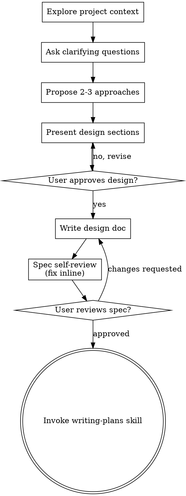

OpenAI Codex v0.143.0
--------
workdir: /home/rob/bpm-pizza-vibecoding-solution
model: gpt-5.4
provider: openai
approval: never
sandbox: read-only
reasoning effort: medium
reasoning summaries: none
session id: 019fbd13-8fa1-7943-a786-75bcb736a024
--------
user
You are the oracle and devil's advocate for the project specified in SPEC.md (current working directory; read it, especially the Speech, Testing, "What done looks like" and Deliverables sections). Context: v1.0.0 shipped deliberately WITHOUT voice — the speech layer (self-hosted OpenAI-compatible STT/TTS over HTTP, push-to-talk via getUserMedia/MediaRecorder, TTS toggle, degraded text-only path) is fully specified and implemented behind optional SPEECH_URL, but no speech service is provisioned and validation is a manual checklist that was never run. The operator's verdict: "the task is called Voice Agent, and a voice agent without voice is a bit stupid." Task: harden the implementer's proposed SPEC changes that make voice a first-class, DONE-relevant part of the product. Spec text only — no plan, no code yet. The spec must remain self-contained for a fresh developer in an empty repo.

PROPOSED SPEC CHANGES (attack, improve, replace):
1. Scope In: speech changes from "optional feature" to "required channel capability": the release is not done without a working voice path. SPEECH_* stay env-configured and the degraded text-only path stays (a speech outage must never break ordering), but "unset in production" stops being an accepted end state.
2. New "Speech service provisioning" paragraph: the deployment ships a self-hosted, CPU-only speech container reachable at SPEECH_URL (OpenAI-compatible /v1/audio/transcriptions + /v1/audio/speech). No vendor/model names in the spec (operator configures via env, consistent with the model-domain rules). A docker-compose/service definition next to the app is a deliverable-level artifact.
3. Testing upgrades:
   a. Automated offline speech tests: a STUB speech service (like the stub gateway/PizzaSim) lets the browser E2E suite exercise the real UI path — mic-button visibility when speech is enabled, STT round trip with a recorded audio fixture posted through /speech/stt, spoken flag set, TTS toggle fetching audio for the final message only. No real STT/TTS quality is asserted offline, only the wiring.
   b. The live acceptance test gains a VOICE variant (opt-in, like the existing one): a recorded audio fixture of a spoken order is sent through the real speech service, the transcript drives a full order, and the four "What done looks like" points are verified via the API. This is the "voice agent actually works" proof.
   c. The name-confirmation rule gets a scripted test: a transcript where STT returns a plausible-but-wrong name and the agent's read-back/confirmation catches it before submit (the ghost-customer failure).
4. "What done looks like" gains one line: with speech configured, a spoken conversation can produce the same verified order (points 1-4) as a typed one.
5. Deliverables tree: add the speech service definition artifact (e.g. deploy/speech-compose.yml — name it neutrally) and the audio fixtures directory under tests/.
6. Decisions locked: add "Voice | Required capability; text-only is a degraded mode, not the product" and keep telephony deferred.

Questions:
a) Is 3b realistic as an opt-in live test (audio fixture quality, language) or should the live voice proof stay a scripted manual checklist with evidence capture instead? Be decisive.
b) Does making voice "required" conflict with "Speech is never required" (degraded path) — how should the spec word the difference between runtime resilience and release completeness?
c) Anything missing for voice-first-class (e.g. latency expectations, audio formats, mic permissions over HTTPS — the demo runs on plain HTTP where getUserMedia is unavailable; must the spec now require HTTPS/a domain for the voice path)?
d) Exact minimal wording/rows per section.

Answer decisively in <=45 lines; end with DECISION: numbered list of exact spec edits.

codex
Reading the required skill instructions first, then I’ll inspect `SPEC.md` and answer by tightening the spec language and testing criteria rather than proposing implementation.
exec
/bin/bash -lc "sed -n '1,240p' /home/rob/.agents/skills/using-superpowers/SKILL.md" in /home/rob/bpm-pizza-vibecoding-solution
exec
/bin/bash -lc "sed -n '1,240p' /home/rob/.agents/skills/brainstorming/SKILL.md" in /home/rob/bpm-pizza-vibecoding-solution
exec
/bin/bash -lc "sed -n '1,260p' /home/rob/bpm-pizza-vibecoding-solution/SPEC.md" in /home/rob/bpm-pizza-vibecoding-solution
 succeeded in 111ms:
---
name: using-superpowers
description: Use when starting any conversation - establishes how to find and use skills, requiring skill invocation before ANY response including clarifying questions
---

<SUBAGENT-STOP>
If you were dispatched as a subagent to execute a specific task, ignore this skill.
</SUBAGENT-STOP>

<EXTREMELY-IMPORTANT>
If you think there is even a 1% chance a skill might apply to what you are doing, you ABSOLUTELY MUST invoke the skill.

IF A SKILL APPLIES TO YOUR TASK, YOU DO NOT HAVE A CHOICE. YOU MUST USE IT.

This is not negotiable. You cannot rationalize your way out of this.
</EXTREMELY-IMPORTANT>

## The Rule

**Invoke relevant or requested skills BEFORE any response or action** — including clarifying questions, exploring the codebase, or checking files. If it turns out wrong for the situation, you don't have to use it.

**Before entering plan mode:** if you haven't already brainstormed, invoke the brainstorming skill first.

Then announce "Using [skill] to [purpose]" and follow the skill exactly. If it has a checklist, create a todo per item.

## Skill Priority

When multiple skills apply, process skills come first — they set the approach, then implementation skills (frontend-design, etc.) carry it out. Brainstorming and systematic-debugging are Superpowers' most common process skills, but the rule holds for any of them.

- "Let's build X" → superpowers:brainstorming first, then implementation skills.
- "Fix this bug" → superpowers:systematic-debugging first, then domain skills.

## Red Flags

These thoughts mean STOP—you're rationalizing:

| Thought | Reality |
|---------|---------|
| "This is just a simple question" | Questions are tasks. Check for skills. |
| "I need more context first" | Skill check comes BEFORE clarifying questions. |
| "Let me explore the codebase first" | Skills tell you HOW to explore. Check first. |
| "I can check git/files quickly" | Files lack conversation context. Check for skills. |
| "Let me gather information first" | Skills tell you HOW to gather information. |
| "This doesn't need a formal skill" | If a skill exists, use it. |
| "I remember this skill" | Skills evolve. Read current version. |
| "This doesn't count as a task" | Action = task. Check for skills. |
| "The skill is overkill" | Simple things become complex. Use it. |
| "I'll just do this one thing first" | Check BEFORE doing anything. |
| "This feels productive" | Undisciplined action wastes time. Skills prevent this. |
| "I know what that means" | Knowing the concept ≠ using the skill. Invoke it. |

## Platform Adaptation

If your harness appears here, read its reference file for special instructions:

- Codex: `references/codex-tools.md`
- Pi: `references/pi-tools.md`
- Antigravity: `references/antigravity-tools.md`

## User Instructions

User instructions (CLAUDE.md, AGENTS.md, GEMINI.md, etc, direct requests) take precedence over skills, which in turn override default behavior. Only skip skill workflows or instructions when your human partner has explicitly told you to.

 succeeded in 113ms:
# PizzaSim Ordering Agent — Specification

> Hand this to a coding agent as the entire task:
> `FOLLOW INSTRUCTIONS PRECISELY AT "SPEC.MD"`.
> This file is the source of truth for what the product is. Everything else in
> the repo — code, tests, prompts, tickets — derives from it.

---

## Where this format comes from

The **shape** of this document is not ours. It is borrowed from Cedric Mössner —
**The Morpheus** ([youtube.com/@TheMorpheusTutorials](https://www.youtube.com/@TheMorpheusTutorials)),
who writes exactly one `SPEC.md` per project and hands the identical file to
every new model in order to compare them. The prompt he sends alongside it is a
single line — `FOLLOW INSTRUCTIONS PRECISELY AT "SPEC.MD"` — which is why that
line, and not a long prompt, stands at the top of this file.

Sections adopted from his specs: *Soul*, *The One Load-Bearing Idea*, hard
*Scope In / Out*, an explicit autonomy clause, work *in passes* with
verification after each, a file-level *Deliverables* list, *Decisions Locked /
Deferred*, and the one-hour *ticket sizing rules*.

Reference specs:
[morphcook](https://github.com/TheMorpheus407/morphcook) — offline Flutter
recipe app; one spec, seven model implementations.
[hogwarts-blender-benchmark](https://github.com/TheMorpheus407/hogwarts-blender-benchmark)
— fully procedural Blender build; `prompt.txt` plus `SPEC.md`.

The content below is ours. The form is his — with thanks.

---

## What done looks like

There is exactly one success condition, and everything else in this document
exists to serve it:

**A customer talks to the agent, and the resulting order appears in the API
under the pizzeria they chose — with the right customer, the right items, the
right quantities.**

Concretely, and this is the acceptance criterion:

1. `POST /pizzerias/{id}/orders` returned an order id.
2. Reading that pizzeria's orders back shows the order, and it is visible on
   that pizzeria's dashboard.
3. The customer name is the one the customer gave.
4. The items and quantities are the ones that were read back and confirmed —
   not a superset, not a subset, not a near match on the item code.

Nothing else counts as done. A green test suite, a clean architecture, a
pleasant interface: none of it is the product. **The order on the board is the
product.**

**Four failures that look like success**, each a failed run and not a partial
one:

- The order landed under a **different pizzeria** than the one the customer
  chose.
- A retry after a timeout created the order **twice**.
- A misheard or mistyped name created a **new customer** instead of matching
  the intended one.
- The order was submitted **without the customer confirming** the read-back.

Every rule below — the state machine, the revision-bound confirmation, the ban
on blind retries, the name read-back, the tenant in the URL path — exists to
prevent exactly one of those four.

---

## Soul

Ordering food by phone works because the person on the other end keeps the
order in their head, reads it back to you, and only then walks to the kitchen.
Nothing is cooked before you said yes.

Most LLM ordering demos invert this. The model holds the order in its context,
guesses item names that sound close enough, and fires the write call the moment
it feels confident. It works in the demo and fails on the fourth turn, in a
noisy room, when the customer changes their mind.

This agent puts the order back where it belongs: **in the code**. The model
does the one thing it is genuinely good at — turning messy human speech into
intent — and nothing else. It never holds the cart, never invents a menu item,
and never reaches the kitchen without a confirmed read-back.

**Core belief:** a language model is a great waiter and a terrible order pad.

---

## The One Load-Bearing Idea

**The order is a state machine owned by the code. The model only speaks.**

- Exactly one `Order` object per conversation, held by the runtime.
- The model cannot write to it directly. It calls tools that request a
  transition, and every transition is validated before it is applied.
- Every item code is validated against the **live menu**. An unknown code is a
  tool error carrying candidate matches — never a silent guess, never a
  fallback to a hardcoded list.
- `submit_order` is the only network write, legal in exactly one state:
  `CONFIRMED`. The only way into `CONFIRMED` is a read-back the customer
  answered yes to.
- One core serves every channel. A transport carries words in and words out;
  it owns no order logic whatsoever.

This one rule replaces prompt-engineering the model into good behaviour. If the
model misbehaves, the state machine refuses — and the refusal is a tool result
the model must deal with in front of the customer.

---

## Scope

### In

- **Two transports over one core:**
  - `cli` — interactive terminal chat.
  - `web` — FastAPI server on port 8888, browser chat UI, streaming the
    agent's intermediate steps as newline-delimited JSON so tool calls and
    tool results are visible, not just the final answer.
- **Speech on the web transport**, served by a self-hosted CPU-only speech
  container over HTTP. See *Speech*.
- **Several pizzerias.** The customer chooses which one they are ordering
  from, and can change it. `PIZZERIA_ID` is the preselection, not a
  restriction.
- **Returning customers.** A known first name can reuse its saved street
  after an explicit confirmation — limited to address reuse via the
  PizzaSim customer data; broader cross-session memory ("the usual")
  stays deferred.
- **Languages:** German and English. The agent answers in the language the
  customer used, per turn, without being told to switch.
- **Menu, prices, cart, customer, submit.** The full happy path plus
  correction ("no, make that three"), removal, and abandonment. The customer
  can ask what is on offer and what items cost, and sees what the basket
  comes to before confirming.
- **Deterministic tests** that run with no network and no LLM, plus one live
  acceptance test and a browser end-to-end test.
- **Structured logging** of every turn: user text, model tool calls, tool
  results, state transitions. One line per event, JSON, to a file.

### Out (explicitly)

- Payment and anything financial beyond showing prices the API supplies.
- Delivery routing, or an ETA of our own invention.
- Accounts, auth, sessions surviving a process restart.
- Modifying or cancelling an order after it was submitted.
- Any regex or keyword parser that produces an order without the model.
  See **Anti-patterns**; this is a hard ban, not a style preference.
- Reading the whole menu aloud when the answer will be spoken.
- Persisting customer data anywhere beyond the process and the PizzaSim API.

---

## Environment and configuration

All configuration comes from environment variables. Load `~/.env` if present;
never write to it, never create it, never print a value.

| Variable | Purpose |
|---|---|
| `LITELLM_PIZZA_URL` | OpenAI-compatible gateway base URL (`/chat/completions` appended) |
| `LITELLM_PIZZA_KEY` | Bearer token for the gateway |
| `LITELLM_PIZZA_MODEL_1` | Model the ordering agent calls; required, no default in code |
| `LITELLM_PIZZA_MODEL_2` | Second configured model, where the build uses one |
| `PIZZASIM_URL` | PizzaSim API base URL; dashboard and docs links derive from it |
| `PIZZASIM_API_KEY` | Sent as header `X-API-Key` on protected routes |
| `PIZZERIA_ID` | UUID of the pizzeria preselected on first load |
| `PIZZERIA_LANG` | Initial language, `de` or `en`: the greeting, the CLI, and the web UI before the customer switches |
| `APP_VERSION` | Release version, `x.y.z`, shown in the footer |
| `SPEECH_URL` | Base URL of the self-hosted speech service (optional) |
| `SPEECH_STT_MODEL` | Transcription model id |
| `SPEECH_TTS_MODEL` | Synthesis model id |
| `SPEECH_TTS_VOICE` | Voice id |

Rules:

- **Nothing is hardcoded.** No UUID, no model name, no menu, no base URL, no
  vendor — not even as a fallback "just in case".
- Missing or empty required variable → exit before the first turn with a
  message naming the variable and the file it was expected in. Never start
  half-configured. `SPEECH_*` are the exception: absent means the speech
  features are not rendered, and everything else works.
- Secrets never appear in logs, transcripts, error messages or the web UI.

---

## The PizzaSim API (contract)

Facts below are **verified** — against running code or a live response. A
verified fact never moves back into the open list; the open list only shrinks.

| Call | Auth | Notes |
|---|---|---|
| `GET /menu` | public | returns `pizzas[]` and `pasta[]`, each with `code` |
| `GET /pizzerias` | `X-API-Key` | list of pizzerias with `id`, `name` |
| `GET /pizzerias/{id}/orders` | `X-API-Key` | that pizzeria's orders; used by timeout recovery |
| `GET /pizzerias/{id}/customers` | `X-API-Key` | customer list — used **only** for address-reuse lookup, never to disclose address text |
| `POST /pizzerias/{id}/orders` | `X-API-Key` | places the order |
| `GET /location?street=…` | public | street plausibility check (optional tool) |

Order request body:

```json
{
  "customer": { "first_name": "Marco", "street_one": "via di Cantieri" },
  "items": [{ "type": "pizza", "code": "margherita", "qty": 2, "extras": [] }]
}
```

Response carries `order_id`, `status`, `eta_seconds`.

Derived URLs — built from `PIZZASIM_URL`, never hardcoded:

- Dashboard of a pizzeria: `{PIZZASIM_URL}/dashboard/pizzerias/{id}`
  (verified against the dashboard's routing code).
- API documentation: `{PIZZASIM_URL}/swagger.html` — there is **no** `/docs`.

Facts that shape behaviour:

- The tenant is **always** in the URL path, never in a header. The API key is
  a server key, not a pizzeria id.
- Customers are unique per pizzeria **by first name**. An unknown name
  silently creates a new customer — a misheard name creates a ghost. Speech
  input must therefore confirm the name explicitly.
- `street_one` is optional and **not** validated for deliverability. Asking
  for it is a policy of this agent — never claim to have checked an address.
- `POST /orders` is **not** idempotent. A retry after a timeout can double a
  real order. See **Error handling**.

Further verified facts (live responses, 2026-07-31/08-01):

- **Menu item shape:** `{"code", "name", "base": [ingredients], "price"}`.
  `price` is a number in euros — the source for every price answer and the
  basket total; no other financial data exists in the API. `name` is a
  single string (identical in DE and EN; there are no per-language names).
  The menu response also carries a top-level `toppings[]` array.
- **`extras[]` is a controlled vocabulary:** the `toppings[]` from
  `GET /menu`. The server rejects unknown extras with `422`
  (`"items[0].extras contains invalid topping 'unicorn_dust'"`); the tool
  layer validates extras against `toppings[]` exactly like item codes.
- **Error bodies are machine-readable:**
  `{"error": "<code>", "details": ["<human sentence>", ...]}` (e.g.
  `validation_failed` with HTTP 422) — mapped to typed errors; `details`
  may feed targeted questions.
- **Status values observed:** `ordered` → `prepared_planned` → `delivered`
  (with `delivered_at` set on the last). A fresh order starts as `ordered`.
- **`GET /location?street=` returns** `{"street": "<echo>",
  "deliverable": <bool>}`, HTTP 200 — `deliverable: true` even for nonsense
  input, so it is a weak plausibility signal at best: never tell the
  customer an address was verified.
- **The list endpoint carries no items.** The detail endpoint
  `GET /pizzerias/{id}/orders/{order_id}` (auth: `X-API-Key`) returns the
  full order incl. `customer` and `items[]`. Submit-timeout recovery
  shortlists by `first_name` + `created_at` recency on the list, then
  verifies the candidate's items via the detail endpoint before adopting
  it; the live acceptance test asserts items and quantities through the
  same detail endpoint.
- **Item codes are unique per type, not globally** — `tonno` exists as a

 succeeded in 120ms:
---
name: brainstorming
description: "You MUST use this before any creative work - creating features, building components, adding functionality, or modifying behavior. Explores user intent, requirements and design before implementation."
---

# Brainstorming Ideas Into Designs

Help turn ideas into fully formed designs and specs through natural collaborative dialogue.

Start by understanding the current project context, then ask questions one at a time to refine the idea. Once you understand what you're building, present the design and get user approval.

<HARD-GATE>
Do NOT invoke any implementation skill, write any code, scaffold any project, or take any implementation action until you have presented a design and the user has approved it. This applies to EVERY project regardless of perceived simplicity.
</HARD-GATE>

## Anti-Pattern: "This Is Too Simple To Need A Design"

Every project goes through this process. A todo list, a single-function utility, a config change — all of them. "Simple" projects are where unexamined assumptions cause the most wasted work. The design can be short (a few sentences for truly simple projects), but you MUST present it and get approval.

## Checklist

You MUST create a task for each of these items and complete them in order:

1. **Explore project context** — check files, docs, recent commits
2. **Offer the visual companion just-in-time** — NOT upfront. The first time a question would genuinely be clearer shown than described, offer it then (its own message); on approval its browser tab opens for you. If no visual question ever arises, never offer it. See the Visual Companion section below.
3. **Ask clarifying questions** — one at a time, understand purpose/constraints/success criteria
4. **Propose 2-3 approaches** — with trade-offs and your recommendation
5. **Present design** — in sections scaled to their complexity, get user approval after each section
6. **Write design doc** — save to `docs/superpowers/specs/YYYY-MM-DD-<topic>-design.md` and commit
7. **Spec self-review** — quick inline check for placeholders, contradictions, ambiguity, scope (see below)
8. **User reviews written spec** — ask user to review the spec file before proceeding
9. **Transition to implementation** — invoke writing-plans skill to create implementation plan

## Process Flow



**The terminal state is invoking writing-plans.** Do NOT invoke frontend-design, mcp-builder, or any other implementation skill. The ONLY skill you invoke after brainstorming is writing-plans.

## The Process

**Understanding the idea:**

- Check out the current project state first (files, docs, recent commits)
- Before asking detailed questions, assess scope: if the request describes multiple independent subsystems (e.g., "build a platform with chat, file storage, billing, and analytics"), flag this immediately. Don't spend questions refining details of a project that needs to be decomposed first.
- If the project is too large for a single spec, help the user decompose into sub-projects: what are the independent pieces, how do they relate, what order should they be built? Then brainstorm the first sub-project through the normal design flow. Each sub-project gets its own spec → plan → implementation cycle.
- For appropriately-scoped projects, ask questions one at a time to refine the idea
- Prefer multiple choice questions when possible, but open-ended is fine too
- Only one question per message - if a topic needs more exploration, break it into multiple questions
- Focus on understanding: purpose, constraints, success criteria

**Exploring approaches:**

- Propose 2-3 different approaches with trade-offs
- Present options conversationally with your recommendation and reasoning
- Lead with your recommended option and explain why
- YAGNI ruthlessly - remove unnecessary features from every approach and design

**Presenting the design:**

- Once you believe you understand what you're building, present the design
- Scale each section to its complexity: a few sentences if straightforward, up to 200-300 words if nuanced
- Ask after each section whether it looks right so far
- Cover: architecture, components, data flow, error handling, testing
- Be ready to go back and clarify if something doesn't make sense

**Design for isolation and clarity:**

- Break the system into smaller units that each have one clear purpose, communicate through well-defined interfaces, and can be understood and tested independently
- For each unit, you should be able to answer: what does it do, how do you use it, and what does it depend on?
- Can someone understand what a unit does without reading its internals? Can you change the internals without breaking consumers? If not, the boundaries need work.
- Smaller, well-bounded units are also easier for you to work with - you reason better about code you can hold in context at once, and your edits are more reliable when files are focused. When a file grows large, that's often a signal that it's doing too much.

**Working in existing codebases:**

- Explore the current structure before proposing changes. Follow existing patterns.
- Where existing code has problems that affect the work (e.g., a file that's grown too large, unclear boundaries, tangled responsibilities), include targeted improvements as part of the design - the way a good developer improves code they're working in.
- Don't propose unrelated refactoring. Stay focused on what serves the current goal.

## After the Design

**Documentation:**

- Write the validated design (spec) to `docs/superpowers/specs/YYYY-MM-DD-<topic>-design.md`
  - (User preferences for spec location override this default)
- Use elements-of-style:writing-clearly-and-concisely skill if available
- Commit the design document to git

**Spec Self-Review:**
After writing the spec document, look at it with fresh eyes:

1. **Placeholder scan:** Any "TBD", "TODO", incomplete sections, or vague requirements? Fix them.
2. **Internal consistency:** Do any sections contradict each other? Does the architecture match the feature descriptions?
3. **Scope check:** Is this focused enough for a single implementation plan, or does it need decomposition?
4. **Ambiguity check:** Could any requirement be interpreted two different ways? If so, pick one and make it explicit.

Fix any issues inline. No need to re-review — just fix and move on.

**User Review Gate:**
After the spec review loop passes, ask the user to review the written spec before proceeding:

> "Spec written and committed to `<path>`. Please review it and let me know if you want to make any changes before we start writing out the implementation plan."

Wait for the user's response. If they request changes, make them and re-run the spec review loop. Only proceed once the user approves.

**Implementation:**

- Invoke the writing-plans skill to create a detailed implementation plan
- Do NOT invoke any other skill. writing-plans is the next step.

## Visual Companion

A browser-based companion for showing mockups, diagrams, and visual options during brainstorming. Available as a tool — not a mode. Accepting the companion means it's available for questions that benefit from visual treatment; it does NOT mean every question goes through the browser.

**Offering the companion (just-in-time):** Do NOT offer it upfront. Wait until a question would genuinely be clearer shown than told — a real mockup / layout / diagram question, not merely a UI *topic*. The first time that happens, offer it then, as its own message:
> "This next part might be easier if I show you — I can put together mockups, diagrams, and comparisons in a browser tab as we go. It's still new and can be token-intensive. Want me to? I'll open it for you."

**This offer MUST be its own message.** Only the offer — no clarifying question, summary, or other content. Wait for the user's response. If they accept, start the server with `--open` so their browser opens to the first screen automatically. If they decline, continue text-only and don't offer again unless they raise it.

**Per-question decision:** Even after the user accepts, decide FOR EACH QUESTION whether to use the browser or the terminal. The test: **would the user understand this better by seeing it than reading it?**

- **Use the browser** for content that IS visual — mockups, wireframes, layout comparisons, architecture diagrams, side-by-side visual designs
- **Use the terminal** for content that is text — requirements questions, conceptual choices, tradeoff lists, A/B/C/D text options, scope decisions

A question about a UI topic is not automatically a visual question. "What does personality mean in this context?" is a conceptual question — use the terminal. "Which wizard layout works better?" is a visual question — use the browser.

If they agree to the companion, read the detailed guide before proceeding:
`skills/brainstorming/visual-companion.md`

codex
Using `using-superpowers` and `brainstorming` to review the spec as a design artifact first. I’ve got the top of `SPEC.md`; now I’m pulling the Speech, Testing, Deliverables, and locked-decisions sections to tighten the exact wording.
exec
/bin/bash -lc "sed -n '220,520p' /home/rob/bpm-pizza-vibecoding-solution/SPEC.md" in /home/rob/bpm-pizza-vibecoding-solution
exec
/bin/bash -lc "sed -n '1,220p' /home/rob/.agents/skills/references/codex-tools.md" in /home/rob/bpm-pizza-vibecoding-solution
exec
/bin/bash -lc 'rg -n "''^## Speech|''^## Testing|''^## Deliverables|''^## Decisions|''^### Decisions|What done looks like|SPEECH_URL|HTTPS|getUserMedia|MediaRecorder" /home/rob/bpm-pizza-vibecoding-solution/SPEC.md' in /home/rob/bpm-pizza-vibecoding-solution
 succeeded in 277ms:
34:## What done looks like
172:| `SPEECH_URL` | Base URL of the self-hosted speech service (optional) |
470:## Speech
478:| STT | `POST {SPEECH_URL}/v1/audio/transcriptions` | multipart audio + model + language |
479:| TTS | `POST {SPEECH_URL}/v1/audio/speech` | JSON: model, voice, input text → audio |
485:  it.** Capture via `getUserMedia` and `MediaRecorder`, playback via a plain
504:- **Speech is never required.** With `SPEECH_URL` unset or the service down,
569:## Testing
595:  points under *What done looks like*. If this fails, the product does not
598:  question — plus one run with `SPEECH_URL` unset, which must render a usable
718:## Deliverables
752:## Decisions locked
784:## Decisions deferred

 exited 2 in 331ms:
sed: can't read /home/rob/.agents/skills/references/codex-tools.md: No such file or directory

 succeeded in 340ms:
Facts that shape behaviour:

- The tenant is **always** in the URL path, never in a header. The API key is
  a server key, not a pizzeria id.
- Customers are unique per pizzeria **by first name**. An unknown name
  silently creates a new customer — a misheard name creates a ghost. Speech
  input must therefore confirm the name explicitly.
- `street_one` is optional and **not** validated for deliverability. Asking
  for it is a policy of this agent — never claim to have checked an address.
- `POST /orders` is **not** idempotent. A retry after a timeout can double a
  real order. See **Error handling**.

Further verified facts (live responses, 2026-07-31/08-01):

- **Menu item shape:** `{"code", "name", "base": [ingredients], "price"}`.
  `price` is a number in euros — the source for every price answer and the
  basket total; no other financial data exists in the API. `name` is a
  single string (identical in DE and EN; there are no per-language names).
  The menu response also carries a top-level `toppings[]` array.
- **`extras[]` is a controlled vocabulary:** the `toppings[]` from
  `GET /menu`. The server rejects unknown extras with `422`
  (`"items[0].extras contains invalid topping 'unicorn_dust'"`); the tool
  layer validates extras against `toppings[]` exactly like item codes.
- **Error bodies are machine-readable:**
  `{"error": "<code>", "details": ["<human sentence>", ...]}` (e.g.
  `validation_failed` with HTTP 422) — mapped to typed errors; `details`
  may feed targeted questions.
- **Status values observed:** `ordered` → `prepared_planned` → `delivered`
  (with `delivered_at` set on the last). A fresh order starts as `ordered`.
- **`GET /location?street=` returns** `{"street": "<echo>",
  "deliverable": <bool>}`, HTTP 200 — `deliverable: true` even for nonsense
  input, so it is a weak plausibility signal at best: never tell the
  customer an address was verified.
- **The list endpoint carries no items.** The detail endpoint
  `GET /pizzerias/{id}/orders/{order_id}` (auth: `X-API-Key`) returns the
  full order incl. `customer` and `items[]`. Submit-timeout recovery
  shortlists by `first_name` + `created_at` recency on the list, then
  verifies the candidate's items via the detail endpoint before adopting
  it; the live acceptance test asserts items and quantities through the
  same detail endpoint.
- **Item codes are unique per type, not globally** — `tonno` exists as a
  pizza and a pasta. Validation and removal always key on `(type, code)`.
- **The customers endpoint** `GET /pizzerias/{id}/customers` (auth:
  `X-API-Key`) returns `customers[]` with `{id, first_name, street_one,
  street_two, created_at, deleted_at}`. Since customers are unique per
  pizzeria by `first_name`, a first name resolves to at most one saved
  address. Guardrail: the verified order-write contract proves only
  `street_one`, so address reuse is limited to `street_one` until
  `street_two` support on `POST /orders` is verified as well.

### Open contract questions — shrink-only

Resolve against the live API before the affected component is implemented,
then move the answer up into the facts and delete the question. Never guess.
A verified fact never returns here.

*(empty — all previous questions were resolved against the live API and
moved into the facts above)*

---

## Order state machine

```
EMPTY ──add_items──▶ COLLECTING ──set_customer──▶ READY
  ▲                      │  ▲                       │
  └──remove last item────┘  └───add/remove/edit─────┘
                                                    │ read_back + customer says yes
                                                    ▼
                                               CONFIRMED ──submit_order──▶ SUBMITTED
                                                    │
                                                    └──any change──▶ back to READY
```

Invariants, all enforced in code and all covered by unit tests:

1. `submit_order` outside `CONFIRMED` returns an error. It does not
   "helpfully" confirm on the model's behalf.
2. Any mutation after `CONFIRMED` drops the order back to `READY`. A
   confirmation applies to the basket that was read back, not to a later one.
3. `CONFIRMED` is reachable only via `confirm_order`, which is only legal
   after `read_back` for the current basket revision. The basket carries a
   revision counter; `confirm_order` must name it.
4. `SUBMITTED` is terminal. The conversation may continue; the order may not.
5. An item enters the basket only with a `code` present in the menu snapshot
   fetched this session.
6. A basket never crosses a tenant boundary. Changing pizzeria starts a fresh
   conversation and a fresh order.

---

## Tools

The model sees exactly these. Names, parameters and semantics are fixed.

| Tool | Parameters | Returns |
|---|---|---|
| `get_menu` | — | pizzas and pasta with codes, display names, prices |
| `add_items` | `items[]` of `{type, code, qty, extras[]}` | new basket + revision |
| `remove_item` | `code`, `type`, optional `qty` | new basket + revision |
| `lookup_customer` | `first_name` | `{customer_exists, saved_street_available}` — booleans only, **no street text** |
| `set_customer` | `first_name`, plus either `street_one` **or** `use_saved_street: true` (mutually exclusive) — with the flag, the **code** copies the saved street into the order; the text never passes through the model | customer as stored (saved street as a flag, not text) |
| `read_back` | — | basket, customer name, revision, and the code-computed basket total — the text the agent reads out. A street reused from saved data is **not** recited; the earlier yes/no reuse confirmation covers it |
| `confirm_order` | `revision` | state `CONFIRMED`, or error if stale |
| `submit_order` | — | `order_id`, `status`, `eta_seconds` |
| `check_street` | `street` | plausibility result (optional) |

Tool result conventions:

- Success: the **full current state**, not a diff. The model never
  reconstructs the basket from history.
- Failure: `{"error": {"code": "...", "message": "...", "candidates": [...]}}`.
  `message` is written so it can be spoken to the customer as-is.
- `add_items` with an unknown code returns `unknown_item` plus up to three
  candidates from the menu. The model asks; it does not pick.
- Quantities are integers. A tool receiving `"zwei"` returns
  `invalid_quantity`; it does not parse German.
- **Totals are computed in code**, from the API prices captured in the
  session's menu snapshot. The model never does arithmetic on prices; the
  web basket shows the same code-owned total that `read_back` carries.
- `remove_item` parameters are fixed, so when several basket lines share
  `(type, code)` with different `extras[]`, the semantics are
  deterministic: without `qty` every matching line is removed; with `qty`
  the most recently added matching line is reduced.
- **Saved-street redaction.** A street reused from saved customer data
  never appears in tool results, streamed intermediate steps, transcripts
  or the structured logs — only booleans and state flags (e.g.
  `street_on_file: true`) may appear there, and the web UI shows it as
  "saved address", never as text. A street the customer dictated in this
  conversation may be echoed as before — it is their own input. First
  names are the only lookup key, so anyone claiming a name must never be
  able to extract the address behind it.

---

## Conversation policy

This is what the system prompt must produce. Write the prompt to achieve it;
do not paste this section into it verbatim.

- Greet first, in the session language, and offer help — one sentence, not a
  menu recital.

**Language authority — one rule.** The session language starts as
`PIZZERIA_LANG` (greeting, CLI, web UI chrome before any switch). The web
header switch changes the session language: UI chrome, the greeting of a
fresh conversation, and the speech hint (STT language, TTS output). For the
agent's replies, per-turn mirroring wins: it answers in the language of the
customer's latest message, even when that differs from the session language.
The CLI has no switch and stays at `PIZZERIA_LANG`.
- **One question per turn.** Never stack "name, street and what would you
  like?"
- Never state a menu item or a price that did not come from `get_menu` in this
  session. Price questions are normal questions, and so is "what does my
  basket come to?"
- Collect the first name; then call `lookup_customer`. If a saved street
  exists, ask exactly one confirmation question ("Soll ich wieder an Ihre
  gespeicherte Adresse liefern?") **without reciting the address**; on yes,
  `set_customer(use_saved_street: true)`. If the customer declines, is
  unknown, or the lookup fails (non-fatal), ask for the street as usual.
  If the customer declines the street entirely, accept it — it is optional
  in the API.
- Before submitting: call `read_back`, present it, and wait for an explicit
  yes. "Mhm" and silence are not a yes; ask once more, then offer to start
  over.
- Never announce that an order was placed before `submit_order` returned an
  `order_id`.
- On success, state the order id in a form a human can repeat back, and the
  wait time in **minutes**, converted from `eta_seconds`.
- On error, explain in plain language what happened and what the options are.
  Never show a status code, stack trace or JSON.
- Never claim to have checked an address for deliverability.

---

## The web channel

The web UI is where a stranger decides whether this thing works. Everything
below is required, and each line is written so it can be checked by looking at
the page.

### The conversation

Type or paste a message, get an answer. The exchange a first-time customer
should be able to have, end to end, without help:

> *What have you got?* → *What does a Margherita cost?* → *I'll take two of
> those and a pasta* → *I'm a new customer, my name is …* → read-back →
> confirm → order id and wait time.

After a completed order, a new conversation can start immediately from the
same page.

### Header

- **The pizzeria being ordered from, by name**, prominent and always visible.
- **A selector to change pizzeria, filled from the API and from nowhere
  else.** The list comes from `GET /pizzerias` at load time. No hardcoded
  names, no bundled list, no fallback entry when the call fails — if it
  fails, the page says the list is unavailable instead of offering a choice
  it cannot honour. Each entry shows the name plus a short form of its UUID
  so similar names can be told apart. Changing the selection starts a fresh
  conversation for that pizzeria.
- **A link to that pizzeria's dashboard**
  (`{PIZZASIM_URL}/dashboard/pizzerias/{id}`), opening in a new tab. Without
  it nobody can check whether the order arrived — and checking that is the
  entire point of the product.
- **Language: German or English**, switchable, applied to the agent's replies
  and to speech in both directions.
- **Start over**, clearing the session and the basket.

### Footer

- **The running version**, `x.y.z`, from `APP_VERSION`, raised on every
  release: patch for fixes, minor for new behaviour, major for a break.
  Without it nobody can tell which build is answering.
- **The full pizzeria UUID**, selectable, for pasting into API calls.
- **Connection state** for the ordering API and the model gateway.
- **A link to the API documentation** (`{PIZZASIM_URL}/swagger.html`).

### Every message gets an answer

The invariant this channel stands on: **no sent message may end without either
a rendered assistant reply or a rendered error.** Never a silent failure,
never an indicator that stops with nothing after it.

- The moment a message is sent, the UI shows the agent is working.
- Intermediate steps render as they stream — which tool was called and what it
  returned — visually distinct from the assistant's words. A stream whose tool
  events the page discards is a defect: the customer sees a frozen screen
  while the agent works normally.
- If the stream ends without a final assistant message, the UI says so.
- If the request errors, times out, or the connection drops, the UI says which
  happened and offers to resend.
- Errors in the customer's language, in plain words. No status codes, no
  tracebacks, no raw JSON.

### The order on screen

- The current basket is visible, with quantities and what it comes to. The
  code owns the order; the customer must see what the code holds.
- The read-back is visually distinct and carries an explicit confirm control.
  Confirmation is an action the customer takes, not a word the agent claims to
  have heard.
- On success: the order id, readable, and the wait in minutes.
- After submission the basket is locked and shown as submitted. Nothing on the
  page can modify or resubmit it.

---

## Speech

Speech is an input and an output method on the web channel, served by a
**self-hosted speech service**: CPU-only, in its own container, reached over
plain HTTP with an OpenAI-compatible surface.

| Direction | Endpoint | Payload |
|---|---|---|
| STT | `POST {SPEECH_URL}/v1/audio/transcriptions` | multipart audio + model + language |
| TTS | `POST {SPEECH_URL}/v1/audio/speech` | JSON: model, voice, input text → audio |

- **The speech service is the only speech path.** No external speech
  provider, no hosted realtime framework, no audio through the LLM gateway —
  that gateway carries chat completions only.
- **The browser captures and plays audio; it does not recognise or synthesise
  it.** Capture via `getUserMedia` and `MediaRecorder`, playback via a plain
  audio element — cross-browser and cross-platform: Firefox, Safari, Chrome,
  on Linux, macOS and Windows alike.
- **The browser speech APIs are forbidden.** `SpeechRecognition` and
  `speechSynthesis` tied the previous implementation to a single browser
  vendor and sent customer audio to a third party. The self-hosted service
  exists to replace them.
- **Nothing about the speech stack is written into source.** Base URL, models
  and voice come from the environment, exactly like the chat model; the
  language sent with STT/TTS requests is the session language (see
  *Language authority* under Conversation policy), not a separate config.
- **Request/response, not streaming.** Record, upload, transcript back.
  Latency is visible and acceptable; do not build partial results, barge-in
  or turn detection on top — this transport cannot do them, and pretending
  otherwise produces a broken feel.
- **Push-to-talk.** The microphone starts and stops on the customer's action,
  never listens continuously. Recording state is visible at all times.
- **Synthesis is optional and off by default**, toggled by the customer,
  applied only to the final assistant message.
- **Speech is never required.** With `SPEECH_URL` unset or the service down,
  microphone and speaker toggle are not rendered and the text UI is fully
  usable. A speech failure is never an order failure.
- **Speech shortens answers, it does not change them.** Same core, same
  tools, same state machine. When a reply will be spoken: at most three menu
  items plus an invitation, times in minutes, order id read in groups.
- **Confirm the name.** Transcription errors on names are the expensive
  failure: a misheard name silently creates a customer nobody will find
  again. Read the name back before submitting.

---

## Error handling

Every case below needs a test and a phrasing.

| Situation | Code does | Customer sees/hears |

codex
`3b` should stay as an opt-in live automated test, not a manual checklist. The point of the new requirement is release-gating reality, and a manual voice proof will rot exactly like the current manual checklist did. Keep it narrow: one or two short, curated fixtures per language, no WER/quality scoring, only pass/fail on end-to-end order correctness through the real speech service. Manual evidence capture can remain a release-note aid, but not the acceptance artifact.

Making voice “required” does not conflict with degraded text-only runtime behavior. The spec should distinguish `release completeness` from `runtime resilience`: voice must be provisioned and proven in the target deployment for the release to be done; if speech is later unavailable at runtime, ordering must degrade to text without blocking orders. Replace “Speech is never required” with wording that says “Speech is required for the product; speech is not required for order continuity.”

What is missing: yes, the spec now needs an environment precondition for secure context. `getUserMedia` is unavailable on ordinary HTTP except localhost, so the voice-capable deployment must run over HTTPS on a real host name, or another secure context explicitly supported by the browser. Also add minimal transport constraints: accepted input format must be the browser-recorded audio blob the app emits; TTS response must be browser-playable audio; and set a soft latency target so the implementer does not ship a “working” but unusable voice path. I would keep it modest: “target under 4 seconds per STT/TTS request on demo hardware; slower is a defect if it breaks turn-taking.”

Minimal section edits should be explicit and surgical, not aspirational.

DECISION:
1. In `What done looks like`, add point `5.`: `With speech configured in the target deployment, a spoken conversation on the web channel can produce the same verified order outcome as points 1-4.`

2. In `Scope -> In`, replace the speech bullet with: `Speech on the web transport is a required channel capability in production. It is provisioned via the self-hosted speech service described in Speech; if the service is unavailable at runtime, ordering degrades to text-only without breaking ordering.`

3. In `Environment and configuration`, change `SPEECH_URL` purpose from `(optional)` to: `Base URL of the self-hosted speech service; required in production releases, optional only for local/dev and explicit text-only test scenarios.`  
   Change the rules bullet from `SPEECH_* are the exception...` to: `For production completeness, `SPEECH_URL`, `SPEECH_STT_MODEL`, `SPEECH_TTS_MODEL`, and `SPEECH_TTS_VOICE` are required. For local/dev and explicit degraded-mode tests, they may be absent; in that case speech controls are not rendered and text ordering remains fully usable.`

4. In `Speech`, replace `Speech is never required...` with: `Speech is a required product capability for release completeness. Text-only is the degraded fallback when speech is unconfigured in dev/test or temporarily unavailable at runtime; a speech outage must never block typed ordering, but a production release without a working speech path is not done.`

5. In `Speech`, add three bullets:  
   `- Voice-capable web deployments must run in a secure browser context: HTTPS on a real host/domain, or localhost during development. Plain HTTP is not a valid acceptance environment for microphone input.`  
   `- The STT path must accept the browser-recorded audio format emitted by `MediaRecorder`; the TTS path must return audio playable by standard browser audio elements.`  
   `- Latency target: each STT request and each TTS request should normally complete quickly enough for turn-based conversation on demo hardware; sustained multi-second delays that make turn-taking awkward are a defect.`

6. Add a new subsection after `Speech` named `Speech service provisioning`: `The deployment includes a self-hosted, CPU-only speech service reachable at `SPEECH_URL`, exposing OpenAI-compatible `POST /v1/audio/transcriptions` and `POST /v1/audio/speech`. The application and the speech service are deployed together as first-party artifacts. The repository must include a neutral deployment definition for this service next to the app deployment artifacts.`

7. In `Testing`, add:  
   `- Offline speech E2E with a stub speech service: exercise the real browser UI path, including speech-control visibility when speech is configured, STT round-trip from recorded fixtures, `spoken: true` turn metadata, and TTS fetch only for the final assistant message when the toggle is enabled. These tests assert wiring, not transcription or synthesis quality.`  
   `- Live voice acceptance test (opt-in): send recorded spoken-order fixtures through the real speech service, drive a full order through the web/API path, and verify the same order-correctness criteria as What done looks like via the API. Include at least one German and one English fixture.`  
   `- Name-confirmation regression test: use a transcript/fixture with a plausible-but-wrong first name and assert that the agent reads back and confirms the name before submission, preventing ghost-customer creation.`

8. In `Deliverables`, add two artifacts: `A neutral speech-service deployment definition (for example under `deploy/`)` and `Recorded audio fixtures for offline and live voice tests under `tests/fixtures/audio/`.`

9. In `Decisions locked`, add row: `Voice | Required release capability on the web channel; text-only is degraded operation, not the product.`

10. Keep telephony deferred exactly as proposed; do not broaden scope beyond web voice.
tokens used
24,584
`3b` should stay as an opt-in live automated test, not a manual checklist. The point of the new requirement is release-gating reality, and a manual voice proof will rot exactly like the current manual checklist did. Keep it narrow: one or two short, curated fixtures per language, no WER/quality scoring, only pass/fail on end-to-end order correctness through the real speech service. Manual evidence capture can remain a release-note aid, but not the acceptance artifact.

Making voice “required” does not conflict with degraded text-only runtime behavior. The spec should distinguish `release completeness` from `runtime resilience`: voice must be provisioned and proven in the target deployment for the release to be done; if speech is later unavailable at runtime, ordering must degrade to text without blocking orders. Replace “Speech is never required” with wording that says “Speech is required for the product; speech is not required for order continuity.”

What is missing: yes, the spec now needs an environment precondition for secure context. `getUserMedia` is unavailable on ordinary HTTP except localhost, so the voice-capable deployment must run over HTTPS on a real host name, or another secure context explicitly supported by the browser. Also add minimal transport constraints: accepted input format must be the browser-recorded audio blob the app emits; TTS response must be browser-playable audio; and set a soft latency target so the implementer does not ship a “working” but unusable voice path. I would keep it modest: “target under 4 seconds per STT/TTS request on demo hardware; slower is a defect if it breaks turn-taking.”

Minimal section edits should be explicit and surgical, not aspirational.

DECISION:
1. In `What done looks like`, add point `5.`: `With speech configured in the target deployment, a spoken conversation on the web channel can produce the same verified order outcome as points 1-4.`

2. In `Scope -> In`, replace the speech bullet with: `Speech on the web transport is a required channel capability in production. It is provisioned via the self-hosted speech service described in Speech; if the service is unavailable at runtime, ordering degrades to text-only without breaking ordering.`

3. In `Environment and configuration`, change `SPEECH_URL` purpose from `(optional)` to: `Base URL of the self-hosted speech service; required in production releases, optional only for local/dev and explicit text-only test scenarios.`  
   Change the rules bullet from `SPEECH_* are the exception...` to: `For production completeness, `SPEECH_URL`, `SPEECH_STT_MODEL`, `SPEECH_TTS_MODEL`, and `SPEECH_TTS_VOICE` are required. For local/dev and explicit degraded-mode tests, they may be absent; in that case speech controls are not rendered and text ordering remains fully usable.`

4. In `Speech`, replace `Speech is never required...` with: `Speech is a required product capability for release completeness. Text-only is the degraded fallback when speech is unconfigured in dev/test or temporarily unavailable at runtime; a speech outage must never block typed ordering, but a production release without a working speech path is not done.`

5. In `Speech`, add three bullets:  
   `- Voice-capable web deployments must run in a secure browser context: HTTPS on a real host/domain, or localhost during development. Plain HTTP is not a valid acceptance environment for microphone input.`  
   `- The STT path must accept the browser-recorded audio format emitted by `MediaRecorder`; the TTS path must return audio playable by standard browser audio elements.`  
   `- Latency target: each STT request and each TTS request should normally complete quickly enough for turn-based conversation on demo hardware; sustained multi-second delays that make turn-taking awkward are a defect.`

6. Add a new subsection after `Speech` named `Speech service provisioning`: `The deployment includes a self-hosted, CPU-only speech service reachable at `SPEECH_URL`, exposing OpenAI-compatible `POST /v1/audio/transcriptions` and `POST /v1/audio/speech`. The application and the speech service are deployed together as first-party artifacts. The repository must include a neutral deployment definition for this service next to the app deployment artifacts.`

7. In `Testing`, add:  
   `- Offline speech E2E with a stub speech service: exercise the real browser UI path, including speech-control visibility when speech is configured, STT round-trip from recorded fixtures, `spoken: true` turn metadata, and TTS fetch only for the final assistant message when the toggle is enabled. These tests assert wiring, not transcription or synthesis quality.`  
   `- Live voice acceptance test (opt-in): send recorded spoken-order fixtures through the real speech service, drive a full order through the web/API path, and verify the same order-correctness criteria as What done looks like via the API. Include at least one German and one English fixture.`  
   `- Name-confirmation regression test: use a transcript/fixture with a plausible-but-wrong first name and assert that the agent reads back and confirms the name before submission, preventing ghost-customer creation.`

8. In `Deliverables`, add two artifacts: `A neutral speech-service deployment definition (for example under `deploy/`)` and `Recorded audio fixtures for offline and live voice tests under `tests/fixtures/audio/`.`

9. In `Decisions locked`, add row: `Voice | Required release capability on the web channel; text-only is degraded operation, not the product.`

10. Keep telephony deferred exactly as proposed; do not broaden scope beyond web voice.
